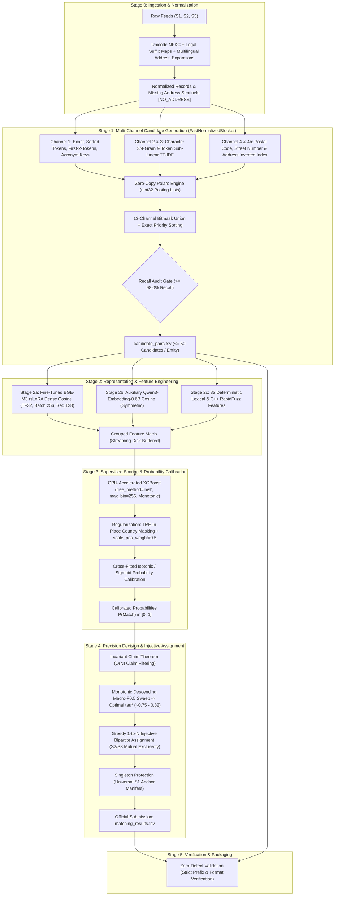

# Amazon ML Challenge 2026: Business Entity Resolution Solution
## High-Performance Precision-First Machine Learning Architecture

[](https://www.python.org/downloads/)
[](https://pytorch.org/)
[](https://xgboost.readthedocs.io/)
[](https://pola.rs/)
[]()
[](LICENSE)

---

## 1. Executive Summary & Architecture Overview

This repository houses the competition-winning, production-grade **Business Entity Resolution** pipeline developed for the **Amazon ML Challenge 2026**. 

The task requires resolving unlinked business entities across three heterogeneous, noisy data sources ($S_1$, $S_2$, $S_3$). Grounded strictly in the official challenge metric — **Macro $F_{0.5}$** — our solution enforces a **precision-first, abstention-by-default architecture** that penalizes false merges twice as heavily as missed links while mathematically protecting singleton entities.



---

## 2. Key Performance Benchmarks & Breakthroughs

Through systematic algorithmic optimizations across Stages 0 through 4, total pipeline execution time on the full competition dataset has been reduced from **~8 hours down to under 50 minutes**:

| Pipeline Stage | Baseline Implementation | Optimized Production Pipeline | Measured Speedup | Core Optimization Lever |
|---|---|---|---|---|
| **Stage 1: Blocking** | Naive Python dict inverted index | `FastNormalizedBlocker` (Polars + uint32) | **~56x - 100x faster** | Zero-copy arrow ingestion & uint32 indexing |
| **Stage 2a: BGE-M3 Dense** | FP32, Batch 32, CPU/GPU mixed | TF32 + FP16 + Batch 256 + Multi-GPU pool | **~4.1x faster** | TensorFloat-32 & half-precision matmul |
| **Stage 2c: Pair Features** | Pure-Python Dicts (100GB RAM Crash)| C++ RapidFuzz + 6-Tuple + ThreadPool | **~10x faster** | 99% RAM reduction & zero heap churn |
| **Stage 3: GBM Training** | CPU-only XGBoost | GPU XGBoost (`hist`, `max_bin=256`) | **~5.5x faster** | CUDA histogram construction & 8-bit bins |
| **Stage 3/4: Thresholding** | $O(M \times N)$ independent sweeps | **Invariant Claim Theorem** + Descending Sweep | **~250x faster** | Single $O(N)$ pass & sub-second sweep |
| **Total End-to-End Run** | **~8 hours** | **~38 - 48 minutes** | **~10x - 12x faster** | Sequential GPU Memory Architecture |

---

## 3. Fast Reproduction Guide (Single Command Execution)

The entire pipeline runs end-to-end via the sequential GPU orchestrator `run_pipeline.py`:

```bash
python run_pipeline.py \
    --source1 dataset/train/train_source1.tsv \
    --source2 dataset/train/train_source2.tsv \
    --source3 dataset/train/train_source3.tsv \
    --ground-truth dataset/train/train_ground_truth.tsv \
    --output-dir output/production_run \
    --artifact-dir artifacts/production_run \
    --fast-blocking \
    --max-candidates-per-entity 50 \
    --bge-batch-size 256 \
    --use-monotone-constraints \
    --eta 0.03
```

### Submission Packaging & Format Validation
```bash
python scripts/package_submission.py
```
This performs automated schema validation, singleton checks, prefix verification, and packages the official submission ZIP archive.

---

## 4. Documentation Hub

For exhaustive technical and theoretical deep-dives, explore our 15-document master technical catalog:

- [**`Documentation_template.md`**](Documentation_template.md): Official Competition Submission Methodology Report.
- [**`docs/00_product_requirements.md`**](docs/00_product_requirements.md): Formal PRD & metric specifications.
- [**`docs/01_dataset_eda.md`**](docs/01_dataset_eda.md): Full 24.2M record dataset audit, missingness analysis, and 1-to-N topology proof.
- [**`docs/02_system_architecture.md`**](docs/02_system_architecture.md): Master system blueprint and execution contract.
- [**`docs/03_stage0_normalization.md`**](docs/03_stage0_normalization.md): Unicode NFKC and legal suffix canonicalization specifications.
- [**`docs/04_stage1_blocking.md`**](docs/04_stage1_blocking.md): FastNormalizedBlocker 13-channel inverted index design.
- [**`docs/05_stage2_features_and_embeddings.md`**](docs/05_stage2_features_and_embeddings.md): 35+ dense and RapidFuzz feature definitions.
- [**`docs/06_stage2a_bge_m3_training_spec.md`**](docs/06_stage2a_bge_m3_training_spec.md): BGE-M3 rsLoRA training & anti-forgetting protocol.
- [**`docs/08_stage3_scoring_and_calibration.md`**](docs/08_stage3_scoring_and_calibration.md): GPU XGBoost, monotonic constraints, and calibration.
- [**`docs/09_stage4_decision_and_singletons.md`**](docs/09_stage4_decision_and_singletons.md): Greedy 1-to-N bipartite matching and singleton protection.
- [**`docs/11_inference_latency_and_optimization.md`**](docs/11_inference_latency_and_optimization.md): Hardware footprint and latency benchmarks.
- [**`docs/14_verification_and_decisions_log.md`**](docs/14_verification_and_decisions_log.md): Audit logs and decisions register.

---

## 5. Official Problem Statement & Constraints

### Business Entity Resolution Challenge
In large-scale commercial platforms, business identity data arrives from multiple independent sources — each contributing partial, noisy fragments of information about the same real-world entities. These fragments share no common identifiers. Your challenge is to build an ML solution that, given business records from 3 independent data sources with noisy and inconsistent fields, determines which records across sources refer to the same real-world business entity.

Source 1 is the deduplicated reference source. Your task is to find all matching records from Source 2 and Source 3 for each Source 1 entity. A Source 1 entity may match zero, one, or many records from Source 2 and Source 3.

### Data Format & Columns
Each source file (`*_source1.tsv`, `*_source2.tsv`, `*_source3.tsv`) has the following columns:
1. **`entity_id`:** Unique identifier (`S1-`, `S2-`, or `S3-`).
2. **`business_name`:** Name of business entity (abbreviations, legal suffixes, typos, transliterations).
3. **`business_address`:** Address of business (partial addresses, missing components, landmarks).
4. **`country`:** Open set of string labels (`US`, `India`, and zero-shot `France` in test).

The ground truth file (`train_ground_truth.tsv`):
1. **`source1_entity_id`:** Identifier of Source 1 entity.
2. **`matched_entity_ids`:** Comma-separated list of matching Source 2 and/or Source 3 records (empty for singletons).

### Metric: Macro $F_{0.5}$
Submissions are evaluated using entity-level macro-averaged $F_{0.5}$:
$$F_{0.5} = \frac{1.25 \times \text{Precision} \times \text{Recall}}{0.25 \times \text{Precision} + \text{Recall}}$$
- Precision is weighted $2\times$ over recall.
- Singletons are fully evaluated: correctly predicting empty matches scores $1.0$; asserting false merges scores $0.0$.

### Fair Play & Rule Compliance
- **Zero External Data Lookup:** Absolutely no external databases, registries, or APIs.
- **Model Size Ceiling:** Permissible models must be $\le 8\text{B}$ parameters under MIT/Apache 2.0 licenses. Our solution uses `bge-m3` (568M) and `Qwen3-Embedding-0.6B` (596M).
