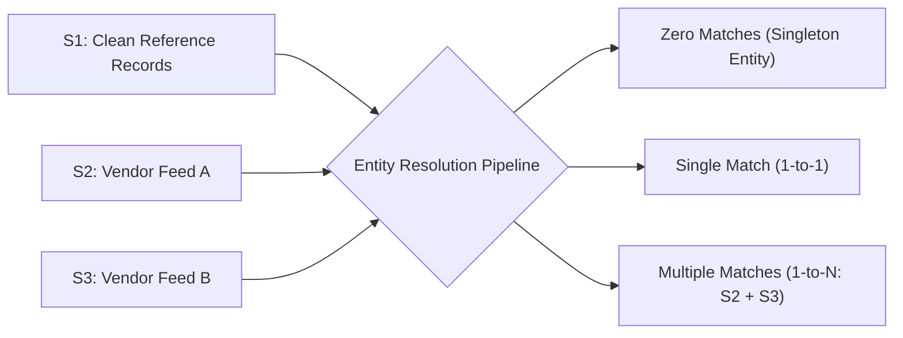

# Product Requirements Document (PRD) — Business Entity Resolution
## Amazon ML Challenge 2026

---

## 1. Problem Statement & Scope

The objective of this challenge is to perform large-scale **Business Entity Resolution** across three independently-sourced tabular datasets without shared identifiers:
- **Source 1 ($S_1$):** Clean reference entity table containing ground-truth anchor businesses.
- **Source 2 ($S_2$):** Noisy vendor feed containing variations in spelling, syntax, abbreviation, and truncation.
- **Source 3 ($S_3$):** Highly noisy vendor feed characterized by severe text distortions, missing address tokens, and non-standard colloquial naming conventions.

For every business entity in $S_1$, the system must identify and output the complete set of true matching records in $S_2 \cup S_3$ — which may be **zero (singletons)**, **one (1-to-1 match)**, or **many (1-to-$N$ matches)**. 

Matching must rely solely on noisy text fields: `business_name`, `business_address`, and `country`.

---

## 2. Mathematical Evaluation Metric & Strategic Implications

### 2.1 The Official Scored Metric: Macro $F_{0.5}$

Submissions are evaluated using the **Macro-averaged $F_{0.5}$ score** computed across all $S_1$ entities in the test set:

$$\text{Macro } F_{0.5} = \frac{1}{|S_1|} \sum_{i=1}^{|S_1|} F_{0.5}^{(i)}$$

For an entity $i \in S_1$ with ground-truth match set $Y_i \subset (S_2 \cup S_3)$ and predicted match set $\hat{Y}_i \subset (S_2 \cup S_3)$:

$$P_i = \frac{|Y_i \cap \hat{Y}_i|}{|\hat{Y}_i|}, \quad R_i = \frac{|Y_i \cap \hat{Y}_i|}{|Y_i|}$$

$$F_{0.5}^{(i)} = \frac{(1 + 0.5^2) \cdot P_i \cdot R_i}{0.5^2 \cdot P_i + R_i} = \frac{1.25 \cdot P_i \cdot R_i}{0.25 \cdot P_i + R_i}$$

### 2.2 Singleton Scoring Mathematics

The evaluation metric defines strict boundary conditions for singleton entities ($Y_i = \emptyset$):
$$\text{If } Y_i = \emptyset \text{ and } \hat{Y}_i = \emptyset \implies F_{0.5}^{(i)} = 1.0 \quad (\text{Perfect Abstention})$$
$$\text{If } Y_i = \emptyset \text{ and } \hat{Y}_i \neq \emptyset \implies F_{0.5}^{(i)} = 0.0 \quad (\text{Catastrophic False Positive})$$

Similarly, for non-empty ground truth:
$$\text{If } Y_i \neq \emptyset \text{ and } \hat{Y}_i = \emptyset \implies F_{0.5}^{(i)} = 0.0 \quad (\text{Missed Match})$$

### 2.3 Strategic Implications

1. **Precision Penalty Weight ($\approx 2\times$):** In the $F_{0.5}$ metric, precision is weighted twice as heavily as recall. False positives are severely penalized. At the margin, asserting an incorrect link destroys score far faster than failing to retrieve a borderline true positive.
2. **Mandatory Abstention Option:** Any architecture that forces a top-1 nearest neighbor output per entity will catastrophically score $0.0$ on every true singleton. The system must natively support an explicit empty match set ($\hat{Y}_i = \emptyset$).
3. **Threshold Shifting:** Classifiers calibrated for standard balanced accuracy or $F_1$ optimization operate at $\tau \approx 0.50$. For $F_{0.5}$, the optimal decision threshold shifts dramatically upward ($\tau^* \in [0.70, 0.85]$), yielding an empirical $\approx 13\%$ relative gain in macro $F_{0.5}$ over naive cutoffs.

---

## 3. Competition Rules & Hard Operational Constraints

| Constraint ID | Constraint Rule | Implementation Enforcement |
|---|---|---|
| **CR-1: Licensing** | All models and libraries must carry permissive open-source licenses (**MIT** or **Apache-2.0**). | Strict verification against model cards. BGE-M3 (MIT), Qwen3-Embedding / Qwen3-0.6B (Apache-2.0), XGBoost / LightGBM (Apache-2.0). All GPL code excluded. |
| **CR-2: Model Size** | Maximum model parameter ceiling is **$\le 8$ Billion parameters**. | BGE-M3: 568M params; Qwen3-0.6B: 596M params. Combined total active weights $< 1.8\text{B}$, comfortably below the 8B ceiling. |
| **CR-3: Zero External Data** | No external data lookups, geocoding services, API calls, or third-party datasets allowed. | Self-contained pipeline trained strictly on competition TSVs. Data augmentation restricted to intra-domain perturbation. |
| **CR-4: Hardware Target** | Must execute cleanly on commodity hardware (**NVIDIA RTX 3060 12GB VRAM**). | LoRA rank-64 rsLoRA adapter training, `CachedMultipleNegativesRankingLoss`, sliced verdict-token classification (~29MB logits vs ~6.5GB full sequence). |
| **CR-5: France Zero-Shot Shift** | Test set includes France (unseen in training data: 0% train $\rightarrow$ 15% test). | Country-agnostic normalization, strict 4-layer anti-forgetting stack, derived match flags only (no categorical country memorization). |
| **CR-6: Deterministic Reproducibility** | Full pipeline from raw TSVs to final submission must be executable via scripts. | End-to-end PowerShell orchestration scripts in `scripts/`, explicit random seeds ($42$). |

---

## 4. Functional Requirements (FR)

| ID | Requirement | Technical Rationale | Primary Artifact |
|---|---|---|---|
| **FR-1** | Identical cross-source text normalization before candidate generation. | Discrepancies in punctuation, case, and legal suffixes artificially inflate lexical distance between true matches. | [`docs/03_stage0_normalization.md`](03_stage0_normalization.md) |
| **FR-2** | Multi-channel unioned candidate generation (blocking). | Single blocking keys exhibit structural blind spots. Unioning dense ANN, token inverted index, and character TF-IDF achieves $>98\%$ recall. | [`docs/04_stage1_blocking.md`](04_stage1_blocking.md) |
| **FR-3** | Generation of intermediate `candidate_pairs.tsv`. | Required as an auditable artifact in the final competition submission package. Must be a strict superset of `matching_results.tsv`. | `output/candidate_pairs.tsv` |
| **FR-4** | Multi-feature supervised classifier scoring rather than raw similarity thresholding. | Single scalar thresholds cannot distinguish "same name, different city" look-alikes from true matches. Requires orthogonal feature capacity. | [`docs/08_stage3_scoring_and_calibration.md`](08_stage3_scoring_and_calibration.md) |
| **FR-5** | Explicit probability calibration (Platt / Isotonic) prior to decision logic. | Raw tree boosting probabilities suffer from distortion under severe negative-to-positive class imbalance ($\approx 30:1$). | [`docs/08_stage3_scoring_and_calibration.md`](08_stage3_scoring_and_calibration.md) |
| **FR-6** | Greedy 1-to-N injective assignment enforcing mutual exclusivity. | Empirical ground-truth topology proves that an $S_2$ or $S_3$ record matches at most one $S_1$ entity (`s2_multi=0`, `s3_multi=0`). | [`docs/09_stage4_decision_and_singletons.md`](09_stage4_decision_and_singletons.md) |
| **FR-7** | Generation of leaderboard submission `matching_results.tsv`. | Exactly one line per $S_1$ entity. Format: `entity_id\tmatched_ids` (comma-separated, or empty for singletons). | `output/matching_results.tsv` |
| **FR-8** | Pre-submission schema validation via `utils/validate_submission.py`. | Verifies TSV headers, entity count integrity, ID existence, absence of duplicate links, and self-match freedom. | `utils/validate_submission.py` |

---

## 5. Non-Functional Requirements (NFR)

| ID | Requirement | Metric & Target |
|---|---|---|
| **NFR-1** | **Memory Safety:** Peak GPU VRAM consumption must remain strictly under 12 GB. | Peak memory $\le 5.26\text{ GB}$ (allowing $>56\%$ safety headroom on RTX 3060). |
| **NFR-2** | **Sub-Quadratic Complexity:** Blocking must avoid exhaustive $O(\|S_1\| \times \|S_2 \cup S_3\|)$ pairwise comparison. | Fast HNSW / exact cosine ANN + token inverted indexing finishes candidate generation across millions of pairs in $< 15$ minutes. |
| **NFR-3** | **Streaming I/O:** Processing millions of raw records must not exceed available host RAM (32GB). | Chunked line streaming with `chunk_size = 50,000` rows; zero monolithic pandas loads of raw 24M dataset. |
| **NFR-4** | **Format Integrity:** Explicit TSV parsing (`sep="\t"`, `quoting=csv.QUOTE_NONE`). | Prevents silent column corruption from embedded commas, quotes, and punctuation in business names and addresses. |

---

## 6. Deliverables & Submission Package Mapping

1. `output/matching_results.tsv`: Primary leaderboard submission artifact. One row per test $S_1$ entity containing comma-separated match IDs or empty for singletons.
2. `output/candidate_pairs.tsv`: Audit artifact containing all candidate links passing Stage 1 blocking. Strict superset of matches.
3. `code/business_entity_resolution/`: Fully functional, modularized, unit-tested Python code implementing Stages 0 through 5.
4. `scripts/`: Production PowerShell pipeline runner scripts (`00_verify_environment.ps1` through `run_all_phases.ps1`).
5. `Documentation_template.md`: Comprehensive methodology document detailing mathematical design, empirical EDA, and architectural choices.
6. `docs/`: In-depth engineering specification and theoretical reference repository.
