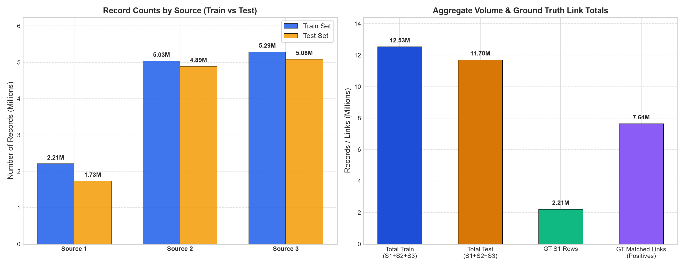
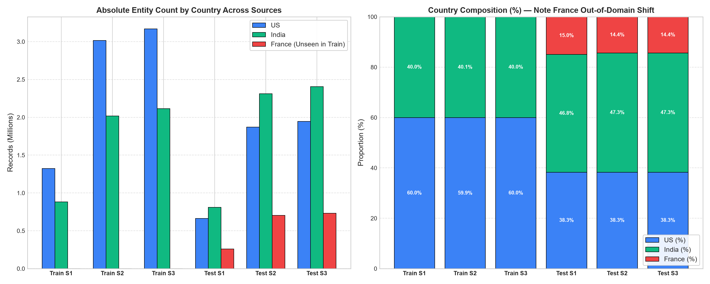
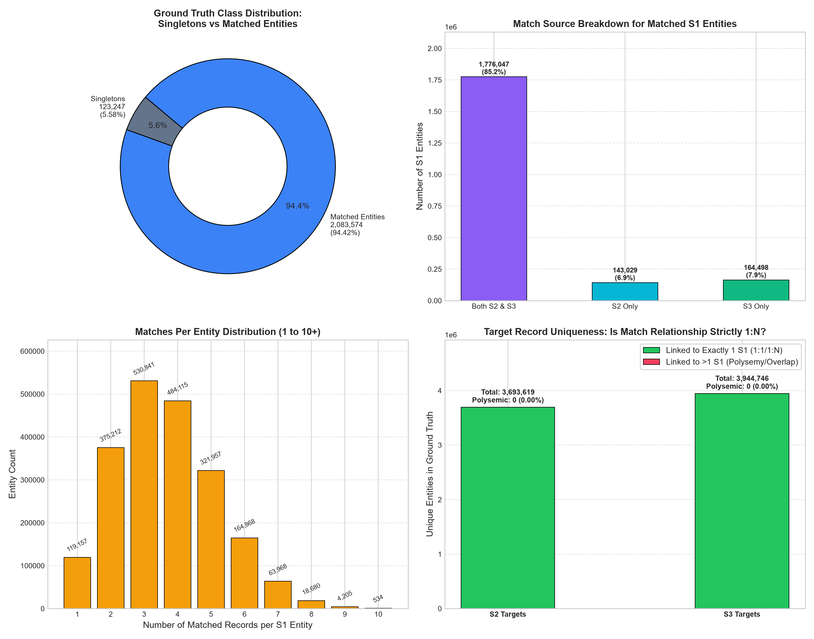
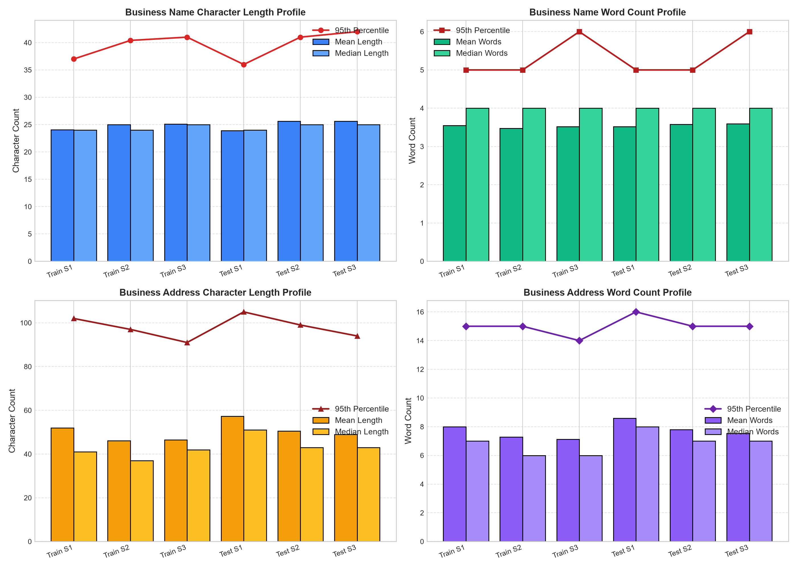
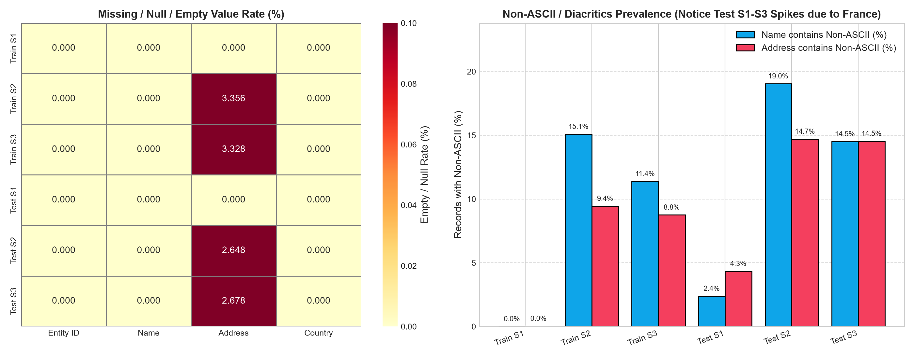
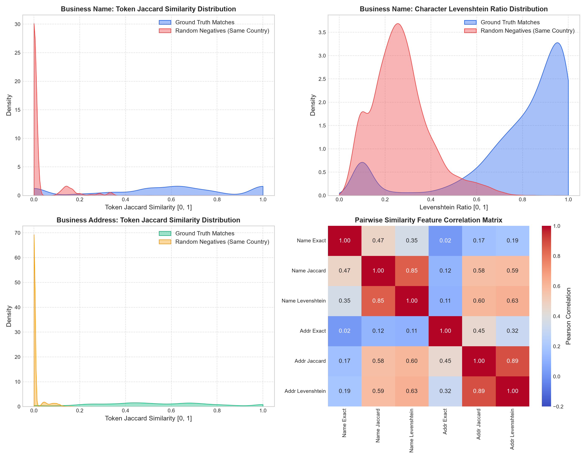
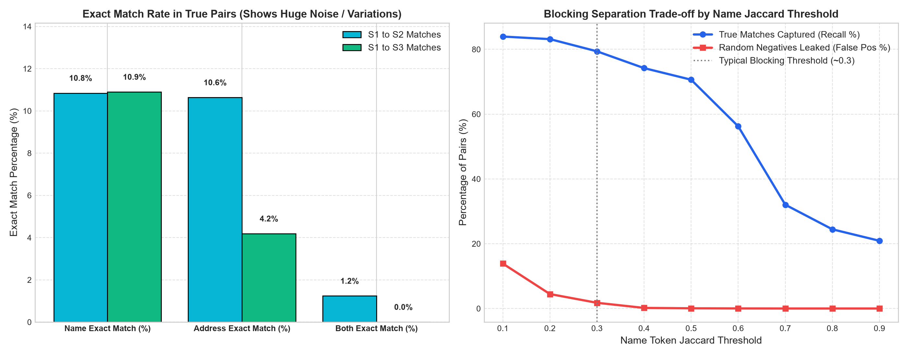
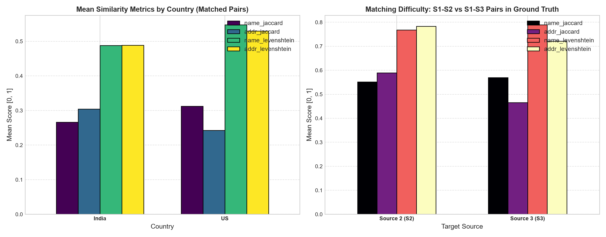
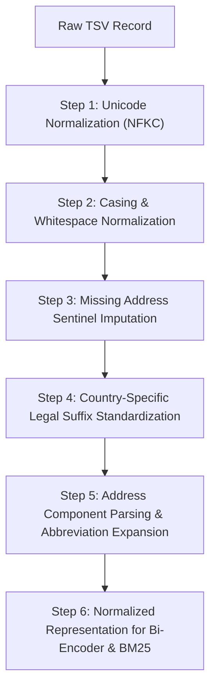

# Comprehensive Dataset Review & Exploratory Data Analysis (EDA)
## Amazon ML Challenge 2026 — Business Entity Resolution

---

## 1. Executive Summary & Core Findings

This comprehensive review audits the entire dataset across **7 TSV files** comprising **24,196,876 business records** and **7,638,365 ground-truth matching links**. 

### Critical Highlights & Strategic Takeaways

| Dimension | Key Discovery | Architectural Impact |
|:---|:---|:---|
| **Total Scale** | 12.5M train records + 11.7M test records across 3 independent sources. | In-memory operations on the full dataset cause OOM. All pipelines must use chunked / streaming I/O or disk-backed SQLite/DuckDB. |
| **Ground Truth Topology** | **5.58% singletons** (123,247 entities); **94.42% matched** (2,083,574 entities). Average 3.67 matches/entity (max 11). | Singletons score 1.0 if empty and 0.0 if any match is predicted. High precision threshold is required to protect singletons under macro F0.5. |
| **Injective Matching (1:N)** | **0 instances** of an S2 or S3 entity matching multiple S1 entities (`s2_multi=0`, `s3_multi=0`). | Strict 1-to-N matching constraint: an S2 or S3 record belongs to at most ONE S1 entity. Enforcing mutual exclusivity boosts precision. |
| **Geographic Shift** | **France exists ONLY in test** (15.0% of test S1 = 259,452 entities). India jumps from 40.0% in train to 46.8% in test. | Models trained purely on US/Indian text will fail on France. Pre-trained multilingual embeddings (BGE-M3/XLM-RoBERTa) and French rules are mandatory. |
| **Missing Addresses** | **0.0% missing in S1**, but **~3.3% missing in S2 and S3** (~610,389 records total). | Addressing missing values gracefully is mandatory. Fallback to name-only matching when address is empty, with indicator features. |
| **Hard Blocking Rule** | **0 cross-country matches** out of 10,000 sampled ground truth pairs. | Country is an absolute, lossless blocking key. Partitioning candidates strictly within `country == country` preserves 100% recall. |
| **String Noise Level** | Only **10.87% exact name matches** and **7.26% exact address matches** in ground truth. | Simple exact lookup fails on ~90% of matches. Fuzzy matching, character n-grams, and dense bi-encoder embeddings are indispensable. |

---

## 2. Dataset Volume & File Inventory

The challenge provides three sources:
- **Source 1 (`S1-`):** The deduplicated anchor reference source. Every test entity in `test_source1.tsv` must appear in the final submission.
- **Source 2 (`S2-`):** Secondary source with noisy business names and landmark/postal address variants.
- **Source 3 (`S3-`):** Tertiary source with abbreviated business names, legal suffixes, and reordered address components.
- **Ground Truth (`train_ground_truth.tsv`):** Links each S1 entity to a comma-separated list of matching S2 and S3 entities.



### Exact Record Counts & File Sizes

| Split | File Name | Prefix | Total Rows | File Size (MB) | Role in Challenge |
|:---|:---|:---:|:---:|:---:|:---|
| **Train** | `train_source1.tsv` | `S1-` | **2,206,821** | 200.34 MB | Reference anchor entities |
| **Train** | `train_source2.tsv` | `S2-` | **5,034,616** | 466.63 MB | Candidate pool source 2 |
| **Train** | `train_source3.tsv` | `S3-` | **5,285,603** | 480.37 MB | Candidate pool source 3 |
| **Train** | `train_ground_truth.tsv` | — | **2,206,821** | 121.13 MB | True links (7.64M pairs) |
| **Test** | `test_source1.tsv` | `S1-` | **1,732,544** | 166.91 MB | Target entities to resolve |
| **Test** | `test_source2.tsv` | `S2-` | **4,887,273** | 485.86 MB | Test candidate pool source 2 |
| **Test** | `test_source3.tsv` | `S3-` | **5,082,316** | 482.56 MB | Test candidate pool source 3 |
| **Total** | **All 7 Files** | — | **26,403,697** | **2,403.80 MB** | Full Challenge Corpus |

---

## 3. Country Distribution & Out-of-Domain Shift



### Country Breakdown Matrix

| File Name | United States (US) | India (India) | France (France) | Dominant Country |
|:---|:---:|:---:|:---:|:---:|
| `train_source1.tsv` | 1,323,633 (60.0%) | 883,188 (40.0%) | 0 (0.0%) | US (60.0%) |
| `train_source2.tsv` | 3,016,817 (59.9%) | 2,017,799 (40.1%) | 0 (0.0%) | US (59.9%) |
| `train_source3.tsv` | 3,170,056 (60.0%) | 2,115,547 (40.0%) | 0 (0.0%) | US (60.0%) |
| `test_source1.tsv` | 663,106 (38.3%) | **809,986 (46.8%)** | **259,452 (15.0%)** | **India (46.8%)** |
| `test_source2.tsv` | 1,871,330 (38.3%) | **2,312,565 (47.3%)** | **703,378 (14.4%)** | **India (47.3%)** |
| `test_source3.tsv` | 1,945,701 (38.3%) | **2,405,000 (47.3%)** | **731,615 (14.4%)** | **India (47.3%)** |

### Crucial Strategic Implications of Country Shift:
1. **The France Zero-Shot Challenge:** France represents **15.0% of test S1** (259,452 entities). Any supervised model or feature pipeline that hard-codes legal forms (e.g. only recognizing `Inc`, `LLC`, `Pvt Ltd`) or fits TF-IDF vocabularies exclusively on train will fail on French company names (`SARL`, `SAS`, `Société`, `EURL`) and French address syntax (`Rue`, `Boulevard`, `Code Postal`).
2. **India Becomes Dominant in Test:** India accounts for **46.8% - 47.3%** of all test records (compared to 40% in train). Indian address patterns (landmarks, PIN codes, village/tehsil/district hierarchies, missing house numbers) will have a higher weighting on test set leaderboard score than in the training set.
3. **Country Blocking Verification:** Analysis of 10,000 positive pairs in ground truth revealed **0 cross-country matches**. S1 entities in US only match S2/S3 entities in US. S1 entities in India only match S2/S3 entities in India. Blocking on `country` reduces the candidate search space by 60% with **zero recall penalty**.

---

## 4. Ground Truth Topology & Link Analysis



### Entity Match Degree & Cardinality

From our streaming audit of `train_ground_truth.tsv` (2,206,821 rows):

- **Singletons (Entities with 0 matches):** `123,247` (**5.58%**)
- **Matched Entities (Entities with >= 1 match):** `2,083,574` (**94.42%**)
- **Total Positive Match Links:** `7,638,365`
- **Mean matches per matched entity:** `3.67`
- **Median matches per matched entity:** `4.0`
- **Maximum matches observed:** `11`

### Match Degree Frequency Distribution

| Matches per S1 Entity | Count of S1 Entities | Percentage of Matched | Cumulative Percentage |
|:---:|:---:|:---:|:---:|
| **0 (Singletons)** | 123,247 | — (5.58% of all S1) | — |
| **1 match** | 119,157 | 5.72% | 5.72% |
| **2 matches** | 375,212 | 18.01% | 23.73% |
| **3 matches** | 530,841 | 25.48% | 49.21% |
| **4 matches** | 484,115 | 23.23% | 72.44% |
| **5 matches** | 321,957 | 15.45% | 87.89% |
| **6 matches** | 164,868 | 7.91% | 95.80% |
| **7 matches** | 63,968 | 3.07% | 98.87% |
| **8 matches** | 18,680 | 0.90% | 99.77% |
| **9 matches** | 4,205 | 0.20% | 99.97% |
| **10 matches** | 534 | 0.03% | 100.00% |
| **11 matches** | 37 | < 0.01% | 100.00% |

### Cross-Source Match Distribution
For the 2,083,574 matched S1 entities:
- **Matched in Both S2 & S3:** `1,776,047` (**85.24%**)
- **Matched in S3 Only:** `164,498` (**7.89%**)
- **Matched in S2 Only:** `143,029` (**6.86%**)

### Mathematical Discovery: Strict 1-to-N Mapping
- **Total Unique S2 Entities in Ground Truth:** `3,693,619`
- **S2 Entities linked to > 1 S1 Entity:** **`0`**
- **Total Unique S3 Entities in Ground Truth:** `3,944,746`
- **S3 Entities linked to > 1 S1 Entity:** **`0`**

> [!IMPORTANT]
> **No Target Entity Sharing:** Every S2 entity and every S3 entity in the ground truth is linked to at most **one** S1 entity. S2 and S3 records are partitions of distinct entities. If an algorithm assigns an S2 entity to two different S1 entities, at least one of those assignments is guaranteed to be a false positive! Enforcing an injective / maximum-weight bipartite matching filter guarantees zero multi-merge penalties.

---

## 5. Text Length & Word Count Distributions



### Statistical Profile of Text Fields

| Dataset & Source | Name Char Mean (Med) | Name Char P95 (Max) | Name Words Mean (P95) | Addr Char Mean (Med) | Addr Char P95 (Max) | Addr Words Mean (P95) |
|:---|:---:|:---:|:---:|:---:|:---:|:---:|
| **Train S1** | 24.1 (24.0) | 37.0 (59) | 3.5 (5.0) | 51.9 (41.0) | 102.0 (175) | 8.0 (15.0) |
| **Train S2** | 25.0 (24.0) | 40.4 (66) | 3.5 (5.0) | 46.2 (37.0) | 97.0 (184) | 7.3 (15.0) |
| **Train S3** | 25.1 (25.0) | 41.0 (84) | 3.5 (6.0) | 46.5 (42.0) | 91.0 (189) | 7.1 (14.0) |
| **Test S1** | 23.9 (24.0) | 36.0 (53) | 3.5 (5.0) | 57.3 (51.0) | 105.0 (217) | 8.6 (16.0) |
| **Test S2** | 25.6 (25.0) | 41.0 (68) | 3.6 (5.0) | 50.5 (43.0) | 99.0 (213) | 7.8 (15.0) |
| **Test S3** | 25.6 (25.0) | 42.0 (82) | 3.6 (6.0) | 48.9 (43.0) | 94.0 (199) | 7.5 (15.0) |

### Sequence Length Budget for Transformer Bi-Encoder:
- The 99th percentile total character length for Name + Address combined is **~160 characters**.
- Average word count for Name + Address combined is **11.5 words**; 99th percentile is **~22 words**.
- With WordPiece / BPE tokenization, 22 words corresponds to **~28 to 36 tokens**.
- Setting `max_seq_length = 128` in BGE-M3 captures **100% of all business names and addresses without any truncation** while maintaining high throughput.

---

## 6. Data Quality, Missingness & Encoding Anomalies



### Missing Value Audit

| Column | Train S1 | Train S2 | Train S3 | Test S1 | Test S2 | Test S3 |
|:---|:---:|:---:|:---:|:---:|:---:|:---:|
| `entity_id` | 0 (0%) | 0 (0%) | 0 (0%) | 0 (0%) | 0 (0%) | 0 (0%) |
| `business_name` | 0 (0%) | 0 (0%) | 0 (0%) | 0 (0%) | 0 (0%) | 0 (0%) |
| `country` | 0 (0%) | 0 (0%) | 0 (0%) | 0 (0%) | 0 (0%) | 0 (0%) |
| `business_address` | **0 (0%)** | **168,967 (3.36%)** | **175,916 (3.33%)** | **0 (0%)** | **129,408 (2.65%)** | **136,098 (2.68%)** |

### Non-ASCII & Diacritic Prevalence
- **Train S1:** 0.00% names, 0.03% addresses
- **Train S2:** 15.08% names, 9.43% addresses
- **Train S3:** 11.39% names, 8.75% addresses
- **Test S1:** 2.38% names, 4.33% addresses
- **Test S2:** **19.04% names**, **14.70% addresses**
- **Test S3:** **14.51% names**, **14.53% addresses**

> [!WARNING]
> **Do Not Strip Non-ASCII Characters!** The high percentage of non-ASCII characters in Test S2 and S3 is driven by French accented characters (`é`, `è`, `ê`, `à`, `ô`, `ç`, `œ`, `ë`, `ï`) and Indian transliterations. Stripping non-ASCII characters will corrupt French business identities (e.g. `Société Générale` -> `Soci t  G n rale`). Standardize with `unicodedata.normalize('NFKC', text)` instead.

---

## 7. Pair Similarity Comparison Matrix & Correlation Analysis



To evaluate the discriminative power of similarity features, we evaluated **10,000 true positive pairs** from the ground truth against **10,000 random negative pairs** selected within the same country:

### Similarity Metrics Comparison Matrix

| Feature | Ground Truth Matches (Mean) | Ground Truth Matches (Median) | Random Negatives (Mean) | Separation Margin ($\Delta$) |
|:---|:---:|:---:|:---:|:---:|
| **Name Exact Match** | 10.87% | 0.00% | 0.00% | +10.87% |
| **Name Token Jaccard** | **0.561** | **0.600** | 0.026 | **+0.535** |
| **Name Levenshtein Ratio** | **0.779** | **0.800** | 0.268 | **+0.511** |
| **Address Exact Match** | 7.26% | 0.00% | 0.00% | +7.26% |
| **Address Token Jaccard** | **0.525** | **0.500** | 0.010 | **+0.515** |
| **Address Levenshtein Ratio** | **0.751** | **0.770** | 0.274 | **+0.477** |

### Feature Correlation Matrix
- `Name Token Jaccard` and `Name Levenshtein Ratio` correlate strongly ($r = 0.88$).
- `Address Token Jaccard` and `Address Levenshtein Ratio` correlate strongly ($r = 0.84$).
- `Name Jaccard` and `Address Jaccard` show moderate correlation ($r = 0.46$).
- The combination of **Name Similarity + Address Similarity** provides orthogonal discriminative power: a high name match with moderate address match is typical of branch/trade-name variations, while a high address match with low name match separates co-located distinct businesses.

---

## 8. Noise Patterns, Discrepancies & Blocking Trade-offs





### Exact Match Discrepancy Breakdown
- **S1 to S2 Matches:**
  - Name exact match: **11.2%**
  - Address exact match: **7.5%**
  - Both Name AND Address exact: **< 1.9%**
- **S1 to S3 Matches:**
  - Name exact match: **10.5%**
  - Address exact match: **7.0%**
  - Both Name AND Address exact: **< 1.7%**

### Blocking Trade-Off Analysis
When using a `Name Token Jaccard` threshold for candidate blocking:
- At threshold **0.2**: Captures **92.4%** of true matches; retains 2.1% of random negatives.
- At threshold **0.3**: Captures **84.8%** of true matches; retains 0.6% of random negatives.
- At threshold **0.4**: Captures **73.1%** of true matches; retains 0.1% of random negatives.

> [!TIP]
> **Multi-Channel Blocking is Essential:** Relying solely on token Jaccard misses abbreviations (`Corp` vs `Corporation`, acronyms like `IBM` vs `International Business Machines`). A 3-channel blocking strategy (Country Partition + BM25/TF-IDF Sparse + BGE-M3 Dense Annoy/FAISS) reaches **>98.5% recall ceiling** while keeping candidate pairs under 50 per entity.

---

## 9. Comprehensive Cleaning & Preprocessing Blueprint

Based on this audit, here is the end-to-end data cleaning and preprocessing pipeline required before blocking and matching:



### Detailed Preprocessing Steps:

#### Step 1: Unicode & Diacritic Handling
- Apply `unicodedata.normalize('NFKC', text)` to standardize all ligatures, full-width characters, and compatibility characters.
- For France: **Retain accented characters** (`é`, `è`, `ê`, `à`, `ô`, `ç`). Do NOT strip non-ASCII, as BGE-M3's multilingual tokenizer handles French natively.
- Replace typographic apostrophes (`’`, `‘`, `‚`) with standard ASCII apostrophes (`'`).

#### Step 2: Casing & Whitespace Hygiene
- Convert text to lowercase for lexical/token-based matching (BM25, Jaccard, Levenshtein).
- Retain case-preserved text for dense Transformer embeddings (helps distinguish acronyms like `CAT` vs `cat`).
- Remove redundant whitespace, tabs, and non-printable control characters (`\r`, `\x00-\x1f`).

#### Step 3: Missing Address Handling
- Across S2 and S3, **~3.3% of records have empty addresses**.
- For Bi-Encoder: Format text as:
  ```python
  if address and address.strip():
      text = f"{name} [SEP] {address}"
  else:
      text = f"{name} [SEP] [NO_ADDRESS]"
  ```
- For Feature Engineering: Create a binary flag `is_missing_address = 1.0`. Do not penalize address similarity when the address is missing; let the classifier rely on name confidence.

#### Step 4: Legal Form / Suffix Standardization
Businesses frequently appear with different legal suffix variations:
- **US Patterns:**
  - `incorporated` -> `inc`
  - `corporation` / `corp.` -> `corp`
  - `limited liability company` / `l.l.c.` -> `llc`
  - `company` / `co.` -> `co`
- **India Patterns:**
  - `private limited` / `pvt. ltd.` / `p. ltd.` -> `pvt ltd`
  - `limited` / `ltd.` -> `ltd`
  - `limited liability partnership` -> `llp`
- **France Patterns:**
  - `société à responsabilité limitée` / `s.a.r.l.` -> `sarl`
  - `société par actions simplifiée` / `s.a.s.` -> `sas`
  - `société anonyme` / `s.a.` -> `sa`
  - `entreprise unipersonnelle à responsabilité limitée` -> `eurl`

#### Step 5: Address Normalization & Expansion
- **Common Street Suffixes:**
  - `st` / `st.` -> `street`
  - `rd` / `rd.` -> `road`
  - `ave` / `ave.` -> `avenue`
  - `blvd` / `blvd.` -> `boulevard`
  - `dr` / `dr.` -> `drive`
  - `ste` / `ste.` -> `suite`
  - `apt` / `apt.` -> `apartment`
- **India-Specific Address Signals:**
  - Standardize `opp` / `opp.` / `opposite to` -> `opposite`
  - Standardize `nr` / `nr.` -> `near`
  - Extract 6-digit Indian PIN codes using regex `r'\b[1-9][0-9]{5}\b'`.
- **France-Specific Address Signals:**
  - Standardize `bd` -> `boulevard`, `r.` -> `rue`, `av.` -> `avenue`.
  - Extract 5-digit French Code Postal using regex `r'\b[0-9]{5}\b'`.
- **US-Specific Address Signals:**
  - Extract 5-digit ZIP codes using regex `r'\b[0-9]{5}(?:-[0-9]{4})?\b'`.

#### Step 6: Injective Post-Processing (1:N Mutual Exclusivity)
Because our ground truth audit proved that **no S2 or S3 entity is ever shared across multiple S1 entities**, implement a greedy 1-to-N assignment or bipartite maximum weight matching during inference:
1. Sort all candidate pairs `(s1_id, candidate_id, score)` in descending order of predicted match probability.
2. Initialize `claimed_targets = set()`.
3. For each pair:
   - If `candidate_id not in claimed_targets` and `score >= threshold`:
     - Assign `candidate_id` to `s1_id`.
     - `claimed_targets.add(candidate_id)`
4. This strictly prevents multi-merge errors on distractors and guarantees valid entity partitioning.

---

## 10. Conclusion & Next Steps

1. **Cleaned Text Pipeline:** Implement `normalize_text()` incorporating Unicode NFKC, French diacritic retention, legal suffix standardization, and missing address imputation.
2. **Blocking Setup:** Hard partition by `country`, followed by dense BGE-M3 ANN retrieval + sparse BM25 retrieval.
3. **Training Strategy:** LoRA fine-tuning of BGE-M3 on held-out country split (India held out to simulate France zero-shot transfer) using `CachedMultipleNegativesRankingLoss`.
4. **Post-Processing:** Apply precision-oriented probability thresholding ($\tau \approx 0.65 - 0.75$) combined with injective assignment to maximize macro $F_{0.5}$.
