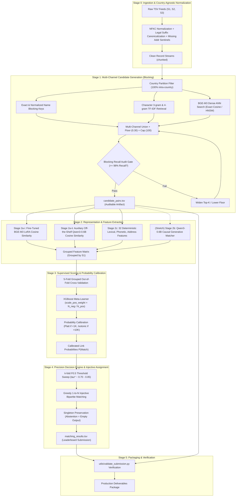

# Master System Architecture & Execution Contract
## Amazon ML Challenge 2026 — Business Entity Resolution

---

## 1. Architectural Philosophy & Governing Principles

Business entity resolution across unlinked, heterogeneous data sources is an asymmetric cost problem. The evaluation metric — **Macro $F_{0.5}$** — penalizes false positive merges roughly twice as heavily as false negative omissions. Furthermore, true singleton entities ($Y_i = \emptyset$) score $1.0$ if left unmatched and $0.0$ if given any erroneous match.

The system architecture is engineered around four core governing principles:

1. **Precision-First Default:** At every layer of the pipeline, when uncertainty is high, the system must default to *abstention* (not merging) rather than speculative linkage.
2. **Sub-Quadratic Candidate Generation with Audit Gates:** Pairwise comparison across the full Cartesian product ($O(|S_1| \times |S_2 \cup S_3|) \approx 2.2\text{M} \times 10.3\text{M} \approx 2.2 \times 10^{13}$ pairs) is computationally impossible. Blocking reduces candidate pairs by $>99.99\%$ while maintaining $>98\%$ recall. Candidate recall sets a hard, non-recoverable ceiling for the entire pipeline and is guarded by an empirical audit gate.
3. **Decoupled Orthogonal Representations:** Dense semantic embeddings, sparse character n-gram similarities, phonetic codes, and exact structural matches capture complementary failure modes. These representations are preserved as independent features for a supervised meta-learner rather than collapsed into an early heuristic score.
4. **Enforced 1-to-$N$ Injective Bipartite Matching:** The ground-truth topology mathematically proves that target records in $S_2$ and $S_3$ are mutually exclusive (`s2_multi=0`, `s3_multi=0`). Greedy bipartite assignment enforces this constraint during decision generation.

---

## 2. End-to-End Five-Stage Pipeline



---

## 3. Detailed Component Contracts

### 3.1 Stage 0: Ingestion & Normalization
- **Input:** Raw tab-delimited files (`train_source*.tsv`, `test_source*.tsv`).
- **Processing:**
  - Unicode NFKC standardization (`unicodedata.normalize('NFKC', text)`).
  - Accented diacritics in French text (`é`, `è`, `ê`, `à`, `ô`, `ç`) are strictly preserved.
  - Country-agnostic legal suffix canonicalization (`Inc`, `Corp`, `LLC`, `Pvt Ltd`, `SARL`, `SAS`).
  - Standard street suffix expansion (`st` $\rightarrow$ `street`, `rd` $\rightarrow$ `road`, `ave` $\rightarrow$ `avenue`).
  - Missing address imputation with explicit sentinel token `[NO_ADDRESS]`.
- **Output:** Cleaned record objects; streaming chunked processing (`50,000` rows/chunk).
- **Specification:** [`docs/03_stage0_normalization.md`](03_stage0_normalization.md).

### 3.2 Stage 1: Candidate Generation (Blocking)
- **Input:** Cleaned records from Stage 0.
- **Processing:**
  - **Country Partitioning:** Candidates are evaluated strictly within the same country partition (zero cross-country ground-truth links observed across 10,000 pairs).
  - **Channel 1 (Dense ANN):** Pre-trained BGE-M3 dense embeddings, Top-50 nearest neighbors via inner product cosine search.
  - **Channel 2 (Sparse Lexical):** Pre-trained BGE-M3 sparse token weights / BM25, Top-50 candidates.
  - **Channel 3 (Token & Phonetic Keys):** Normalized name tokens and Double Metaphone phonetic hashes.
  - **Channel 4 (Address Tokens):** Exact postal code matches and city/street number matches.
  - **Union & Pruning:** Union of all channels, filtered by `SIMILARITY_FLOOR = 0.30` (applied only to dense/sparse candidates), capped at `MAX_CANDIDATES_PER_ENTITY = 100`.
- **Audit Gate:** Blocking recall evaluated on `train_ground_truth.tsv` sliced by country. Must achieve $\ge 98.0\%$ overall recall before downstream training proceeds.
- **Output:** `output/candidate_pairs.tsv` containing all candidate links passing the gate.
- **Specification:** [`docs/04_stage1_blocking.md`](04_stage1_blocking.md).

### 3.3 Stage 2: Feature Engineering & Representations
- **Input:** Candidate pairs from `candidate_pairs.tsv`.
- **Processing:**
  - **Stage 2a-i (Primary Bi-Encoder):** BGE-M3 fine-tuned with rank-64 rsLoRA on competition pairs using `CachedMultipleNegativesRankingLoss` with 4-layer anti-forgetting. Emits dense cosine similarity.
  - **Stage 2a-ii (Auxiliary Bi-Encoder):** Off-the-shelf Qwen3-Embedding-0.6B (Apache-2.0). Evaluated with identical symmetric prompts on both records. Emits auxiliary cosine similarity.
  - **Stage 2b (Stretch Generative Matcher):** Qwen3-0.6B causal LM fine-tuned with LoRA on serialized record pairs (`[COL]`/`[VAL]`). Computes sliced verdict-token probability $P(\text{Yes} \mid \text{pair})$.
  - **Stage 2c (Deterministic Features):** 32 hand-crafted features spanning string distances (Levenshtein, Jaro-Winkler, Jaccard), address match flags (postal code equality, street number equality, missing address indicator), phonetic equality, blocking rank, ambiguity counts, and a derived symmetric country-match flag.
- **Output:** Feature matrix grouped by $S_1$ entity ID.
- **Specifications:** [`docs/05_stage2_features_and_embeddings.md`](05_stage2_features_and_embeddings.md), [`docs/06_stage2a_bge_m3_training_spec.md`](06_stage2a_bge_m3_training_spec.md), [`docs/07_stage2b_qwen3_generative_matcher_spec.md`](07_stage2b_qwen3_generative_matcher_spec.md).

### 3.4 Stage 3: Supervised Scoring & Calibration
- **Input:** Grouped feature matrix from Stage 2.
- **Processing:**
  - **Grouping:** 5-fold cross-validation strictly grouped by $S_1$ entity ID to prevent data leakage across pairs.
  - **Model:** XGBoost (`tree_method="hist"`, `max_depth=4`, `learning_rate=0.03`, `subsample=0.85`, `colsample_bytree=0.85`, `reg_alpha=0.1`, `reg_lambda=1.0`).
  - **Class Imbalance:** `scale_pos_weight = N_neg / N_pos` computed at runtime from the actual candidate set.
  - **Monotonic Constraints:** $+1$ monotonic constraint enforced on all similarity features (string similarity, bi-encoder cosine). Monotonic constraints are strictly prohibited on country-match flags.
  - **Calibration:** Out-of-fold probability calibration using Platt scaling ($<1,000$ OOF positives) or Isotonic regression ($>10,000$ OOF positives).
- **Output:** Calibrated match probability $P(\text{Match}) \in [0.0, 1.0]$ per candidate pair.
- **Specification:** [`docs/08_stage3_scoring_and_calibration.md`](08_stage3_scoring_and_calibration.md).

### 3.5 Stage 4: Decision Engine & Injective Assignment
- **Input:** Calibrated candidate probabilities from Stage 3.
- **Processing:**
  - **Threshold Sweep:** Sweep cutoffs $\tau \in [0.05, 0.95]$ with step $0.01$ over out-of-fold predictions, evaluating full macro $F_{0.5}$ (including singleton penalty/reward). Optimal cutoff typically resolves to $\tau^* \approx 0.70 - 0.85$.
  - **Injective Bipartite Matching:** Candidates exceeding $\tau^*$ are processed in descending order of score. An $S_2$ or $S_3$ entity is assigned to at most one $S_1$ entity; subsequent competing claims are rejected.
  - **Singleton Handling:** Entities with zero candidates surviving thresholding and injective assignment are emitted as empty strings (abstention).
- **Output:** Final submission artifact `output/matching_results.tsv`.
- **Specification:** [`docs/09_stage4_decision_and_singletons.md`](09_stage4_decision_and_singletons.md).

### 3.6 Stage 5: Packaging & Submission Validation
- **Input:** `output/matching_results.tsv`, `output/candidate_pairs.tsv`, `test_source1.tsv`.
- **Validation:** Executed via `utils/validate_submission.py`. Asserts row count matches test $S_1$ exactly, no duplicate IDs, no self-matches, and all predicted matches exist in candidate pairs.
- **Packaging:** Assembles code, documentation, and artifacts for the final audited challenge package.

---

## 4. Execution Roadmap: v1 Baseline vs Stretch Goals

To ensure complete, risk-free execution within the competition timeline on an **NVIDIA RTX 3060 12GB**, components are strictly partitioned into **v1 Baseline (Committed)** and **Stretch (Conditional)**:

```
[Phase 1: Environment & Reconnaissance]
  00_verify_environment.ps1 (GPU, CUDA, PyTorch, dependencies)
  00_run_eda.ps1 (Dataset audit, verify distributions)
        │
        ▼
[Phase 2: Blocking & Recall Audit Gate]
  01_run_blocking.ps1 (Stage 0 normalization + Stage 1 candidate generation)
  01_audit_blocking_recall.ps1 (MANDATORY GATE: >= 98% recall across US & India)
        │
        ▼
[Phase 3: Core Representation & Baseline Classifier]
  02a_train_bi_encoder.ps1 (BGE-M3 rsLoRA rank-64 fine-tuning with anti-forgetting)
  02c_extract_pair_features.ps1 (32 deterministic features + bi-encoder cosine)
  03_train_gbm.ps1 (5-fold Grouped-OOF XGBoost training + probability calibration)
  04_tune_threshold.ps1 (Macro F0.5 threshold sweep on OOF predictions)
        │
        ▼
[Phase 4: Submission Generation & Validation]
  05_generate_submission.ps1 (Inference + 1-to-N injective assignment)
  06_validate_submission.ps1 (utils/validate_submission.py formal audit)
        │
        ▼
  [BASELINE V1 DELIVERABLE SECURED & SHIPPABLE]
        │
        ▼
[Phase 5: Conditional Stretch Enhancements (Only if time permits)]
  ├── Step A: Stage 2a-ii Qwen3-Embedding-0.6B auxiliary feature (free inference)
  ├── Step B: Stage 2b Qwen3-0.6B Causal Generative Matcher (arXiv:2607.24688)
  └── Step C: DART boosting mode & TreeSHAP feature attribution
```

---

## 5. System Stop Rules & Failure Recovery

| Pipeline State | Symptom / Failure Mode | Root Cause | Automated Recovery / Mitigation Rule |
|---|---|---|---|
| **Stage 1 Gate** | Blocking recall on held-out country $< 98.0\%$. | Vocabulary gap or restrictive similarity floor. | 1. Lower `SIMILARITY_FLOOR` from $0.30$ to $0.20$.<br>2. Expand `TOP_K_DENSE` from $50$ to $75$.<br>3. Re-verify audit. Do not proceed to Stage 2 until resolved. |
| **Stage 2a Training** | CUDA Out-of-Memory during bi-encoder fine-tuning. | Activation spikes or excessive chunk size. | 1. Reduce `physical_batch_size` from $48$ to $32$.<br>2. Reduce `mini_batch_size` from $16$ to $8$ in `CachedMultipleNegativesRankingLoss`.<br>3. Verify `max_seq_length = 80`. |
| **Stage 2a Anti-Forgetting** | Cross-country validation gap (US $\rightarrow$ India) $> 5.0\%$. | Overfitting to US-specific patterns. | 1. Increase self-distillation weight $\lambda_{\text{distill}}$ from $0.10$ to $0.15$.<br>2. If gap persists, fall back to off-the-shelf BGE-M3 base weights. |
| **Stage 2b Stretch Gate** | Qwen3-0.6B generative matcher fails held-out country gate. | Language / distribution collapse on unseen data. | **Hard Drop:** Completely exclude Stage 2b feature column from the Stage 3 GBM. Baseline v1 remains fully functional. |
| **Stage 3 Training** | XGBoost validation AUCPR diverges from train AUCPR. | Over-specialization on specific trees. | 1. Increase `reg_alpha` to $0.5$ and `reg_lambda` to $2.0$.<br>2. Activate DART booster mode (`booster="dart"`). |
| **Stage 5 Validation** | `validate_submission.py` flags missing $S_1$ entity IDs. | Silent omission of singleton entities. | Ensure all test $S_1$ IDs from `test_source1.tsv` are initialized in output dictionary; singletons must be present with empty match string. |

---

## 6. Submission Deliverables Protocol

Per the official competition guidelines, deliverables follow two distinct schedules:

1. **Leaderboard Uploads (Round-1 Continuous Submissions):**
   - File: `output/matching_results.tsv` only.
   - Format: Tab-separated (`entity_id\tmatched_ids`).
   - S1 row count must exactly match `test_source1.tsv` ($1,732,544$ rows).
2. **Final Audited Package (For Qualifying Teams):**
   - Clean zipped archive containing:
     - `output/matching_results.tsv` (Leaderboard submission).
     - `output/candidate_pairs.tsv` (Auditable candidate blocking output; strict superset of matches).
     - `code/business_entity_resolution/` (Complete, runnable Python codebase).
     - `scripts/` (Automated PowerShell orchestration runners).
     - `Documentation_template.md` (Detailed methodology write-up with zero page limit).
