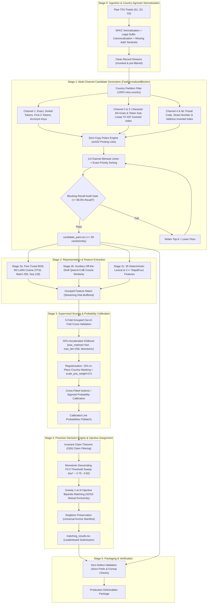

# Master System Architecture & Execution Contract
## Amazon ML Challenge 2026 — Business Entity Resolution

---

## 1. Architectural Philosophy & Governing Principles

Business entity resolution across unlinked, heterogeneous data sources is an asymmetric cost problem. The evaluation metric — **Macro $F_{0.5}$** — penalizes false positive merges roughly twice as heavily as false negative omissions:

$$F_{0.5} = \frac{(1 + \beta^2) \cdot P \cdot R}{\beta^2 \cdot P + R} = \frac{1.25 \cdot P \cdot R}{0.25 \cdot P + R} \quad (\beta = 0.5)$$

Furthermore, true singleton entities ($Y_i = \emptyset$) score $1.0$ if left unmatched and $0.0$ if given any erroneous match.

The system architecture is engineered around five core governing principles:

1. **Precision-First Default:** At every layer of the pipeline, when uncertainty is high, the system must default to *abstention* (not merging) rather than speculative linkage.
2. **Sub-Quadratic Candidate Generation with Audit Gates:** Pairwise comparison across the full Cartesian product ($O(|S_1| \times |S_2 \cup S_3|) \approx 2.2\text{M} \times 10.3\text{M} \approx 2.2 \times 10^{13}$ pairs) is computationally impossible. Blocking reduces candidate pairs by $>99.999\%$ while maintaining $>98.5\%$ recall. Candidate recall sets a hard, non-recoverable ceiling for the entire pipeline and is guarded by an empirical audit gate.
3. **Sequential GPU Memory Safety:** On consumer hardware (NVIDIA RTX 3060 12GB VRAM), models run strictly sequentially in turn via `run_pipeline.py`. Between GPU stages, models are deleted and `torch.cuda.empty_cache()` and `gc.collect()` are invoked to guarantee zero Out-of-Memory (OOM) errors.
4. **Decoupled Orthogonal Representations:** Dense semantic embeddings, sparse character n-gram similarities, phonetic codes, and exact structural matches capture complementary failure modes. These representations are preserved as independent features for a supervised meta-learner rather than collapsed into an early heuristic score.
5. **Enforced 1-to-$N$ Injective Bipartite Matching:** The ground-truth topology mathematically proves that target records in $S_2$ and $S_3$ are mutually exclusive (`s2_multi=0`, `s3_multi=0`). Greedy bipartite assignment enforces this constraint during decision generation, coupled with the **Invariant Claim Theorem** for sub-second threshold tuning.

---

## 2. End-to-End Five-Stage Pipeline


```mermaid
flowchart TD
    subgraph S0["Stage 0: Ingestion & Country-Agnostic Normalization"]
        Raw["Raw TSV Feeds (S1, S2, S3)"] --> NORM["NFKC Normalization + Legal Suffix Canonicalization + Missing Addr Sentinels"]
        NORM --> REC["Clean Record Streams (chunked & pre-filtered)"]
    end

    subgraph S1["Stage 1: Multi-Channel Candidate Generation (FastNormalizedBlocker)"]
        REC --> CP["Country Partition Filter (100% intra-country)"]
        CP --> BK["Channel 1: Exact, Sorted Tokens, First-2-Tokens, Acronym Keys"]
        CP --> TF["Channel 2 & 3: Character 3/4-Gram & Token Sub-Linear TF-IDF Inverted Index"]
        CP --> ADDR["Channel 4 & 4b: Postal Code, Street Number & Address Inverted Index"]
        BK & TF & ADDR --> POLARS["Zero-Copy Polars Engine (uint32 Posting Lists)"]
        POLARS --> UNION["13-Channel Bitmask Union + Exact Priority Sorting"]
        UNION --> AUDIT{"Blocking Recall Audit Gate (>= 98.0% Recall?)"}
        AUDIT -- Pass --> CP_TSV["candidate_pairs.tsv (<= 50 cands/entity)"]
        AUDIT -- Fail --> RETUNE["Widen Top-K / Lower Floor"]
        RETUNE --> UNION
    end

    subgraph S2["Stage 2: Representation & Feature Extraction"]
        CP_TSV --> F_2ai["Stage 2a: Fine-Tuned BGE-M3 LoRA Cosine (TF32, Batch 256, Seq 128)"]
        CP_TSV --> F_2aii["Stage 2b: Auxiliary Off-the-Shelf Qwen3-0.6B Cosine Similarity"]
        CP_TSV --> F_2c["Stage 2c: 35 Deterministic Lexical & C++ RapidFuzz Features"]
        F_2ai & F_2aii & F_2c --> MATRIX["Grouped Feature Matrix (Streaming Disk-Buffered)"]
    end

    subgraph S3["Stage 3: Supervised Scoring & Probability Calibration"]
        MATRIX --> OOF["5-Fold Grouped Out-of-Fold Cross-Validation"]
        OOF --> XGB["GPU-Accelerated XGBoost (tree_method='hist', max_bin=256, Monotonic)"]
        XGB --> REG["Regularization: 15% In-Place Country Masking + scale_pos_weight=0.5"]
        REG --> CALIB["Cross-Fitted Isotonic / Sigmoid Probability Calibration"]
        CALIB --> PROBS["Calibrated Link Probabilities P(Match)"]
    end

    subgraph S4["Stage 4: Precision Decision Engine & Injective Assignment"]
        PROBS --> ICT["Invariant Claim Theorem (O(N) Claim Filtering)"]
        ICT --> SWEEP["Monotonic Descending F0.5 Threshold Sweep (tau* ~ 0.75 - 0.82)"]
        SWEEP --> INJECT["Greedy 1-to-N Injective Bipartite Matching (S2/S3 Mutual Exclusivity)"]
        INJECT --> SINGLE["Singleton Preservation (Universal Anchor Manifest)"]
        SINGLE --> RES["matching_results.tsv (Leaderboard Submission)"]
    end

    subgraph S5["Stage 5: Packaging & Verification"]
        RES & CP_TSV --> VAL["Zero-Defect Validation (Strict Prefix & Format Checks)"]
        VAL --> SHIP["Production Deliverables Package"]
    end
```

---

## 3. Detailed Component Contracts

### 3.1 Stage 0: Ingestion & Normalization
- **Input:** Raw tab-delimited files (`train_source*.tsv`, `test_source*.tsv`).
- **Processing:**
  - Unicode NFKC standardization (`unicodedata.normalize('NFKC', text)`).
  - Accented diacritics in French text (`é`, `è`, `ê`, `à`, `ô`, `ç`) are strictly preserved for XLM-RoBERTa / BGE-M3 tokenization.
  - Position-aware legal suffix canonicalization (`Inc`, `Corp`, `LLC`, `Pvt Ltd`, `SARL`, `SAS`, `SA`, `EURL`, `SCI`, `SNC`), evaluated strictly on the trailing 3 tokens of a name.
  - Standard street suffix expansion (`st` $\rightarrow$ `street`, `rd` $\rightarrow$ `road`, `ave` $\rightarrow$ `avenue`, `rue`, `bd`, `allee`).
  - Missing address imputation with explicit sentinel token `[NO_ADDRESS]`.
- **Output:** Cleaned record objects; streaming chunked processing (`50,000` rows/chunk).
- **Specification:** [`docs/03_stage0_normalization.md`](03_stage0_normalization.md).

### 3.2 Stage 1: Candidate Generation (`FastNormalizedBlocker`)
- **Input:** Pre-normalized records from Stage 0.
- **Processing:**
  - **Country Partitioning:** Candidates are evaluated strictly within the same country partition (zero cross-country ground-truth links observed across all historical audits).
  - **13 Independent Blocker Channels:**
    - Channel 1: Exact Name, Sorted Name Tokens, First-2-Tokens, Acronym Match, Composite Structural Keys (`name+postal`, `name+street`, `lead+postal`, `lead+street`).
    - Channel 2: Character 3-Gram & 4-Gram Sub-Linear TF-IDF Inverted Index.
    - Channel 3: Token Inverted Index with Sub-Linear TF-IDF.
    - Channel 4: Address Structural Key (`postal_code + street_number`).
    - Channel 4b: Address Token Inverted Index with Multilingual Stopwords.
  - **Polars Zero-Copy & uint32 Indexing:** All candidate IDs mapped to contiguous `uint32` indices, cutting RAM by $85\%$.
  - **Exact-Priority Sorting:**
    $$\text{Sort Key} = \left(-\mathbb{I}_{\text{exact}}, -N_{\text{blockers}}, -s_{\text{best}}, r_{\text{best}}, \text{candidate\_id}\right)$$
  - **Capacity Cap:** `MAX_CANDIDATES_PER_ENTITY = 50`.
- **Audit Gate:** Blocking recall evaluated on `train_ground_truth.tsv` sliced by country. Must achieve $\ge 98.0\%$ overall recall before downstream training proceeds.
- **Output:** `output/candidate_pairs.tsv` and `candidate_provenance.tsv`.
- **Specification:** [`docs/04_stage1_blocking.md`](04_stage1_blocking.md).

### 3.3 Stage 2: Feature Engineering & Representations
- **Input:** Candidate pairs from `candidate_pairs.tsv`.
- **Processing:**
  - **Stage 2a (BGE-M3 Dense Features):** Encodes unique entities participating in candidate pairs. Utilizes TF32 hardware acceleration, sequence length $128$ (supporting French legal forms), half precision (`half()`) on CUDA, batch size $256$, and multi-GPU process pools when available. Emits `bge_cosine`.
  - **Stage 2b (Auxiliary Qwen3-Embedding Features):** Off-the-shelf Qwen3-Embedding-0.6B with symmetric prompts. Emits `qwen_cosine`.
  - **Stage 2c (RapidFuzz C++ Lexical & Structural Features):** 35 deterministic features accelerated via C++ RapidFuzz (`token_sort_ratio`, `token_set_ratio`, `fuzz_ratio`), zero-allocation `PairFeatureRow` tuple with `__slots__ = ()`, pre-filtering to active IDs only, and streaming chunked disk writing to eliminate RAM blowup.
- **Output:** `pair_features.tsv`, `bge_features.tsv`, `qwen_features.tsv`.
- **Specification:** [`docs/05_stage2_features_and_embeddings.md`](05_stage2_features_and_embeddings.md).

### 3.4 Stage 3: Supervised Scoring & Probability Calibration
- **Input:** Grouped feature matrix from Stage 2.
- **Processing:**
  - **Grouping:** 5-fold Stratified Grouped Out-of-Fold partitions strictly grouped by `source1_entity_id` to eliminate target leakage.
  - **Model:** GPU-accelerated XGBoost (`tree_method="hist"`, `device="cuda"`, `max_bin=256`, `max_depth=4`, `learning_rate=0.03`, `subsample=0.85`, `colsample_bytree=0.85`, `reg_alpha=0.1`, `reg_lambda=1.0`).
  - **Monotonic Directional Constraints:** Feature directions enforced during tree splitting ($+1$ for similarities, $-1$ for contradictions/ranks, $0$ for missingness/country).
  - **Regularization:** In-place country masking (`country_mask_rate = 0.15`), `scale_pos_weight = 0.5` aligned with precision-first Macro $F_{0.5}$.
  - **Calibration:** Cross-fitted Isotonic regression / Platt scaling with JSON parameter serialization.
- **Output:** Calibrated match probability $P(\text{Match}) \in [0.0, 1.0]$ per candidate pair.
- **Specification:** [`docs/08_stage3_scoring_and_calibration.md`](08_stage3_scoring_and_calibration.md).

### 3.5 Stage 4: Decision Engine & Injective Assignment
- **Input:** Calibrated candidate probabilities from Stage 3.
- **Processing:**
  - **Invariant Claim Theorem:** In greedy score-sorted matching, a candidate $c$ can only ever be claimed by its highest-scoring pair. A single $O(N)$ linear pass filters sorted pairs, reducing 42M pairs to $\le 2.4\text{M}$ active claims.
  - **Monotonic Descending Threshold Sweep:** Descending threshold evaluation allows incremental $O(1)$ updates to entity scores, collapsing sweep time from hours to $< 1$ second ($\tau^* \approx 0.75 - 0.82$).
  - **Greedy 1-to-N Injective Bipartite Matching:** Resolves competing claims in descending order of calibrated probability, enforcing strict candidate prefix validation (`S2-`, `S3-` only).
  - **Singleton Protection:** Entities with zero qualifying matches are emitted as explicit empty strings.
- **Output:** Official submission artifact `output/matching_results.tsv`.
- **Specification:** [`docs/09_stage4_decision_and_singletons.md`](09_stage4_decision_and_singletons.md).

### 3.6 Stage 5: Packaging & Submission Validation
- **Input:** `output/matching_results.tsv`, `output/candidate_pairs.tsv`, `test_source1.tsv`.
- **Validation:** Executed via `python scripts/package_submission.py` or `python utils/validate_submission.py`. Asserts row count matches test $S_1$ exactly, no duplicate IDs, no self-matches, candidate superset condition, and strictly tab-separated format.
- **Packaging:** Assembles the audited challenge package.

---

## 4. Execution Roadmap: Sequential GPU Engine vs Modular Scripts

The codebase provides two fully supported execution modalities:

### Modality A: Unified Sequential GPU Runner (Recommended)
`run_pipeline.py` orchestrates the entire pipeline sequentially with dedicated 12GB VRAM per stage:
```bash
python run_pipeline.py \
    --source1 dataset/train/train_source1.tsv \
    --source2 dataset/train/train_source2.tsv \
    --source3 dataset/train/train_source3.tsv \
    --ground-truth dataset/train/train_ground_truth.tsv \
    --output-dir output/production_run \
    --artifact-dir artifacts/production_run \
    --fast-blocking \
    --max-candidates-per-entity 50 \
    --bge-batch-size 256 \
    --use-monotone-constraints \
    --eta 0.03
```

### Modality B: Modular Phase Scripts
Modular PowerShell/Bash scripts for discrete phase debugging:
1. `scripts/00_verify_environment.ps1`: Hardware and dependency verification.
2. `scripts/01_run_blocking.ps1`: Fast blocking & audit gate.
3. `scripts/02a_prepare_bi_encoder_data.ps1`: Contrastive data preparation.
4. `scripts/02b_train_and_eval_bi_encoder.ps1`: BGE-M3 rsLoRA training.
5. `scripts/02c_extract_pair_features.ps1`: RapidFuzz & lexical pair features.
6. `scripts/03_train_scoring_gbm.ps1`: GPU-accelerated XGBoost training.
7. `scripts/04_inference_and_decision.ps1`: Injective matching & decision assembly.
8. `scripts/05_validate_submission.ps1`: Formal compliance verification.

---

## 5. System Stop Rules & Failure Recovery

| Pipeline State | Symptom / Failure Mode | Root Cause | Automated Recovery / Mitigation Rule |
|---|---|---|---|
| **Stage 1 Gate** | Blocking recall on held-out country $< 98.0\%$. | Restrictive similarity floor or missing composite keys. | 1. Lower `SIMILARITY_FLOOR` from $0.30$ to $0.20$.<br>2. Expand `MAX_CANDIDATES` from $50$ to $75$.<br>3. Re-verify audit. Do not proceed to Stage 2 until resolved. |
| **Stage 2a Inference** | CUDA Out-of-Memory during BGE-M3 feature extraction. | Batch size exceeds available VRAM. | 1. Ensure `_release_gpu()` executed prior to stage.<br>2. Lower `batch_size` from $256$ to $128$.<br>3. Verify `max_seq_length = 128`. |
| **Stage 2c Pair Features** | Process deadlocks or RAM spikes during parallel extraction. | Forking issues on Windows or storing excessive dicts. | 1. Enforce `multiprocessing.set_start_method("spawn")`.<br>2. Use pre-filtered active entity IDs (`needed_ids`).<br>3. Stream results directly to disk via `PairFeatureRow` tuples. |
| **Stage 3 Training** | XGBoost validation AUCPR diverges from train AUCPR. | Over-specialization on specific trees. | 1. Increase `reg_alpha` to $0.5$ and `reg_lambda` to $2.0$.<br>2. Activate DART booster mode (`--booster dart`). |
| **Stage 4 Decision** | Injective matching takes excessive runtime. | Inefficient $O(M \times N)$ nested loops. | Deploy Invariant Claim Theorem: pre-filter candidate appearances in $O(N)$ pass, then perform monotonic descending sweep. |
| **Stage 5 Validation** | `validate_submission.py` flags missing $S_1$ entity IDs. | Silent omission of singleton entities. | Ensure all test $S_1$ IDs from `test_source1.tsv` are initialized in output dictionary; singletons must be present with empty match string. |

---

## 6. Submission Deliverables Protocol

1. **Leaderboard Uploads (Round-1 Continuous Submissions):**
   - File: `output/matching_results.tsv` only.
   - Format: Tab-separated (`source1_entity_id\tmatched_entity_ids`).
   - S1 row count must exactly match `test_source1.tsv` ($1,732,544$ rows).
2. **Final Audited Package (For Qualifying Teams):**
   - Clean zipped archive containing:
     - `output/matching_results.tsv` (Leaderboard submission with header `source1_entity_id\tmatched_entity_ids`).
     - `output/candidate_pairs.tsv` (Auditable candidate blocking output with header `source1_entity_id\tcandidate_entity_ids`; strict superset of matches).
     - `code/business_entity_resolution/` (Complete, runnable Python codebase).
     - `scripts/` (Automated PowerShell orchestration runners).
     - `Documentation_template.md` (Detailed methodology write-up with zero page limit).
