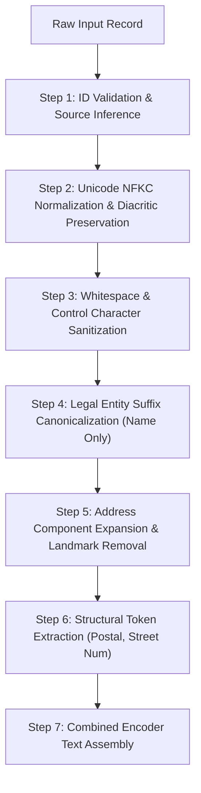

# Stage 0 — Ingestion, Normalization, and Preprocessing Contract
## Amazon ML Challenge 2026 — Business Entity Resolution

---

## 1. Executive Summary & Design Scope

**Stage 0** is the foundational data hygiene layer. It ingests raw tab-delimited files across Source 1 ($S_1$), Source 2 ($S_2$), and Source 3 ($S_3$) and transforms them into standardized, deterministic, auditable record representations.

Stage 0 performs **strictly intra-record normalization**. It does not construct candidate pairs, does not query ground truth, does not invoke external lookups, and does not perform supervised learning. Its normalized representations feed Stage 1 blocking, Stage 2 feature engineering, and transformer encoders.

**Canonical Implementation:**
- Code: `src/normalize.py` and `src/data_builder.py` (`normalize_tsv_file`, `normalize_entity_record`).
- CLI Invocation: `python -m src.data_builder --mode stage0_normalize --data_dir ../../dataset --output_dir ../../dataset/stage0_normalized --splits train test`

---

## 2. Non-Negotiable Invariants

| Invariant ID | Rule | Failure Consequence | Enforcement Mechanism |
|---|---|---|---|
| **INV-1: Open-Set Country** | Country must be treated as an open set of string labels. Never filter or one-hot encode to `{US, India}`. | French test records ($15.0\%$ of test set) would be dropped or misclassified. | Country values pass through as strings; matching is strictly relational (`country_1 == country_2`). |
| **INV-2: Unicode Preservation** | Standardize text using **NFKC** (`unicodedata.normalize('NFKC', text)`). Never strip non-ASCII characters or apply ASCII-folding. | Corrupts French business identities (e.g. `Société Générale` $\rightarrow$ `Soci t  G n rale`). | Retain all valid Unicode letters, marks, and numbers across European and Indic scripts. |
| **INV-3: Explicit Missingness** | Missing addresses ($\approx 3.3\%$ in $S_2/S_3$) must not be imputed with fake addresses or generic strings. | Artificially distorts string similarity and bi-encoder attention. | Impute with explicit sentinel token `[NO_ADDRESS]`; set indicator feature `is_address_missing = 1.0`. |
| **INV-4: Auditability** | Raw name, address, and country fields must be preserved alongside normalized columns. | Inability to debug or verify candidate matches against original feeds. | Multi-column schema retaining both raw and normalized values. |
| **INV-5: Strict TSV Quoting** | All TSV parsing and serializing must use `sep="\t"` and `quoting=csv.QUOTE_NONE`. | Silent column shifting from embedded commas or quotes in business names. | Explicit tab-separated streaming parser with quote escaping. |
| **INV-6: Determinism** | Exactly identical output bytes must be produced for identical input files across all runs. | Nondeterministic cross-validation folds and unstable feature tables. | Pure functions, zero stochastic sampling, fixed dictionary sorting. |
| **INV-7: Streaming I/O** | Large multi-million-row TSVs ($>12.5\text{M}$ train records) must be processed in fixed chunks. | Host RAM exhaustion (OOM crash). | Streamed chunk processing (`chunk_size = 50,000` rows). |

---

## 3. Normalized Record Schema

Each normalized record produced by Stage 0 contains the following fields:

```text
entity_id            : String (e.g. "S1-000000001", "S2-000000042")
source               : Categorical string ("S1", "S2", "S3") derived from entity_id prefix
country_raw          : Original verbatim country string
country_canonical    : Canonicalized country label (e.g. "US", "India", "France")
raw_name             : Unaltered business name as received
raw_address          : Unaltered business address as received
norm_name            : Canonicalized business name (NFKC, lowercase, suffix-standardized)
norm_address         : Canonicalized address (abbreviations expanded, punctuation clean)
encoder_text         : Canonical combined representation: "{norm_name} | {norm_address}"
is_address_missing   : Binary integer flag (1 if raw_address is null/whitespace, else 0)
postal_code          : Extracted numeric/alphanumeric postal code token (or empty)
street_number        : Extracted leading street/building number (or empty)
trailing_segment     : Extracted city/state/postal tail segment
digit_runs           : Tuple of significant numeric tokens for blocking checks
```

---

## 4. Normalization Pipeline & Step-by-Step Rules



### Step 1: ID Validation & Source Inference
- Validate that `entity_id` matches regex `^(S1|S2|S3)-[0-9A-Za-z_-]+$`.
- Derive `source` directly from the prefix: `S1` $\rightarrow$ reference, `S2` $\rightarrow$ vendor feed A, `S3` $\rightarrow$ vendor feed B.

### Step 2: Unicode NFKC Normalization & Diacritic Preservation
- Apply `unicodedata.normalize('NFKC', text)`. This resolves compatibility characters (e.g., `½` $\rightarrow$ `1/2`, ligature `fi` $\rightarrow$ `fi`) and full-width alphanumeric glyphs.
- **Accented characters are strictly retained:** French vowels (`é`, `è`, `ê`, `à`, `ô`, `ç`, `œ`, `ë`, `ï`) are standard letters in French orthography and must never be stripped.
- Normalize typographic punctuation:
  - Curly apostrophes (`’`, `‘`, `‚`) $\rightarrow$ ASCII single quote (`'`).
  - Curly quotes (`“`, `”`) $\rightarrow$ ASCII double quote (`"`).
  - Em/en dashes (`—`, `–`) $\rightarrow$ ASCII hyphen (`-`).

### Step 3: Whitespace & Control Character Sanitization
- Strip non-printable ASCII control codes (`\x00` through `\x1f`, `\x7f`).
- Convert tabs (`\t`) and newlines (`\r`, `\n`) to single spaces.
- Collapse consecutive spaces (`\s+`) into a single space; apply `.strip()`.

### Step 4: Legal Entity Suffix Canonicalization (Trailing Name Context Only)
Legal suffixes are canonicalized to standardized full forms only when appearing at the end of business names (or preceding punctuation), mapping all dotted and abbreviated forms consistently:

- **United States:**
  - `inc.` / `inc` / `incorporated` $\rightarrow$ `incorporated`
  - `corp.` / `corp` / `corporation` $\rightarrow$ `corporation`
  - `l.l.c.` / `llc.` / `llc` / `limited liability company` $\rightarrow$ `limited liability company`
  - `co.` / `co` / `company` $\rightarrow$ `company`
  - `ltd.` / `ltd` / `limited` $\rightarrow$ `limited`
  - `ent.` / `enterprise` / `enterprises` $\rightarrow$ `enterprises`
- **India:**
  - `pvt. ltd.` / `p. ltd.` / `pvt ltd` / `private limited` $\rightarrow$ `private limited`
  - `ltd.` / `ltd` / `limited` $\rightarrow$ `limited`
  - `l.l.p.` / `llp` / `limited liability partnership` $\rightarrow$ `limited liability partnership`
- **France:**
  - `société à responsabilité limitée` / `s.a.r.l.` / `sarl` $\rightarrow$ `sarl`
  - `société par actions simplifiée` / `s.a.s.` / `sas` $\rightarrow$ `sas`
  - `société anonyme` / `s.a.` / `sa` $\rightarrow$ `sa`
  - `entreprise unipersonnelle à responsabilité limitée` $\rightarrow$ `eurl`

> [!CAUTION]
> **Context Sensitivity:** Never apply legal suffix replacements globally inside addresses. For example, replacing `co` with `company` inside an address string would corrupt street names like `Columbia St` or `Colorado Blvd`.

### Step 5: Address Component Expansion & Landmark Removal
- **Street Suffix Expansions:** `st` / `st.` $\rightarrow$ `street`, `rd` / `rd.` $\rightarrow$ `road`, `ave` / `ave.` $\rightarrow$ `avenue`, `blvd` / `blvd.` $\rightarrow$ `boulevard`, `dr` / `dr.` $\rightarrow$ `drive`, `ste` / `ste.` $\rightarrow$ `suite`, `apt` / `apt.` $\rightarrow$ `apartment`, `bd` $\rightarrow$ `boulevard`, `r.` $\rightarrow$ `rue`.
- **Landmark Extraction:** Indian addresses frequently contain relative directions (e.g. `Near State Bank of India`, `Opposite Railway Station`). Strip landmark clauses prefixed with `near`, `opp`, `opposite`, `behind` from the core matching string, but store them as auxiliary tokens.

### Step 6: Structural Token Extraction
Extract key tokens used in Stage 1 blocking and Stage 2 deterministic features:
- **Postal Code:**
  - India: 6-digit PIN code matching `\b[1-9][0-9]{5}\b`.
  - US: 5-digit ZIP matching `\b[0-9]{5}(?:-[0-9]{4})?\b`.
  - France: 5-digit Code Postal matching `\b[0-9]{5}\b`.
- **Street Number:** Leading digit sequence at the start of the address (`^\d+`).
- **Digit Runs:** Tuple of all numeric runs of length $\ge 2$ appearing in name or address.

### Step 7: Encoder Text Assembly
Construct the canonical sequence for transformer bi-encoder encoding (using pipe separator ` | `):
```python
if is_address_missing:
    encoder_text = f"{norm_name} | [NO_ADDRESS]"
else:
    encoder_text = f"{norm_name} | {norm_address}"
```

---

## 5. Verification Gate & Acceptance Criteria

Stage 0 output must satisfy all of the following audit checks before Stage 1 candidate generation may proceed:

1. **Row Count Preservation:** Normalized file row count must match raw TSV row count exactly across all 7 files ($26,435,994$ total rows; $24,229,173$ business records across the 6 entity files).
2. **One-to-One Entity Mapping:** `entity_id` set in normalized output must be an exact $1:1$ match with raw TSV IDs. Zero duplicate IDs.
3. **Diacritic Integrity:** Sample inspection of French test records must show valid accented characters (`Société`, `Hôtel`, `Boulangerie`), with $0\%$ character corruption.
4. **Missingness Flag Consistency:** Every record where `raw_address` is null or empty string must have `is_address_missing == 1` and `encoder_text` containing `[NO_ADDRESS]`.
5. **Deterministic Re-Run:** Executing Stage 0 a second time on the same input files must produce bit-for-bit identical TSV outputs (`diff` returns zero differences).
