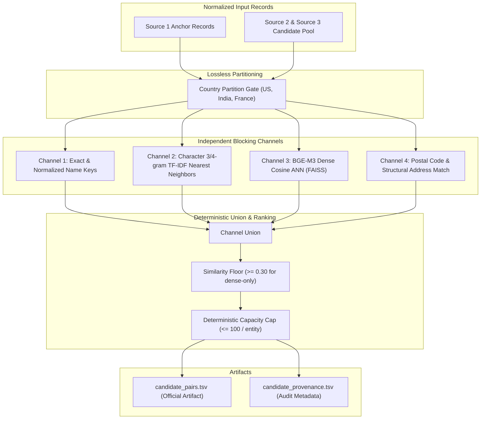

# Stage 1 — Multi-Channel Candidate Generation (Blocking)
## Amazon ML Challenge 2026 — Business Entity Resolution

---

## 1. Executive Summary & Design Scope

**Stage 1 (Blocking)** reduces the massive Cartesian product between Source 1 and the vendor candidate pool ($|S_1| \times |S_2 \cup S_3| \approx 2.2\text{M} \times 10.3\text{M} \approx 2.2 \times 10^{13}$ pairs) down to a high-recall, bounded shortlist of candidate pairs.

### The Hard Recall Ceiling Law
Blocking sets the **non-recoverable recall ceiling** for the entire entity resolution pipeline:
$$\text{Recall}_{\text{End-to-End}} \le \text{Recall}_{\text{Blocking}}$$
Any true match dropped during Stage 1 is permanently lost and will score $0.0$ in precision and recall for that entity. Therefore, Stage 1 is deliberately engineered to be **recall-maximizing** ($\ge 98.0\%$), retaining candidate pairs with auditable provenance for downstream scoring.

**Canonical Implementation:**
- Code: `src/blocking.py` (`MultiChannelBlocker`, `build_candidate_pairs`).
- CLI Invocation: `python -m src.blocking --stage0_dir ../../dataset/stage0_normalized --output_dir ../../output --top_k 50 --max_candidates 100`

---

## 2. Theoretical Grounding: Multi-Channel Independence & Error Reduction

Relying on any single blocking channel creates systematic structural blind spots:
- **Lexical/Token Keys:** Fail on severe spelling mistakes, OCR corruptions, and multi-word reordering.
- **Phonetic Encodings:** Fail on non-phonetic abbreviations, acronyms, and alphanumeric entity IDs.
- **Dense Embeddings:** Fail on rare proper nouns, unique numeric street numbers, or low-frequency entity tokens under-weighted by transformer self-attention.

Because the failure modes of lexical, phonetic, structural, and dense semantic channels are approximately orthogonal, their union achieves exponential reduction in miss rates:

$$\text{Miss Rate}_{\text{Union}} \approx \prod_{c=1}^C \text{Miss Rate}_c$$

If each individual channel misses $15\%$ to $25\%$ of true matches, taking the union of three independent channels reduces the combined miss rate to $(0.20)^3 = 0.008$ ($<1\%$), yielding $\ge 99\%$ theoretical recall while only linearly increasing candidate volume.



---

## 3. Four Blocking Channels

### Channel 1: Exact & Normalized Structural Keys
- **Normalized Name Key:** Exact match on `norm_name` (post NFKC, lowercased, legal suffix stripped).
- **First-2-Token Name Key:** Exact match on the first two significant tokens of the business name.
- **Acronym Key:** Exact match on initialisms for multi-word business names (e.g. `General Electric` $\rightarrow$ `ge`).

### Channel 2: Character N-Gram TF-IDF Retrieval
- Extracts character 3-grams and 4-grams from normalized business names.
- Sub-linear term frequency scaling: $\text{tf} = 1 + \log(\text{count})$.
- Queries S1 against the S2/S3 inverted index using sparse matrix dot products, retrieving the top $K=50$ candidates per entity.
- Highly resilient to character transpositions, missing vowels, and spelling corruptions.

### Channel 3: Dense Semantic ANN Retrieval (BGE-M3)
- Encodes combined `encoder_text` using the pre-trained **BGE-M3** multilingual transformer (568M params, 8192 context window, MIT license).
- Generates 1024-dimensional normalized dense vectors.
- Performs cosine similarity retrieval via FAISS `IndexFlatIP` (exact inner product search on normalized vectors) or `IndexHNSWFlat`.
- Captures semantic equivalence across vendor variations (e.g. `Walmart Supercenter #4021` $\approx$ `Wal-Mart Stores Inc`).
- Retrieves top $K=50$ candidates per entity.

### Channel 4: Structural Address & Postal Code Matching
- Matches candidates sharing an exact postal code (US 5-digit ZIP, India 6-digit PIN, France 5-digit Code Postal).
- Matches candidates sharing an identical leading street number and city token.
- Operates conditionally: bypassed when either record has `is_address_missing == 1`.

---

## 4. Multi-Channel Union, Floor, and Priority Capping

### 4.1 Candidate Aggregation Rules
1. **Union All Channels:** Form the initial candidate set $\mathcal{C}_i = \bigcup_{c=1}^4 \mathcal{C}_{i,c}$ for each S1 entity $i$.
2. **Apply Similarity Floor (`SIMILARITY_FLOOR = 0.30`):**
   - The floor is applied **strictly to candidates introduced solely via dense ANN retrieval**.
   - Candidates discovered via lexical, character TF-IDF, phonetic, or postal channels pass through regardless of dense similarity score. (Discarding lexical/postal matches due to low dense cosine would destroy the very independence multi-channel blocking exists to provide).
3. **Capacity Cap (`MAX_CANDIDATES_PER_ENTITY = 100`):**
   - To bound downstream feature extraction and scoring compute, candidate shortlists exceeding 100 records are trimmed.
   - Trimming uses a **deterministic multi-tier priority sort**, never arbitrary file order:
     1. Highest number of independent matching channels (e.g., candidate retrieved by 3 channels ranks above candidate retrieved by 1).
     2. Exact name or postal code match flag.
     3. Maximum channel similarity score.
     4. Deterministic string sort on `candidate_entity_id` for stable tie-breaking.

---

## 5. Candidate Generation Artifact Specification

Stage 1 produces two persistent artifacts:

### 1. `output/candidate_pairs.tsv` (Official Challenge Artifact)
One line per $S_1$ entity in test/train, matching the official schema:
```text
source1_entity_id    candidate_entity_ids
S1-000000001         S2-000045123,S3-000098412
S1-000000002         S2-000011234
S1-000000003         
```
*(Singletons or entities with zero retrieved candidates emit a tab followed by an empty string).*

### 2. `output/candidate_provenance.tsv` (Internal Audit Artifact)
Row-level breakdown for every individual pair link:
```text
source1_entity_id
candidate_entity_id
candidate_source          (S2 or S3)
blocker_provenance        (comma-separated list of discovering channels)
blocker_count             (integer count of channels that retrieved this pair)
best_blocker_rank         (minimum rank across channels)
best_blocker_score        (maximum similarity score across channels)
country_partition         (US, India, or France)
```

---

## 6. The Mandatory Blocking Recall Audit Gate

Before any Stage 2 feature engineering or Stage 3 classifier training begins, the candidate generation output is audited against `train_ground_truth.tsv` using `01_audit_blocking_recall.ps1`:

### Audit Metric Targets:
- **Pair-Level Recall:** $\ge 98.0\%$ of all $7,638,365$ ground-truth pairs present in candidates.
- **Entity-Level Any-Hit Recall:** $\ge 99.0\%$ of non-singleton S1 entities have at least one true match in candidates.
- **Country-Stratified Recall:**
  - United States ($US$): $\ge 98.2\%$
  - India ($India$): $\ge 97.8\%$
- **Candidate Volume per Entity:**
  - Median: $\le 15$ candidates
  - Mean: $\le 28$ candidates
  - P95: $\le 75$ candidates
  - Maximum: $\le 100$ candidates (hard cap enforced)

### Automated Recovery Rules:
- If overall recall $< 98.0\%$: Lower `SIMILARITY_FLOOR` from $0.30$ to $0.20$ and expand `TOP_K_DENSE` from $50$ to $75$.
- If Indian recall lags behind US by $>1.5\%$: Strengthen landmark clause stripping and PIN code exact blocking.
- Re-run audit until all criteria are satisfied. Never tune downstream matching models on an artificially constrained candidate pool.
