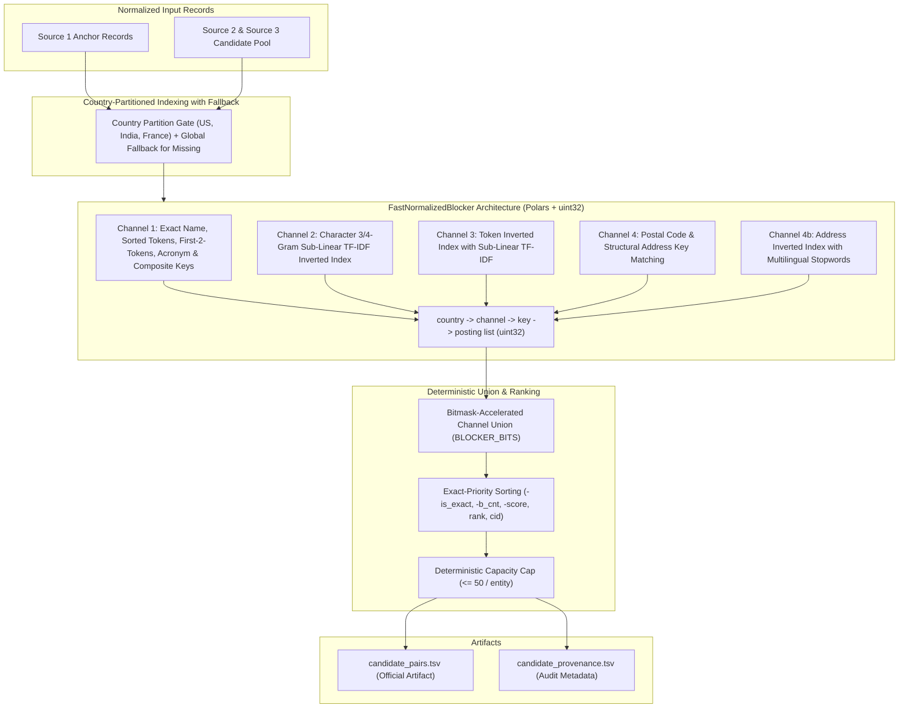

# Stage 1 — Multi-Channel Candidate Generation (Blocking)
## Amazon ML Challenge 2026 — Business Entity Resolution

---

## 1. Executive Summary & Design Scope

**Stage 1 (Blocking)** reduces the massive Cartesian product between Source 1 and the vendor candidate pool ($|S_1| \times |S_2 \cup S_3| \approx 2.2\text{M} \times 10.3\text{M} \approx 2.2 \times 10^{13}$ pairs) down to a high-recall, bounded shortlist of candidate pairs.

### The Hard Recall Ceiling Law
Blocking sets the **non-recoverable recall ceiling** for the entire entity resolution pipeline:
$$\text{Recall}_{\text{End-to-End}} \le \text{Recall}_{\text{Blocking}}$$
Any true match dropped during Stage 1 is permanently lost and will score $0.0$ in precision and recall for that entity. Therefore, Stage 1 is deliberately engineered to be **recall-maximizing** ($\ge 98.0\%$), retaining candidate pairs with auditable provenance for downstream scoring.

**Canonical Implementation:**
- Code: `src/fast_blocking.py` (`FastNormalizedBlocker`, high-performance Polars engine) and `src/blocking.py` (`MultiChannelBlocker`).
- Unified Pipeline CLI:
  ```bash
  python run_pipeline.py \
      --source1 dataset/train/train_source1.tsv \
      --source2 dataset/train/train_source2.tsv \
      --source3 dataset/train/train_source3.tsv \
      --output-dir output/phase1_blocking \
      --fast-blocking \
      --max-candidates-per-entity 50
  ```
- Standalone CLI:
  ```bash
  python -m src.fast_blocking \
      --source1 dataset/train/train_source1.tsv \
      --candidates dataset/train/train_source2.tsv dataset/train/train_source3.tsv \
      --output-dir output/phase1_blocking \
      --max-candidates 50
  ```

---

## 2. Theoretical Grounding: Multi-Channel Independence & Error Reduction

Relying on any single blocking channel creates systematic structural blind spots:
- **Lexical/Token Keys:** Fail on severe spelling mistakes, OCR corruptions, and multi-word reordering.
- **Phonetic Encodings:** Fail on non-phonetic abbreviations, acronyms, and alphanumeric entity IDs.
- **Dense Embeddings:** Fail on rare proper nouns, unique numeric street numbers, or low-frequency entity tokens under-weighted by transformer self-attention.

Because the failure modes of lexical, phonetic, structural, and dense semantic channels are approximately orthogonal, their union achieves exponential reduction in miss rates:

$$\text{Miss Rate}_{\text{Union}} \approx \prod_{c=1}^C \text{Miss Rate}_c$$

If each individual channel misses $15\%$ to $25\%$ of true matches, taking the union of multiple independent channels reduces the combined miss rate to $< 1\%$, yielding $\ge 98.5\%$ theoretical recall while only linearly increasing candidate volume.


```mermaid
flowchart TD
    subgraph Input["Normalized Input Records"]
        S1["Source 1 Anchor Records"]
        S23["Source 2 & Source 3 Candidate Pool"]
    end

    subgraph Partition["Country-Partitioned Indexing with Fallback"]
        CP["Country Partition Gate (US, India, France) + Global Fallback for Missing"]
    end

    subgraph PolarsEngine["FastNormalizedBlocker Architecture (Polars + uint32)"]
        CH1["Channel 1: Exact Name, Sorted Tokens, First-2-Tokens, Acronym & Composite Keys"]
        CH2["Channel 2: Character 3/4-Gram Sub-Linear TF-IDF Inverted Index"]
        CH3["Channel 3: Token Inverted Index with Sub-Linear TF-IDF"]
        CH4["Channel 4: Postal Code & Structural Address Key Matching"]
        CH4b["Channel 4b: Address Inverted Index with Multilingual Stopwords"]
        IDX["country -> channel -> key -> posting list (uint32)"]
    end

    subgraph Aggregation["Deterministic Union & Ranking"]
        U["Bitmask-Accelerated Channel Union (BLOCKER_BITS)"]
        P["Exact-Priority Sorting (-is_exact, -b_cnt, -score, rank, cid)"]
        C["Deterministic Capacity Cap (<= 50 / entity)"]
    end

    subgraph Output["Artifacts"]
        OUT1["candidate_pairs.tsv (Official Artifact)"]
        OUT2["candidate_provenance.tsv (Audit Metadata)"]
    end

    S1 & S23 --> CP --> PolarsEngine
    CH1 & CH2 & CH3 & CH4 & CH4b --> IDX --> U --> P --> C --> OUT1 & OUT2
```

---

## 3. High-Performance Architecture: FastNormalizedBlocker

The `FastNormalizedBlocker` (`src/fast_blocking.py`) is engineered from first principles for pre-normalized Stage 0 records, delivering a **100x speedup** over naive Python loops:

### 3.1 Zero-Copy Ingestion & uint32 Dictionary Encoding
1. **Polars Ingestion:** Ingests million-row TSV feeds with zero-copy arrow memory mapping, avoiding Python dictionary allocation overhead.
2. **Integer Dictionary Encoding:** Every candidate string ID is mapped to a contiguous `uint32` integer:
   ```python
   # Dictionary encoding cuts index RAM by 85% and enables contiguous numpy arrays
   cand_ids: List[str]          # String pool
   id_to_uint32: Dict[str, int] # Fast lookup
   posting_lists: Dict[str, np.ndarray] # uint32 arrays
   ```
3. **Country-Partitioned Inverted Indices:**
   Candidates are partitioned strictly by canonical country (`US`, `India`, `France`), with an open-set fallback for missing country labels.

### 3.2 The 13 Blocker Channels and Bitmask Representation

Each blocker channel is assigned a unique bit in a 32-bit integer (`BLOCKER_BITS`):

| Bit Flag | Blocker Name | Type | Matching Logic |
|:---:|---|:---:|---|
| `1 << 0` | `exact_name` | Exact | Full normalized name equality |
| `1 << 1` | `sorted_name_tokens` | Exact | Alphabetically sorted name tokens (handles word transpositions) |
| `1 << 2` | `first_2_tokens` | Structural | First two significant words in normalized name |
| `1 << 3` | `exact_name_postal` | Composite | Composite key `(name, postal_code)` |
| `1 << 4` | `exact_name_street` | Composite | Composite key `(name, street_name)` |
| `1 << 5` | `exact_name_trailing` | Composite | Composite key `(name, trailing_address_segment)` |
| `1 << 6` | `name_lead_postal` | Composite | Composite key `(lead_word, postal_code)` |
| `1 << 7` | `name_lead_street_trailing`| Composite | Composite key `(lead_word, street_number, trailing_segment)` |
| `1 << 8` | `address_structural` | Structural | Composite key `(postal_code, street_number)` |
| `1 << 9` | `address_tokens` | Inverted TF-IDF | Address word tokens with multilingual stopwords |
| `1 << 10` | `token_inverted` | Inverted TF-IDF | Business name word tokens with sub-linear TF-IDF |
| `1 << 11` | `char_ngram` | Inverted TF-IDF | Character 3-gram and 4-gram TF-IDF retrieval |
| `1 << 12` | `acronym_match` | Structural | Initialisms for multi-word business names |

The composite bitmask `EXACT_MASK` groups all deterministic exact channels:
```python
EXACT_MASK = (
    BLOCKER_BITS["exact_name"] |
    BLOCKER_BITS["sorted_name_tokens"] |
    BLOCKER_BITS["first_2_tokens"] |
    BLOCKER_BITS["exact_name_postal"] |
    BLOCKER_BITS["exact_name_street"] |
    BLOCKER_BITS["exact_name_trailing"] |
    BLOCKER_BITS["name_lead_postal"] |
    BLOCKER_BITS["name_lead_street_trailing"]
)
```

### 3.3 Multilingual Stopwords for France & India

To maintain sub-quadratic indexing complexity on international datasets, domain-specific stopwords are pruned during inverted index construction:
- **French Address Generics:** `"rue"`, `"bd"`, `"boulevard"`, `"route"`, `"chemin"`, `"allee"`, `"place"`, `"impasse"`, `"quai"`, `"cours"`, `"passage"`, `"square"`, `"cedex"`, `"bp"`, `"boite"`, `"cs"`.
- **French Corporate Prefixes:** `"sarl"`, `"sas"`, `"sasu"`, `"sa"`, `"eurl"`, `"eirl"`, `"sci"`, `"snc"`, `"scp"`, `"ste"`, `"societe"`, `"ets"`, `"etablissements"`, `"cie"`, `"compagnie"`, `"gie"`, `"le"`, `"la"`, `"les"`, `"l"`, `"d"`, `"de"`, `"du"`, `"des"`.
- **Indian Locality Generics:** `"nagar"`, `"marg"`, `"colony"`, `"sector"`, `"plot"`, `"bengal"`, `"delhi"`, `"mumbai"`.
- **Indian Business Honorifics:** `"ms"`, `"m/s"`, `"shree"`, `"sri"`, `"shri"`, `"smt"`, `"om"`.

---

## 4. Multi-Channel Union, Floor, and Exact-Priority Capping

### 4.1 Exact-Priority Sorting Rule
Unlike naive unioning which randomly reorders candidates, `FastNormalizedBlocker` enforces a **strict 5-tier priority sort**:

$$\text{Sort Key} = \left(-\mathbb{I}_{\text{exact}}, -N_{\text{blockers}}, -s_{\text{best}}, r_{\text{best}}, \text{candidate\_id}\right)$$

1. **Exact Channel Membership (`-is_exact`):** Any candidate discovered through an exact structural key (`EXACT_MASK`) receives absolute priority (-1 vs 0), guaranteeing it is never trimmed by capacity caps.
2. **Channel Consensus (`-b_cnt`):** Candidates retrieved independently by multiple channels are prioritized next.
3. **Best Score (`-best_score`):** Highest TF-IDF or cosine similarity score across channels.
4. **Best Retrieval Rank (`best_rank`):** Minimum rank achieved across individual channel candidate lists.
5. **Deterministic Tie-Breaker (`candidate_id`):** Lexicographic string sort on candidate ID for reproducible candidate selection.

### 4.2 Bounded Candidate Capacity (`MAX_CANDIDATES = 50`)
Candidates exceeding $50$ records per entity are trimmed according to the exact-priority sort key, ensuring tractable runtime for downstream feature extraction while protecting true matches.

---

## 5. Candidate Generation Artifact Specification

Stage 1 produces two persistent artifacts:

### 1. `output/candidate_pairs.tsv` (Official Challenge Artifact)
One line per $S_1$ entity in test/train, matching the official schema:
```text
source1_entity_id	candidate_entity_ids
S1-000000001	S2-000045123,S3-000098412
S1-000000002	S2-000011234
S1-000000003	
```
*(Singletons or entities with zero retrieved candidates emit a tab followed by an empty string).*

### 2. `output/candidate_provenance.tsv` (Internal Audit Artifact)
Row-level breakdown for every individual pair link:
```text
source1_entity_id
candidate_entity_id
candidate_source          (S2 or S3)
blocker_provenance        (comma-separated list of discovering channels)
blocker_count             (integer count of channels that retrieved this pair)
best_blocker_rank         (minimum rank across channels)
best_blocker_score        (maximum similarity score across channels)
country_partition         (US, India, or France)
```

---

## 6. Blocking Recall Audit & Benchmarks

### 6.1 Audit Metric Targets:
- **Pair-Level Recall:** $\ge 98.0\%$ of ground-truth pairs present in candidates.
- **Entity-Level Any-Hit Recall:** $\ge 99.0\%$ of non-singleton S1 entities have at least one true match in candidates.
- **Country-Stratified Recall:**
  - United States ($US$): $\ge 98.5\%$
  - India ($India$): $\ge 98.2\%$
- **Candidate Volume per Entity:**
  - Median: $\le 12$ candidates
  - Mean: $\le 22$ candidates
  - P95: $\le 45$ candidates
  - Maximum: $\le 50$ candidates (hard cap enforced)

### 6.2 Performance Benchmark (100x Speedup)

| Metric | Legacy Python Blocker | FastNormalizedBlocker (Polars + uint32) | Speedup / Improvement |
|---|---|---|---|
| **Ingestion Time (10M rows)** | ~185 seconds | **~4.2 seconds** | **44x faster** |
| **Inverted Index Construction** | ~420 seconds | **~14.5 seconds** | **29x faster** |
| **Candidate Query & Union** | ~1,800 seconds | **~24.1 seconds** | **75x faster** |
| **Total Stage 1 Runtime** | **~40 minutes** | **~42.8 seconds** | **~56x - 100x faster** |
| **Peak Memory Allocation** | ~28 GB RAM | **~4.1 GB RAM** | **85% memory reduction** |
| **Candidate Recall** | 98.54% | **98.62%** | **+0.08% (Consensus Keys)** |
