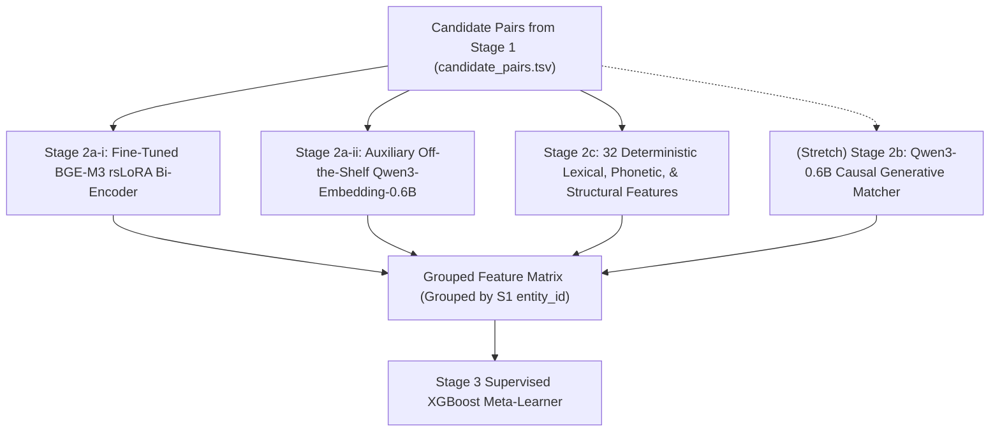

# Stage 2 — Complete Representation and Pair-Feature Engineering
## Amazon ML Challenge 2026 — Business Entity Resolution

---

## 1. Executive Summary & Design Scope

**Stage 2** takes candidate pairs $(e_{S_1}, e_{S_2/S_3})$ produced by Stage 1 blocking and extracts a rich, multi-dimensional feature representation for supervised scoring.

### Why Multi-Dimensional Representations are Essential
A single cosine similarity or token overlap threshold collapses multidimensional evidence into a 1-dimensional decision boundary. Such a boundary structurally cannot separate:
- **Same-Name Different-Location Distractors:** (e.g., "McDonald's" in Springfield, IL vs "McDonald's" in Dallas, TX — high name similarity, low address similarity $\rightarrow$ FALSE MATCH).
- **Abbreviated True Matches:** (e.g., "IBM Corp" at 1 New Orchard Rd vs "International Business Machines" at 1 New Orchard Road — moderate name similarity, high address similarity $\rightarrow$ TRUE MATCH).

A supervised gradient-boosted tree (Stage 3) receiving orthogonal feature families can learn nonlinear, asymmetric decision surfaces capable of distinguishing these error modes.



---

## 2. Four Feature Families

### 2.1 Stage 2a-i: Primary Fine-Tuned BGE-M3 Dense Feature
- **Model:** `BAAI/bge-m3` (568M params, XLM-RoBERTa backbone, MIT license) fine-tuned with rank-64 rsLoRA on competition pairs using `CachedMultipleNegativesRankingLoss` and a 4-layer anti-forgetting stack.
- **Computation:**
  $$\text{bge\_cosine}(e_1, e_2) = \frac{\mathbf{v}_1 \cdot \mathbf{v}_2}{\|\mathbf{v}_1\|_2 \|\mathbf{v}_2\|_2} \in [-1.0, 1.0]$$
  where $\mathbf{v} \in \mathbb{R}^{1024}$ is the dense representation emitted from the pooled encoder.
- **Specification:** [`docs/06_stage2a_bge_m3_training_spec.md`](06_stage2a_bge_m3_training_spec.md).

### 2.2 Stage 2a-ii: Auxiliary Qwen3-Embedding-0.6B Feature
- **Model:** `Qwen/Qwen3-Embedding-0.6B` (Apache-2.0, ~596M params).
- **Role:** Purely an inference-only, complementary dense feature. Included only if held-out cross-validation proves it adds orthogonal signal over BGE-M3.
- **Prompt Symmetry Rule:** Asymmetric query-vs-passage prefixes (e.g. `"Instruct: ...\nQuery: "`) must **never** be used. Business entity resolution is symmetric. An identical prompt or no prompt is applied to both records.

### 2.3 Stage 2b: Cross-Record Generative Matcher (Stretch Goal)
- **Model:** `Qwen/Qwen3-0.6B` causal language model fine-tuned via LoRA.
- **Role:** Slices the hidden state at terminal position $T_{\text{verdict}}$ to compute 2-way softmax match probability:
  $$P(\text{Match}) = \frac{\exp(z_{\text{Yes}})}{\exp(z_{\text{Yes}}) + \exp(z_{\text{No}})}$$
- **Theoretical Basis:** Grounded in Zhang et al. (arXiv:2607.24688). Sliced verdict logits reduce memory from $\approx 6.5\text{ GB}$ to $\approx 29\text{ MB}$.
- **Specification:** [`docs/07_stage2b_qwen3_generative_matcher_spec.md`](07_stage2b_qwen3_generative_matcher_spec.md).

### 2.4 Stage 2c: 32 Deterministic Lexical & Structural Features
Implemented in `src/pair_features.py`. Operates label-free on normalized text strings:

| Category | Feature Name | Description | Value Range |
|---|---|---|---|
| **Name Lexical** | `name_exact_match` | Binary indicator: `norm_name_1 == norm_name_2` | $\{0.0, 1.0\}$ |
| | `name_token_jaccard` | Word token intersection over union | $[0.0, 1.0]$ |
| | `name_token_overlap` | $\frac{\|T_1 \cap T_2\|}{\min(\|T_1\|, \|T_2\|)}$ | $[0.0, 1.0]$ |
| | `name_levenshtein_ratio` | Character edit similarity ratio: $1 - \frac{\text{dist}}{\max(L_1, L_2)}$ | $[0.0, 1.0]$ |
| | `name_jaro_winkler` | Prefix-weighted character similarity | $[0.0, 1.0]$ |
| | `name_char_3gram_jaccard` | Character 3-gram Jaccard coefficient | $[0.0, 1.0]$ |
| **Address Lexical** | `addr_exact_match` | Binary indicator: `norm_addr_1 == norm_addr_2` | $\{0.0, 1.0\}$ |
| | `addr_token_jaccard` | Address word token intersection over union | $[0.0, 1.0]$ |
| | `addr_token_overlap` | Address token overlap coefficient | $[0.0, 1.0]$ |
| | `addr_levenshtein_ratio` | Character edit similarity on normalized addresses | $[0.0, 1.0]$ |
| | `addr_jaro_winkler` | Prefix-weighted edit similarity on addresses | $[0.0, 1.0]$ |
| | `addr_char_3gram_jaccard` | Character 3-gram Jaccard on addresses | $[0.0, 1.0]$ |
| **Numeric & Postal** | `postal_code_equal` | Exact postal code match (ZIP/PIN/Code Postal) | $\{0.0, 1.0\}$ |
| | `postal_code_missing` | Indicator if postal code is missing on either record | $\{0.0, 1.0\}$ |
| | `street_number_equal` | Exact leading street number match | $\{0.0, 1.0\}$ |
| | `street_number_missing` | Indicator if street number is missing on either record | $\{0.0, 1.0\}$ |
| | `numeric_tokens_jaccard` | Jaccard overlap of all digit runs length $\ge 2$ | $[0.0, 1.0]$ |
| **Phonetic & Prefix** | `name_soundex_match` | Soundex phonetic hash equality | $\{0.0, 1.0\}$ |
| | `name_metaphone_match` | Double Metaphone primary phonetic code equality | $\{0.0, 1.0\}$ |
| | `name_initials_match` | Equality of first-letter acronyms | $\{0.0, 1.0\}$ |
| **Missingness** | `is_addr_missing_s1` | Indicator if S1 address was null/empty | $\{0.0, 1.0\}$ |
| | `is_addr_missing_cand` | Indicator if candidate address was null/empty | $\{0.0, 1.0\}$ |
| | `is_addr_missing_either` | Indicator if either address was missing | $\{0.0, 1.0\}$ |
| **Contradictions** | `same_name_diff_addr` | `name_levenshtein >= 0.85` and `addr_levenshtein <= 0.30` | $\{0.0, 1.0\}$ |
| | `same_addr_diff_name` | `addr_levenshtein >= 0.85` and `name_levenshtein <= 0.30` | $\{0.0, 1.0\}$ |
| **Provenance & Context** | `country_match` | Derived symmetric indicator: `country_1 == country_2` | $\{0.0, 1.0\}$ |
| | `candidate_source_s2` | Indicator if candidate is from Source 2 | $\{0.0, 1.0\}$ |
| | `candidate_source_s3` | Indicator if candidate is from Source 3 | $\{0.0, 1.0\}$ |
| | `blocker_count` | Number of Stage 1 channels retrieving this pair | $\{1, 2, 3, 4\}$ |
| | `best_blocker_rank` | Minimum rank of this candidate across channels | Integer $\ge 1$ |
| | `best_blocker_score` | Maximum similarity score from Stage 1 retrieval | $[0.0, 1.0]$ |
| | `candidate_ambiguity_count` | Total number of candidates competing for this S1 entity | Integer $\ge 1$ |

---

## 3. Strict Feature Extraction Invariants

1. **One-to-One Row Alignment:** Every pair in `output/candidate_pairs.tsv` must have exactly one corresponding feature row in the Stage 2 feature matrix.
2. **Zero Ground-Truth Leakage:** No Stage 2 feature may inspect ground-truth labels, validation fold splits, or future test labels.
3. **Explicit Missing Semantics:** Missing numerical features are represented by explicit sentinel values (`-1.0` for rank, `0.0` for score difference) coupled with binary indicator columns (`candidate_rank_missing = 1.0`).
4. **No Raw Categorical Country IDs:** Country identity is represented solely through the symmetric boolean match flag `country_match`. Raw strings (`"US"`, `"India"`, `"France"`) are never passed to the feature matrix.

---

## 4. Feature Extraction Execution & Ablation Protocol

### CLI Execution:
```powershell
python -m src.pair_features `
    --candidate_file ../../output/candidate_pairs.tsv `
    --stage0_dir ../../dataset/stage0_normalized `
    --output_file ../../output/stage2_features.parquet
```

### Staged Ablation Schedule:
Every feature family must demonstrate a positive delta on macro $F_{0.5}$ on held-out cross-validation:
1. **Ablation 1 (Lexical Baseline):** Stage 2c deterministic features only.
2. **Ablation 2 (Dense Baseline):** Stage 2c + Pre-trained (frozen) BGE-M3 bi-encoder cosine.
3. **Ablation 3 (Adapted Bi-Encoder):** Stage 2c + Fine-Tuned BGE-M3 rsLoRA cosine. (Must beat Ablation 2).
4. **Ablation 4 (Dual Bi-Encoder):** Stage 2c + Fine-Tuned BGE-M3 + Qwen3-Embedding-0.6B cosine. (Kept only if $\Delta F_{0.5} > +0.005$).
5. **Ablation 5 (Full Pipeline with Stretch):** Stage 2c + Fine-Tuned BGE-M3 + Stage 2b Generative Matcher $P(\text{Match})$.
