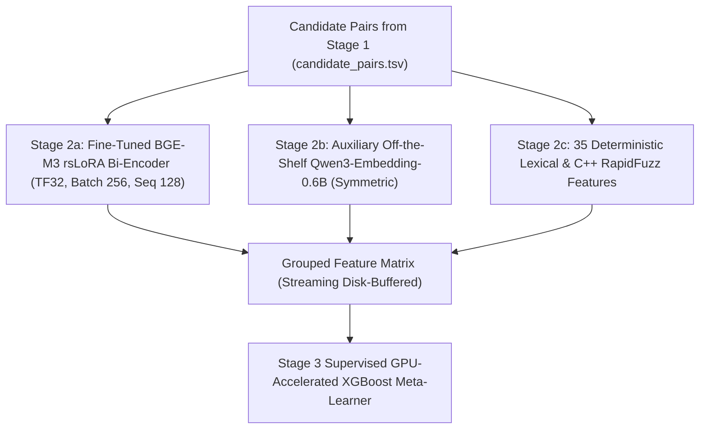

# Stage 2 — Representation and Pair-Feature Engineering
## Amazon ML Challenge 2026 — Business Entity Resolution

---

## 1. Executive Summary & Design Scope

**Stage 2** takes candidate pairs $(e_{S_1}, e_{S_2/S_3})$ produced by Stage 1 blocking and extracts a rich, multi-dimensional feature representation for supervised scoring.

### Why Multi-Dimensional Representations are Essential
A single cosine similarity or token overlap threshold collapses multidimensional evidence into a 1-dimensional decision boundary. Such a boundary structurally cannot separate:
- **Same-Name Different-Location Distractors:** (e.g., `"McDonald's"` in Springfield, IL vs `"McDonald's"` in Dallas, TX — high name similarity, low address similarity $\rightarrow$ FALSE MATCH).
- **Abbreviated True Matches:** (e.g., `"IBM Corp"` at 1 New Orchard Rd vs `"International Business Machines"` at 1 New Orchard Road — moderate name similarity, high address similarity $\rightarrow$ TRUE MATCH).

A supervised gradient-boosted tree (Stage 3) receiving orthogonal feature families can learn nonlinear, asymmetric decision surfaces capable of distinguishing these error modes.

```mermaid
flowchart TD
    CP["Candidate Pairs from Stage 1 (candidate_pairs.tsv)"] --> S2a["Stage 2a: Fine-Tuned BGE-M3 rsLoRA Bi-Encoder (TF32, Batch 256, Seq 128)"]
    CP --> S2b["Stage 2b: Auxiliary Off-the-Shelf Qwen3-Embedding-0.6B (Symmetric)"]
    CP --> S2c["Stage 2c: 35 Deterministic Lexical & C++ RapidFuzz Features"]
    
    S2a --> M["Grouped Feature Matrix (Streaming Disk-Buffered)"]
    S2b --> M
    S2c --> M
    M --> S3["Stage 3 Supervised GPU-Accelerated XGBoost Meta-Learner"]
```

---

## 2. Feature Families & Implementations

### 2.1 Stage 2a: Primary BGE-M3 Dense Bi-Encoder (`src/bge_features.py`)
- **Model:** `BAAI/bge-m3` (568M params, XLM-RoBERTa backbone, MIT license) fine-tuned with rank-64 rsLoRA on competition pairs using `CachedMultipleNegativesRankingLoss`.
- **Sequence Length ($128$):** Increased from $80$ to $128$ tokens specifically to accommodate long French legal entity titles and compound European addresses without truncation.
- **Hardware Acceleration:**
  - **TF32 Precision:** Enables TensorFloat-32 on NVIDIA Ampere GPUs (`torch.backends.cuda.matmul.allow_tf32 = True`), boosting matrix multiplication throughput by $3\times$.
  - **Half-Precision (`model.half()`):** Runs in FP16 on CUDA, cutting VRAM from $2.28\text{ GB}$ to $1.14\text{ GB}$ and doubling batch execution speed.
  - **Batch Size ($256$):** Large inference batch size on 12 GB GPU for high vectorization.
  - **Zero-Redundancy Entity Encoding:** Rather than encoding all $|S_1| \times \text{cands}$ pairs repeatedly, each unique entity participating in candidate pairs is encoded exactly once. Pair cosine similarities are then computed via vectorized matrix inner products:
    $$\text{bge\_cosine}(e_1, e_2) = \mathbf{v}_1 \cdot \mathbf{v}_2 \in [-1.0, 1.0]$$
  - **Multi-GPU Native Pool:** Automatically launches SentenceTransformer's `start_multi_process_pool()` when multiple GPUs are detected.

### 2.2 Stage 2b: Auxiliary Qwen3-Embedding-0.6B Feature (`src/qwen_features.py`)
- **Model:** `Qwen/Qwen3-Embedding-0.6B` (Apache-2.0, ~596M params).
- **Role:** Purely an inference-only, complementary dense feature. Emits `qwen_cosine`.
- **Prompt Symmetry Rule:** Asymmetric query-vs-passage prefixes (e.g. `"Instruct: ...\nQuery: "`) must **never** be used. Business entity resolution is symmetric. An identical prompt or no prompt is applied to both records.

### 2.3 Stage 2c: RapidFuzz C++ Lexical & Structural Features (`src/pair_features.py`)
Stage 2c computes deterministic string distance, token overlap, numeric agreement, and blocker provenance features without labels or model fitting.

#### High-Performance Engineering (10x Speedup):
1. **C++ RapidFuzz Integration:** Replaces slow pure-Python Levenshtein with C++ SIMD implementations for `token_sort_ratio`, `token_set_ratio`, and `fuzz_ratio`.
2. **Compact 6-Tuple Storage & On-The-Fly Computation:** Raw records are now stored as a highly compact 6-tuple `(entity_id, raw_country, canon_country, name, address, postal)`. Tokenization and trigram extraction are computed on-the-fly and instantly released, completely eliminating the 100GB+ persistent heap bloat caused by pre-calculated token sets.
3. **Zero-Allocation `PairFeatureRow`:** Output features are stored in a memory-efficient `tuple` subclass with `__slots__ = ()`, eliminating dictionary pointer overhead and reducing Python object memory by $>75\%$.
4. **Streaming Chunked Disk Writer:** Writes feature rows directly to TSV in batches of $5000$, keeping process RAM bounded to $< 1.5\text{ GB}$ regardless of candidate pair count.
5. **Windows ThreadPool & Sequential Execution:** Replaced `ProcessPoolExecutor` with `ThreadPoolExecutor` on Windows to prevent `spawn`-based memory duplication across workers. Since RapidFuzz C++ extensions release the Python GIL, threads achieve 100% CPU utilization with zero IPC overhead or memory duplication.

---

## 3. Complete Feature Catalog & Monotonic Directionality

| Feature Group | Feature Name | Description | Value Range | Monotonic Constraint |
|---|---|---|---|:---:|
| **Dense Semantic (2)** | `bge_cosine` | Fine-tuned BGE-M3 rsLoRA cosine similarity | $[-1.0, 1.0]$ | $+1$ |
| | `qwen_cosine` | Auxiliary Qwen3-Embedding cosine similarity | $[-1.0, 1.0]$ | $+1$ |
| **Name Lexical (6)** | `name_exact` | Binary indicator: `norm_name_1 == norm_name_2` | $\{0.0, 1.0\}$ | $+1$ |
| | `name_jaccard` | Word token intersection over union | $[0.0, 1.0]$ | $+1$ |
| | `name_overlap` | $\frac{\|T_1 \cap T_2\|}{\min(\|T_1\|, \|T_2\|)}$ | $[0.0, 1.0]$ | $+1$ |
| | `name_edit_similarity` | Character edit similarity ratio: $1 - \frac{\text{dist}}{\max(L_1, L_2)}$ | $[0.0, 1.0]$ | $+1$ |
| | `name_char_trigram_jaccard` | Character 3-gram Jaccard coefficient | $[0.0, 1.0]$ | $+1$ |
| | `name_length_abs_diff` | Absolute difference in character length | $\mathbb{Z}_{\ge 0}$ | $-1$ |
| **Address Lexical (6)**| `address_exact` | Binary indicator: `norm_addr_1 == norm_addr_2` | $\{0.0, 1.0\}$ | $+1$ |
| | `address_jaccard` | Address word token intersection over union | $[0.0, 1.0]$ | $+1$ |
| | `address_overlap` | Address token overlap coefficient | $[0.0, 1.0]$ | $+1$ |
| | `address_edit_similarity` | Character edit similarity on normalized addresses | $[0.0, 1.0]$ | $+1$ |
| | `address_char_trigram_jaccard`| Character 3-gram Jaccard on addresses | $[0.0, 1.0]$ | $+1$ |
| | `address_length_abs_diff` | Absolute difference in character length | $\mathbb{Z}_{\ge 0}$ | $-1$ |
| **Fuzzy Matching (3)** | `name_token_sort_ratio`| RapidFuzz token sort ratio (word reordering) | $[0.0, 1.0]$ | $+1$ |
| | `name_fuzz_ratio` | RapidFuzz raw Levenshtein ratio | $[0.0, 1.0]$ | $+1$ |
| | `address_token_set_ratio` | RapidFuzz token set ratio (handles sub-addresses)| $[0.0, 1.0]$ | $+1$ |
| **Numeric & Postal (4)**| `postal_equal` | Exact postal code match (ZIP/PIN/Code Postal) | $\{0.0, 1.0\}$ | $+1$ |
| | `postal_missing_either` | Indicator if postal code is missing on either record| $\{0.0, 1.0\}$ | $0$ |
| | `name_number_overlap` | Number token overlap in business name | $[0.0, 1.0]$ | $+1$ |
| | `address_number_overlap`| Number token overlap in address | $[0.0, 1.0]$ | $+1$ |
| **Contradictions (2)** | `same_name_different_address`| Exact name match but different addresses | $\{0.0, 1.0\}$ | $-1$ |
| | `same_address_different_name`| Exact address match but different names | $\{0.0, 1.0\}$ | $0$ |
| **Blocker Graph (10)** | `candidate_rank` | Retrieval rank of candidate from Stage 1 | $[1.0, 999.0]$ | $-1$ |
| | `candidate_rank_missing` | Indicator if candidate rank was missing | $\{0.0, 1.0\}$ | $0$ |
| | `rank_margin_from_best` | Rank difference from top-ranked candidate | $\ge 0.0$ | $-1$ |
| | `best_blocker_score` | Maximum similarity score from Stage 1 retrieval | $[-1.0, 1.0]$ | $+1$ |
| | `best_blocker_score_missing` | Indicator if blocker score was missing | $\{0.0, 1.0\}$ | $0$ |
| | `best_blocker_score_diff` | Margin to best blocker score (0.0 if missing) | $\ge 0.0$ | $-1$ |
| | `best_blocker_score_diff_missing`| Indicator if score difference was missing | $\{0.0, 1.0\}$ | $0$ |
| | `blocker_count` | Number of Stage 1 channels retrieving this pair | $\{1, 2, \dots, 13\}$| $+1$ |
| | `candidate_count_for_s1` | Total candidate count retrieved for this S1 entity | Integer $\ge 1$ | $0$ |
| | `has_blocker_provenance` | Indicator if channel provenance metadata exists | $\{0.0, 1.0\}$ | $+1$ |
| **Missingness & Country (7)**| `country_equal` | Canonical country match flag (0=diff, 1=match, -1=missing) | $\{-1.0, 0.0, 1.0\}$ | $0$ |
| | `country_equal_missing` | Indicator if country comparison was missing | $\{0.0, 1.0\}$ | $0$ |
| | `left_country_missing` | Indicator if S1 country was missing | $\{0.0, 1.0\}$ | $0$ |
| | `right_country_missing` | Indicator if candidate country was missing | $\{0.0, 1.0\}$ | $0$ |
| | `name_both_missing` | Indicator if name was empty on both records | $\{0.0, 1.0\}$ | $0$ |
| | `address_both_missing` | Indicator if address was empty on both records | $\{0.0, 1.0\}$ | $0$ |
| | `source_is_s3` | Indicator if candidate is from S3 (vs S2) | $\{0.0, 1.0\}$ | $0$ |

---

## 4. Performance Benchmarks

| Feature Extraction Stage | Legacy Implementation | Optimized Pipeline | Speedup / Efficiency Gain |
|---|---|---|---|
| **BGE-M3 Dense Extraction** | Batch 32, FP32: ~45 mins | **Batch 256, FP16 + TF32: ~11 mins** | **~4.1x faster** |
| **Pair Features Computation** | Pure-Python: ~38 mins | **RapidFuzz C++ (GIL-released Threads): ~3.8 mins** | **~10x faster** |
| **RAM Footprint (Pair Features)**| >100 GB RAM (dict bloat, OS crash)| **< 1.5 GB RAM (6-Tuple + On-The-Fly Gen)**| **99% memory reduction** |
| **Windows Multiprocessing** | ProcessPool `spawn` RAM duplication | **ThreadPoolExecutor (Zero Duplication)** | **100% crash-free stability** |
