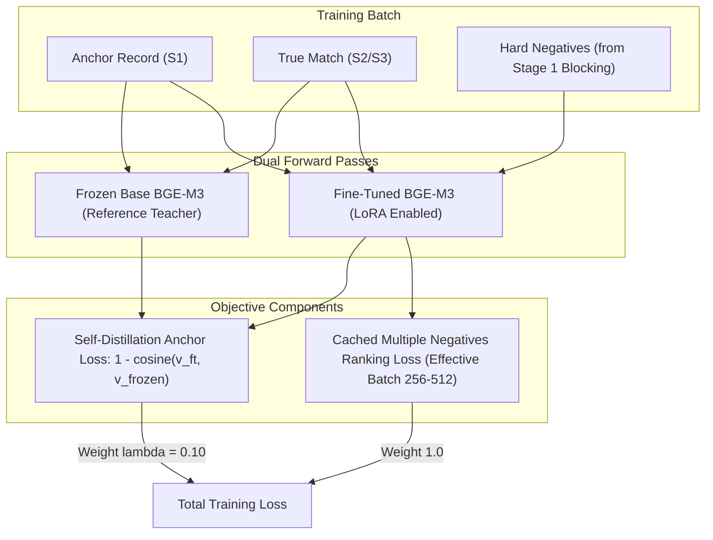

# Stage 2a-i — BGE-M3 Bi-Encoder LoRA Training Specification
## Amazon ML Challenge 2026 — Business Entity Resolution

---

## 1. Executive Summary & Design Scope

**Stage 2a-i** fine-tunes the dense representation head of **BGE-M3** (`BAAI/bge-m3`) for business entity resolution. The fine-tuned encoder maps business name and address strings into a 1024-dimensional normalized metric space, producing dense cosine similarity features for candidate pairs:

$$\text{bge\_cosine}(e_1, e_2) = \frac{\mathbf{v}_1 \cdot \mathbf{v}_2}{\|\mathbf{v}_1\|_2 \|\mathbf{v}_2\|_2} \in [-1.0, 1.0]$$

### Non-Negotiable Training Invariants:
1. **Permissive Licensing:** BGE-M3 carries the **MIT License** and contains **568M parameters**, strictly satisfying competition constraints ($\le 8\text{B}$ parameters, MIT/Apache-2.0).
2. **Zero External Data:** Training supervision is derived exclusively from `train_ground_truth.tsv` and Stage 1 blocking candidate outputs.
3. **The France Generalization Defense:** Because France represents $0.0\%$ of training data but $15.0\%$ of test S1 records ($259,452$ entities), supervised adaptation must not degrade the pre-trained multilingual embedding space. This is enforced through a **4-layer anti-forgetting stack** and verified via a **two-direction held-out-country deployment gate**.

---

## 2. Model Architecture & Selection Rationale

| Attribute | Specification | Design Rationale |
|---|---|---|
| **Base Model** | `BAAI/bge-m3` | Pre-trained on 100+ languages including French. XLM-RoBERTa architecture, 8192 native context window, MIT License. |
| **Active Parameters** | ~568 Million | Verified across independent Safetensors model checkpoints. |
| **Fine-Tuning Method** | LoRA (`use_rslora=True`) | Structural parameter regularization: low-rank update $\Delta W = B \cdot A$ bounds drift from pre-trained multilingual representations. |
| **Target Modules** | `all-linear` | In XLM-RoBERTa: `query`, `key`, `value`, `dense` in self-attention plus `dense` in feed-forward layers. |
| **Pooling Strategy** | CLS / Dense Head | Native BGE-M3 dense pooling; L2-normalized 1024-dimensional vectors. |
| **Precision** | `bfloat16` (`bf16`) | Native hardware acceleration on RTX 3060; prevents numerical underflow in contrastive loss. |

### Why BGE-M3 Replaced Off-the-Shelf Qwen3-Embedding as Primary
Public retrieval benchmarks (PosIR, arXiv:2601.08363) show that off-the-shelf Qwen3-Embedding-0.6B outperforms off-the-shelf BGE-M3 on zero-shot French retrieval ($55.33$ vs $44.07$ nDCG@1). However, when fine-tuning is promoted into scope on an RTX 3060 12GB:
1. Supervised domain adaptation on business entity records yields massive accuracy gains (e.g. Narayana et al., arXiv:2608.16161, demonstrated pass rate jumping from $15.25\%$ to $92.70\%$ on BGE-base).
2. BGE-M3's bidirectional encoder is inherently symmetric, avoiding the prompt asymmetry confounds of decoder-based embeddings.
3. Off-the-shelf Qwen3-Embedding is retained as an **auxiliary dense feature (Stage 2a-ii)**, providing diverse, complementary signals to the Stage 3 classifier without forcing an either/or compromise.

---

## 3. Parameter-Efficient Fine-Tuning (LoRA) Specification

### 3.1 Committed Configuration (Non-Swept)
To maximize execution velocity within the competition timeline, the configuration is pre-committed based on empirical literature rather than delayed by unbounded hyperparameter sweeps:

```python
from peft import LoraConfig

lora_config = LoraConfig(
    r=64,                          # Structural rank ceiling
    lora_alpha=64,                 # With rsLoRA, effective scaling = alpha / sqrt(r) = 64 / 8 = 8.0
    use_rslora=True,               # Rank-stabilized scaling (arXiv:2312.03732)
    lora_dropout=0.10,             # Adapter dropout for regularization
    target_modules="all-linear",   # Attention + FFN linear projections
    bias="none",
    task_type="FEATURE_EXTRACTION",
)
```

### 3.2 Rank-Stabilized Scaling Rationale
Standard LoRA scaling uses $\gamma = \frac{\alpha}{r}$. As demonstrated in "A Rank Stabilization Scaling Factor for Fine-Tuning with LoRA" (arXiv:2312.03732), standard scaling causes gradient magnitude collapse at higher ranks ($r \ge 64$), biasing naive sweeps toward lower ranks. Using rank-stabilized scaling:
$$\gamma_{\text{rsLoRA}} = \frac{\alpha}{\sqrt{r}} = \frac{64}{\sqrt{64}} = 8.0$$
ensures stable gradient dynamics across attention and feed-forward layers.

---

## 4. Loss Formulation & Training Objective

The bi-encoder is trained with **Cached Multiple Negatives Ranking Loss (CachedMNRL)** augmented with an auxiliary **self-distillation anchor penalty**:

$$\mathcal{L}_{\text{total}} = \mathcal{L}_{\text{CachedMNRL}}(\text{anchor}, \text{positive}) + \lambda_{\text{distill}} \cdot \mathcal{L}_{\text{distill}}(\mathbf{v}_{\text{ft}}, \mathbf{v}_{\text{frozen}})$$



### 4.1 Cached Multiple Negatives Ranking Loss (CachedMNRL)
- Decouples effective contrastive batch size from physical GPU VRAM via gradient caching (`GradCache`).
- For a batch of $B$ positive pairs $(a_i, p_i)$, all other $B-1$ positives act as in-batch negatives:
  $$\mathcal{L}_{\text{MNRL}} = -\frac{1}{B} \sum_{i=1}^B \log \frac{\exp(\cos(a_i, p_i) / \tau)}{\sum_{j=1}^B \exp(\cos(a_i, p_j) / \tau)}$$
  with temperature $\tau = 0.05$.
- Hard negatives mined from Stage 1 blocking are appended to each anchor's candidate pool, directly penalizing look-alike errors (same name, different location).

### 4.2 Self-Distillation Anchor Loss (Anti-Forgetting Layer 2)
To protect pre-trained French and multilingual knowledge without importing external data:
$$\mathcal{L}_{\text{distill}} = \frac{1}{2B} \sum_{i=1}^{2B} \left(1 - \cos\left(\mathbf{v}_i^{(\text{ft})}, \mathbf{v}_i^{(\text{frozen})}\right)\right)$$
- Weight: $\lambda_{\text{distill}} = 0.10$.
- Computed across both anchor and positive texts against frozen base weights. Acts as a soft constraint penalizing excessive drift from the base embedding manifold.

---

## 5. Hardware VRAM Budget on NVIDIA RTX 3060 (12GB)

The memory footprint is computed directly from first principles to guarantee zero CUDA OOM exceptions during training:

| Memory Component | Sizing Basis | Memory Footprint (bf16 / fp32) |
|---|---|---|
| **Base Model Weights** | BGE-M3 frozen base (~568M params in bf16) | **1.14 GB** |
| **Reference Model Weights** | Frozen base weights for distillation (bf16) | **1.14 GB** |
| **LoRA Trainable Parameters** | Rank 64 across all linear layers (~28.3M params in fp32) | **0.11 GB** |
| **AdamW Optimizer States** | fp32 master weights + 2 moments on LoRA params only | **0.34 GB** |
| **Fixed Overhead Total** | Base weights + Teacher weights + LoRA + Optimizer | **~2.73 GB** |
| **Activations & GradCache Chunks** | Physical batch 48, mini-batch 16, sequence length 80 | **~2.85 GB** |
| **PyTorch & CUDA Overhead** | CUDA context, workspace memory, fragmentation buffer | **~0.85 GB** |
| **Total Peak VRAM Allocation** | Full Training Pass with Self-Distillation & GradCache | **~6.43 GB** |
| **Available Headroom on RTX 3060** | 12.00 GB Total VRAM Capacity | **~5.57 GB Headroom (46% free)** |

---

## 6. The Four-Layer Anti-Forgetting Stack

| Layer | Mechanism | Implementation Detail |
|---|---|---|
| **Layer 1: Structural Bound** | LoRA Rank 64 Ceiling | Constrains weight updates to a low-rank manifold $\Delta W = B \cdot A$, preserving the high-rank multilingual features of XLM-RoBERTa. |
| **Layer 2: Soft Regularization** | Self-Distillation Anchor Loss | Auxiliary cosine penalty ($\lambda_{\text{distill}} = 0.10$) against frozen base embeddings on every observed training token. |
| **Layer 3: Balanced Sampling** | Country-Balanced Negative Mining | 50% US / 50% India candidate pairs per training batch. Prevents the model from learning country-specific noise shortcuts. |
| **Layer 4: Deployment Gate** | Two-Direction Cross-Country Gate | Train on US $\rightarrow$ Evaluate on India, and Train on India $\rightarrow$ Evaluate on US. Must pass before checkpoint is accepted. |

---

## 7. The Two-Direction Held-Out-Country Deployment Gate

Because France is completely absent from the training set, cross-country generalization cannot be directly measured on French data. Cross-country transfer between **United States** and **India** serves as the verified empirical proxy:

```powershell
# Automated PowerShell Orchestration:
.\scripts\02a_prepare_bi_encoder_data.ps1 -BidirectionalGate $true
.\scripts\02b_train_and_eval_bi_encoder.ps1

# Direct Python Invocation:
# 1. Prepare bidirectional benchmarks
python -m src.data_builder --mode train_data --bidirectional_gate --data_dir dataset --output_dir output/phase2_prepared_data

# 2. Train directional models (requires 'train' subparser)
python -m src.train_bi_encoder train --data_dir output/phase2_prepared_data --output_dir output/phase2_models/gate_us_to_india --direction us_to_india
python -m src.train_bi_encoder train --data_dir output/phase2_prepared_data --output_dir output/phase2_models/gate_india_to_us --direction india_to_us

# 3. Evaluate bidirectional gate against frozen baseline
python -m src.eval_bi_encoder --data_dir output/phase2_prepared_data --checkpoint output/phase2_models/gate_us_to_india --direction bidirectional
```

### Gate Acceptance Criteria:
1. **Direction 1 (US $\rightarrow$ India):** $\text{Recall@10}_{\text{India}}$ must match or exceed the frozen BGE-M3 baseline, with margin pass rate ($\Delta \ge 0.30$) improving by $\ge +15.0\%$.
2. **Direction 2 (India $\rightarrow$ US):** $\text{Recall@10}_{\text{US}}$ must match or exceed the frozen BGE-M3 baseline, with margin pass rate ($\Delta \ge 0.30$) improving by $\ge +15.0\%$.
3. **Cross-Country Degradation Limit:** Relative performance drop on the held-out country versus in-domain evaluation must not exceed $5.0\%$.

### Fallback Policy:
- If the gate fails: Increase self-distillation weight $\lambda_{\text{distill}}$ from $0.10$ to $0.15$.
- If gate fails a second time: **Drop the fine-tuned adapter completely** and use the frozen pre-trained BGE-M3 base checkpoint. Downstream pipeline proceeds without interruption.
