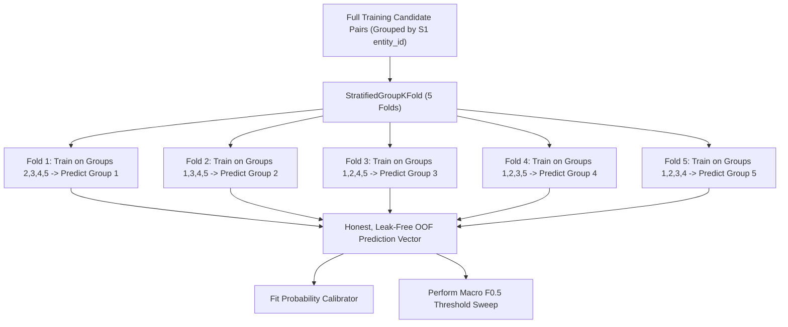
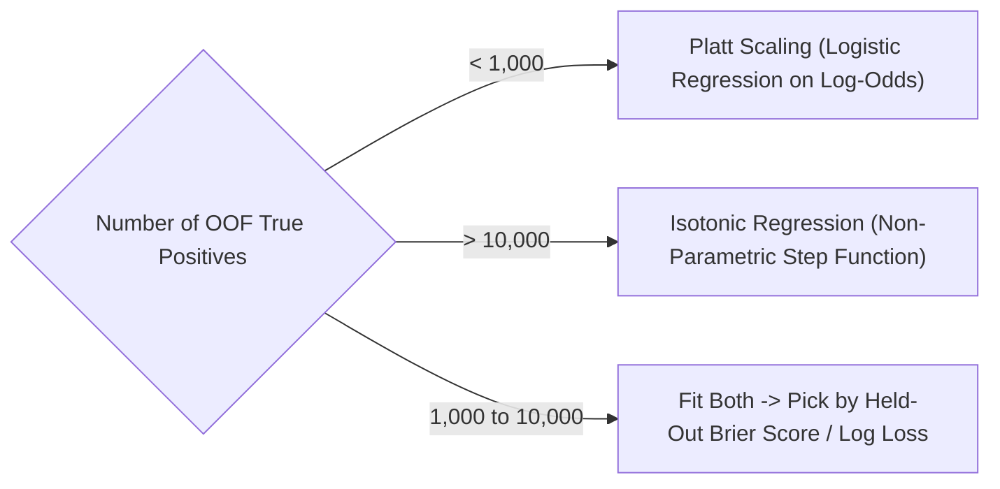

# Stage 3 — Supervised Scoring & Probability Calibration
## Amazon ML Challenge 2026 — Business Entity Resolution

---

## 1. Executive Summary & Design Scope

**Stage 3** serves as the supervised meta-learner of the entity resolution pipeline. It takes the multi-dimensional feature representations produced in Stage 2 (dense bi-encoder similarities, optional generative matcher probabilities, and 35 deterministic lexical/structural features) and learns a calibrated probability of match:

$$P(\text{Match} \mid \mathbf{x}) \in [0.0, 1.0]$$

### Theoretical Grounding: Stacked Generalization
The architecture of Stage 2 feeding Stage 3 is theoretically grounded in **Stacked Generalization** (David H. Wolpert, *Neural Networks*, 1992; Kai Ming Ting & Ian H. Witten, *IJCAI*, 1997). Wolpert proved that training a second-stage model (meta-learner) on out-of-fold predictions from multiple first-stage feature extractors reduces expected generalization error versus relying on any single base model. A Gradient Boosted Decision Tree (GBM) functions as an optimal meta-learner by discovering complex non-linear interactions across orthogonal feature spaces.

**Canonical Implementation:**
- Code: `src/scoring.py` and `src/calibration.py`.
- PowerShell Orchestrator:
  ```powershell
  .\scripts\03_train_scoring_gbm.ps1 -Booster gbtree -CompareDART $true
  ```
- Direct CLI Invocation:
  ```powershell
  python -m src.scoring `
      --mode train `
      --features output/phase2_features_train/pair_features.tsv `
      --bge-features output/phase2_features_train/bge_pair_features.tsv `
      --qwen-features output/phase2_features_train/qwen_pair_features.tsv `
      --qwen-matcher-features output/phase2_features_train/qwen_matcher_features.tsv `
      --ground-truth dataset/train/train_ground_truth.tsv `
      --output-dir output/phase3_gbm `
      --country-mask-rate 0.15 `
      --use-monotone-constraints `
      --booster gbtree `
      --compare-dart `
      --eta 0.03
  ```

---

## 2. Supervised Model Architecture & Hyperparameters

We utilize **XGBoost** (`xgboost.XGBClassifier`) with histogram-based binning (`tree_method="hist"`). The baseline configuration is grounded in Friedman (2001, 2002):

```python
import xgboost as xgb

xgb_params = {
    "objective": "binary:logistic",
    "eval_metric": "aucpr",          # Precision-recall area; robust under extreme class imbalance
    "tree_method": "hist",           # High-throughput exact histogram binning
    "max_depth": 4,                  # Shallow depth prevents leaf memorization
    "learning_rate": 0.03,           # Shrinkage (Friedman 2001) for superior out-of-domain generalization
    "n_estimators": 1000,            # Generous ceiling paired with low learning rate
    "subsample": 0.85,               # Stochastic row subsampling (Friedman 2002)
    "colsample_bytree": 0.85,        # Column subsampling per tree (bagging analogue)
    "min_child_weight": 5,           # Minimum sum of instance weight in a leaf; prevents fitting rare positives
    "reg_alpha": 0.1,                # L1 regularization on leaf weights
    "reg_lambda": 1.0,               # L2 regularization on leaf weights
    "scale_pos_weight": None,        # Dynamically computed: N_neg / N_pos on candidate set
    "seed": 42,
}
```

### 2.1 Shrinkage & Subsampling Rationale (Friedman 2001, 2002)
- **Shrinkage ($\eta = 0.03$):** Jerome Friedman (2001), *"Greedy Function Approximation: A Gradient Boosting Machine"*, proved that small learning rates ($\eta \le 0.1$) empirically yield lower generalization error than large step sizes. Early stopping (50 rounds patience on AUCPR) determines the optimal iteration count rather than relying on arbitrary iteration counts.
- **Stochastic Subsampling ($0.85$):** Friedman (2002), *"Stochastic Gradient Boosting"*, showed that randomly subsampling training rows on each iteration injects variance reduction akin to bagging, dramatically improving generalization on noisy tabular datasets.

### 2.2 Class Imbalance Handling
In `candidate_pairs.tsv`, non-matching candidate pairs heavily outnumber true matching pairs (typically $\approx 15:1$ to $50:1$).
- `scale_pos_weight` is computed dynamically at runtime from the training candidate pool:
  $$\text{scale\_pos\_weight} = \frac{N_{\text{negative pairs}}}{N_{\text{positive pairs}}}$$
- **Warning on Double Weighting:** Never combine `scale_pos_weight` with a custom weighted loss or focal loss. Applying both compounds the reweighting quadratically, which has been shown in real-world community audits to collapse Average Precision from $0.65$ down to $0.03$.

---

## 3. Leakage Prevention: 5-Fold Grouped Out-of-Fold Protocol

Standard `KFold` or `StratifiedKFold` splits at the candidate-pair level, meaning pairs belonging to the same $S_1$ entity would appear in both training and validation folds. This produces severe target leakage.



### Protocol Steps:
1. **Grouping by Entity:** All candidate pairs for an $S_1$ entity reside strictly within a single fold.
2. **Inner Validation:** Within each training fold, an inner grouped split monitors early stopping on AUCPR without leaking the outer validation fold.
3. **Concatenation:** Out-of-fold raw probability scores are concatenated to form a leak-free OOF prediction vector.
4. **Final Model Retraining:** A final model is trained across all labeled pairs using the average best iteration from the 5 folds.

---

## 4. Zero-Shot Generalization Upgrades

### 4.1 Anti-Shortcut Feature Masking (`--country-mask-rate 0.15`)
In training data, true matches exclusively share the same country. A tree model can easily learn a shortcut split: `if country_equal == 1: predict True`. Because France is completely absent from training data, over-relying on this shortcut damages zero-shot transfer.
- During training, we stochastically set `country_equal = -1.0` (missing) and `country_equal_missing = 1.0` on $15\%$ of training samples.
- XGBoost's sparsity-aware split finding learns default split directions that rely on name, address, and dense similarity signals.
- At test inference, feature masking is turned OFF.

### 4.2 Monotonic Constraints
To prevent decision trees from learning spurious non-monotonic artifacts (e.g., predicting that higher name similarity decreases match probability), we enforce directionality constraints:
- **`+1` (Positive Monotonicity):** Enforced on all similarity signals (`name_exact`, `address_exact`, `name_jaccard`, `name_edit_similarity`, `address_jaccard`, `address_edit_similarity`, `postal_equal`, `bge_cosine`, `qwen_cosine`, `qwen_matcher_prob`, `best_blocker_score`, `blocker_count`). Increasing similarity can only increase or maintain match probability.
- **`-1` (Negative Monotonicity):** Enforced on margin/contradiction gap features (`best_blocker_score_diff`, `candidate_rank`, `rank_margin_from_best`, `same_name_different_address`, `same_address_different_name`, `name_length_abs_diff`, `address_length_abs_diff`). A larger gap to the top candidate or higher rank index decreases confidence.
- **`0` (Unconstrained):** Applied to indicator flags (`*_missing`, `*_missing_either`), source flags (`source_is_s3`), candidate counts, and `country_equal`. (Monotonic constraints on `country_equal` are strictly prohibited to prevent shortcut learning).

---

## 5. Probability Calibration (Platt Scaling vs Isotonic Regression)

Raw probabilities from tree ensembles trained under heavy class imbalance are systematically distorted (probabilities tend to push toward the extremes or bunch around the mean).

We calibrate probabilities using out-of-fold predictions. The selection rule is determined by the **OOF positive sample size**:



### 5.1 Platt Scaling (Sigmoid Fitting)
Fits a 1-dimensional logistic regression model on the raw model logits $z_i$:
$$P_{\text{calibrated}}(y_i = 1 \mid z_i) = \frac{1}{1 + \exp(A \cdot z_i + B)}$$
Because Platt scaling only fits two parameters ($A$ and $B$), it is immune to overfitting on small validation slices.

### 5.2 Isotonic Regression
Fits a non-parametric, monotonic step function minimizing mean squared error:
$$\min \sum_{i=1}^N \left(y_i - f(z_i)\right)^2 \quad \text{subject to } f(z_i) \le f(z_j) \text{ whenever } z_i \le z_j$$
Isotonic regression offers higher capacity but will severely overfit if calibration volume is small. Serialized calibrator metadata exports both `"method"` and `"name"` parameters to guarantee downstream compatibility.

### 5.3 Macro $F_{0.5}$ Threshold Optimization with Fast Singleton Accounting
In `src/scoring.py`'s `choose_threshold()`, candidates are swept across thresholds $\tau \in [0.05, 0.95]$ with step $0.01$. The search is accelerated to sub-second runtime via pre-grouped entity pair indices and exact analytical singleton credit tracking:
- S1 entities with true matches $Y_i \neq \emptyset$: $F_{0.5} = \frac{1.25 \cdot \text{TP}}{1.25 \cdot \text{TP} + 0.25 \cdot \text{FP} + \text{FN}}$
- True singleton S1 entities ($Y_i = \emptyset$): Score $1.0$ if no candidate exceeds $\tau$, and $0.0$ if any false positive candidate is accepted.
Pre-computing the base singleton credit reduces the evaluation from $418\text{M}$ inner loops down to vectorized dictionary lookups with exact numerical fidelity.

---

## 6. Escalation Paths: DART & Comparative Diagnostics

- **DART (Dropouts meet Multiple Additive Regression Trees):** Rashmi & Gilad-Bachrach (*AISTATS 2015*). DART mutes a random subset of previous trees during each boosting round, preventing early trees from dominating the ensemble.
  - *Runtime Implementation:* `src/scoring.py` natively supports `--booster gbtree` and `--booster dart` (`rate_drop=0.10`, `skip_drop=0.50`, `sample_type="uniform"`, `normalize_type="tree"`).
  - *Booster Invariance Assertion:* At training and load time, `actual_booster == booster` is asserted, and the booster choice is persisted in `stage3_metadata.json`. At inference time, `load_model()` explicitly instantiates the matching booster class before loading weights.
  - *Comparative Diagnostic:* Passing `--compare-dart` triggers an automated comparative benchmark running both GBDT and DART through cross-country diagnostics (US $\leftrightarrow$ India) to empirically test whether tree dropout mitigates out-of-domain degradation.
- **Focal Loss / Beta-Weighted Loss:** Tested only if standard `binary:logistic` fails to separate hard negatives. When testing focal loss, `scale_pos_weight` must be completely removed.

---

## 7. Methodological Note: Diagnostic Rigor vs Real-World Generalization

A critical distinction must be maintained between the **rigor of our cross-validation diagnostics** and **proven real-world generalization to France**:

### 7.1 Cross-Validation Diagnostic Rigor
1. **Zero Entity Leakage:** `StratifiedGroupKFold` guarantees no $S_1$ entity appears in both training and validation folds.
2. **Zero Early-Stopping Leakage:** In each outer fold of `train_oof`, early stopping is monitored exclusively on an inner grouped split carved out of the training indices. The outer validation fold is scored only after model selection is frozen.
3. **Cross-Country Proxy Diagnostic:** `evaluate_held_out_country_diagnostic` trains strictly on US records and evaluates on India records (and reverse), measuring how much performance degrades when the entity distribution shifts across borders.

### 7.2 The Real-World Generalization Caveat (France: 0% Train, 15% Test)
- While the cross-country diagnostic provides the strongest possible internal sanity check, **US $\leftrightarrow$ India transfer is a heuristic proxy, not a mathematical guarantee of transfer to France**.
- France features distinct linguistic morphology (French contractions, accents), French corporate legal suffixes (*SARL*, *SAS*, *EURL*, *SCI*), and continental address syntax (street type prefixing names, e.g., *14 Rue de la Paix* vs *14 Main Street*).
- For this reason, internal CV scores are never treated as ground truth for test performance. The pipeline's defense relies on architectural invariants:
  - **15% stochastic dropout on `country_match`** to force decision trees away from tabular shortcuts.
  - **Strict monotonic constraints** (+1 on lexical similarities, -1 on rank/margin penalties) to guarantee physically rational behavior on unseen text distributions.
  - **BGE-M3 rsLoRA anti-forgetting stack** (LoRA rank 64 + self-distillation) preserving base multilingual representations.

