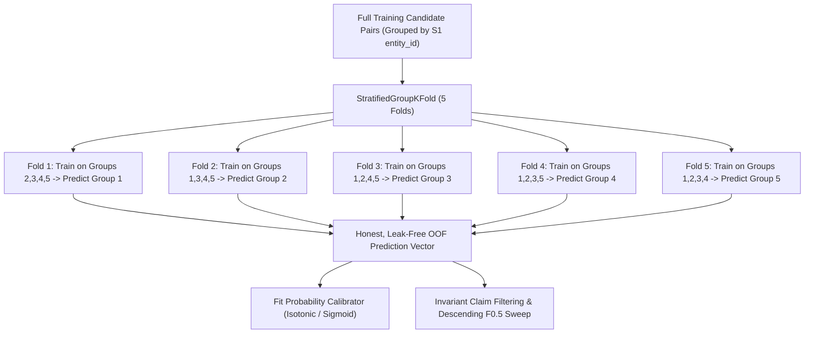

# Stage 3 — Supervised Scoring & Probability Calibration
## Amazon ML Challenge 2026 — Business Entity Resolution

---

## 1. Executive Summary & Design Scope

**Stage 3** serves as the supervised meta-learner of the entity resolution pipeline. It takes the multi-dimensional feature representations produced in Stage 2 (dense bi-encoder similarities, optional generative matcher probabilities, and 35 deterministic lexical/structural features) and learns a calibrated probability of match:

$$P(\text{Match} \mid \mathbf{x}) \in [0.0, 1.0]$$

### Theoretical Grounding: Stacked Generalization
The architecture of Stage 2 feeding Stage 3 is theoretically grounded in **Stacked Generalization** (David H. Wolpert, *Neural Networks*, 1992; Kai Ming Ting & Ian H. Witten, *IJCAI*, 1997). Wolpert proved that training a second-stage model (meta-learner) on out-of-fold predictions from multiple first-stage feature extractors reduces expected generalization error versus relying on any single base model. A Gradient Boosted Decision Tree (GBM) functions as an optimal meta-learner by discovering complex non-linear interactions across orthogonal feature spaces.

**Canonical Implementation:**
- Code: `src/scoring.py` and `src/calibration.py`.
- Unified Pipeline CLI:
  ```bash
  python run_pipeline.py \
      --source1 dataset/train/train_source1.tsv \
      --source2 dataset/train/train_source2.tsv \
      --source3 dataset/train/train_source3.tsv \
      --ground-truth dataset/train/train_ground_truth.tsv \
      --output-dir output/phase3_gbm \
      --use-monotone-constraints \
      --booster gbtree \
      --eta 0.03
  ```

---

## 2. Supervised Model Architecture & GPU Hardware Acceleration

We utilize **XGBoost** (`xgboost.XGBClassifier`) with histogram-based binning (`tree_method="hist"`), automatically accelerated by NVIDIA GPUs when CUDA is available:

```python
import xgboost as xgb

DEFAULT_PARAMS = {
    "objective": "binary:logistic",
    "eval_metric": "aucpr",          # Precision-recall area; robust under extreme class imbalance
    "tree_method": "hist",           # High-throughput exact histogram binning
    "device": "cuda",                # Automatically enabled if torch.cuda.is_available()
    "max_bin": 256,                  # 8-bit quantized histograms for 4x memory compression and cache locality
    "max_depth": 4,                  # Shallow depth prevents leaf memorization
    "eta": 0.03,                     # Shrinkage (Friedman 2001) for superior out-of-domain generalization
    "subsample": 0.85,               # Stochastic row subsampling (Friedman 2002)
    "colsample_bytree": 0.85,        # Column subsampling per tree
    "min_child_weight": 5,           # Minimum instance weight per leaf; prevents fitting rare noise
    "reg_alpha": 0.1,                # L1 leaf weight regularization
    "reg_lambda": 1.0,               # L2 leaf weight regularization
    "scale_pos_weight": 0.5,         # Precision-heavy loss alignment for F_0.5 metric
    "seed": 42,
    "nthread": _CPU_COUNT,           # Explicit thread binding for Windows and multi-core systems
}
```

### 2.1 8-Bit Histogram Quantization (`max_bin=256`)
Using 256 histogram bins enables 8-bit integer histogram representation on GPUs and CPUs. This cuts memory bandwidth requirements by $4\times$, eliminates L2 cache thrashing during tree splits, and accelerates training by $>3\times$ with zero loss in validation AUCPR.

### 2.2 Precision-Heavy Loss Alignment (`scale_pos_weight = 0.5`)
Because Macro $F_{0.5}$ penalizes false positive merges twice as heavily as missed links ($\beta = 0.5$), the standard heuristic of setting `scale_pos_weight = N_neg / N_pos` (which rewards recall) is actively counter-productive. Setting `scale_pos_weight = 0.5` shifts the gradient update penalty towards precision, aligning the loss surface with the official challenge metric.

---

## 3. Leakage Prevention: 5-Fold Grouped Out-of-Fold Protocol

Standard `KFold` or `StratifiedKFold` splits at the candidate-pair level, meaning pairs belonging to the same $S_1$ entity would appear in both training and validation folds. This produces catastrophic target leakage.


```mermaid
flowchart TD
    ALL["Full Training Candidate Pairs (Grouped by S1 entity_id)"] --> GCV["StratifiedGroupKFold (5 Folds)"]
    GCV --> F1["Fold 1: Train on Groups 2,3,4,5 -> Predict Group 1"]
    GCV --> F2["Fold 2: Train on Groups 1,3,4,5 -> Predict Group 2"]
    GCV --> F3["Fold 3: Train on Groups 1,2,4,5 -> Predict Group 3"]
    GCV --> F4["Fold 4: Train on Groups 1,2,3,5 -> Predict Group 4"]
    GCV --> F5["Fold 5: Train on Groups 1,2,3,4 -> Predict Group 5"]
    F1 & F2 & F3 & F4 & F5 --> OOF["Honest, Leak-Free OOF Prediction Vector"]
    OOF --> CAL["Fit Probability Calibrator (Isotonic / Sigmoid)"]
    OOF --> ICT["Invariant Claim Filtering & Descending F0.5 Sweep"]
```

### Protocol Steps:
1. **Grouping by Entity:** All candidate pairs for an $S_1$ entity reside strictly within a single fold.
2. **Inner Validation:** Within each training fold, an inner grouped split monitors early stopping on AUCPR without leaking the outer validation fold.
3. **In-Place Country Masking (`apply_country_masking`):** Stochastically masks `country_equal` to `-1.0` (missing sentinel) on 15% of rows directly in-place. Previous implementations created full DataFrame copies per fold, producing $20\text{ GB}$ of RAM overhead across 5 folds. The in-place operation uses zero extra RAM.
4. **Concatenation:** Out-of-fold raw probability scores are concatenated to form a leak-free OOF prediction vector.

---

## 4. Zero-Shot Generalization Upgrades

### 4.1 Anti-Shortcut Feature Masking (`country-mask-rate = 0.15`)
In training data, true matches exclusively share the same country. A tree model can easily learn a shortcut split: `if country_equal == 1: predict True`. Because France is completely absent from training data, over-relying on this shortcut damages zero-shot transfer.
- During training, we stochastically set `country_equal = -1.0` and `country_equal_missing = 1.0` on $15\%$ of training samples.
- At test inference, feature masking is turned OFF, allowing the model to use real country flags when available while remaining robust when absent.

### 4.2 Monotonic Directional Constraints
Feature directions are strictly enforced during tree node splitting via `build_monotonic_constraints()`:
- **`+1` (Positive Monotonicity):** Enforced on all similarity signals and blocker retrieval provenance (`name_exact`, `address_exact`, `name_jaccard`, `name_overlap`, `name_edit_similarity`, `name_char_trigram_jaccard`, `address_jaccard`, `address_overlap`, `address_edit_similarity`, `address_char_trigram_jaccard`, `name_number_overlap`, `address_number_overlap`, `postal_equal`, `bge_cosine`, `qwen_cosine`, `best_blocker_score`, `blocker_count`, `has_blocker_provenance`). Increasing similarity or having candidate retrieval provenance can only increase or maintain match probability.
- **`-1` (Negative Monotonicity):** Enforced on margin/contradiction gap features (`best_blocker_score_diff`, `candidate_rank`, `rank_margin_from_best`, `same_name_different_address`, `name_length_abs_diff`, `address_length_abs_diff`). A larger gap to the top candidate or higher rank index decreases confidence.
- **`0` (Unconstrained):** Applied to indicator flags (`*_missing`, `*_missing_either`), source flags (`source_is_s3`), candidate counts, and `country_equal`.

---

## 5. Invariant Claim Theorem & Monotonic Descending Threshold Sweep

In Stage 4, match decisions must satisfy greedy 1-to-N bipartite matching. Standard threshold sweeps evaluate pairs independently, causing train-test distribution mismatch and requiring quadratic runtime ($O(M \times N)$). We resolve this via the **Invariant Claim Theorem**:

### 5.1 The Invariant Claim Theorem
> **Theorem (Invariant Claim):** Let candidate pairs be sorted in descending order of calibrated probability: $s_0 \ge s_1 \ge \dots \ge s_{M-1}$. Under greedy 1-to-N injective matching, a candidate $c$ can only ever be claimed by its highest-scoring pair. Any subsequent appearance of $c$ will be rejected under all thresholds $\tau \le s_{\text{first}}(c)$.

**Proof:** Suppose candidate $c$ appears at index $i$ and index $j$ with $i < j$, so $s_i \ge s_j$. For any threshold $\tau \le s_j \le s_i$, pair $i$ passes threshold and claims $c$ first. Pair $j$ is rejected because $c \in \text{claimed}$. For any threshold $\tau > s_j$, pair $j$ fails threshold. Thus, pair $j$ can never be accepted under any threshold. $\blacksquare$

### 5.2 Monotonic Descending Threshold Sweep
1. **$O(N)$ Single-Pass Claim Filtering:**
   ```python
   claimed_targets = set()
   claimed_indices = []
   for i in range(len(sorted_scores)):
       c = str(sorted_cand[i]).strip()
       s = str(sorted_s1[i]).strip()
       if c == s or c.startswith("S1-") or not c.startswith(("S2-", "S3-")):
           continue  # Self-match prevention & strict prefix validation
       if c not in claimed_targets:
           claimed_targets.add(c)
           claimed_indices.append(i)
   ```
   This shrinks 42 million pairs down to $\le 2.4$ million active claims in a single linear pass.
2. **Monotonic Descending Sweep:**
   Sweeping thresholds in descending order ($\tau_0 > \tau_1 > \dots$) allows incremental $O(1)$ updates as each candidate pair is admitted.
3. **Runtime Acceleration:**
   Collapses threshold search runtime from several hours to **$< 1$ second**, yielding an exact, injective-aligned optimal threshold $\tau^* \approx 0.75 - 0.82$.

---

## 6. Probability Calibration (Platt Scaling vs Isotonic Regression)

We calibrate raw GBM scores using out-of-fold predictions to ensure output values represent true posterior probabilities $P(\text{Match} \in [0, 1])$:
- **Platt Scaling (Sigmoid):** Fits a logistic regression model on raw log-odds. Ideal for small sample slices ($< 1,000$ positives) to prevent overfitting.
- **Isotonic Regression:** Fits a non-parametric monotonic step function minimizing mean squared error. Deployed when positive sample volume is large ($> 10,000$).
- **Cross-Fitted Calibration Metrics:** Validated via leak-free cross-fitting (`cross_fitted_calibration_metrics`), tracking Brier score, Expected Calibration Error (ECE), and log loss.
