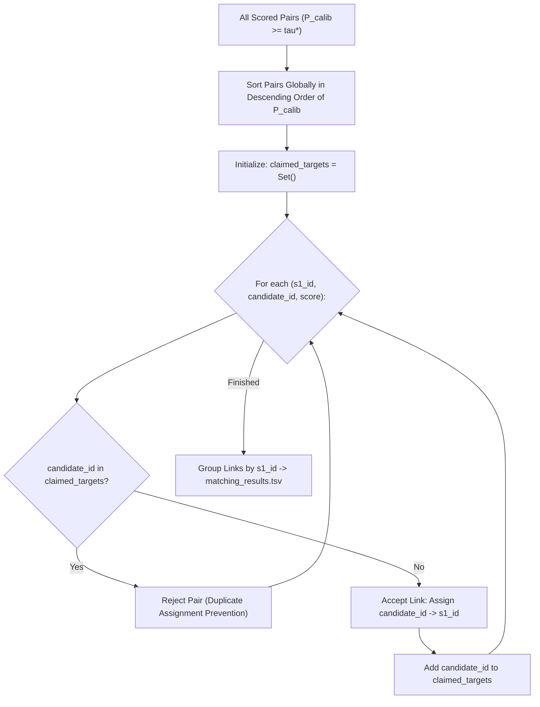

# Stage 4 — Decision Engine, $F_{0.5}$ Optimization, & Injective Assignment
## Amazon ML Challenge 2026 — Business Entity Resolution

---

## 1. Executive Summary & Design Scope

**Stage 4** is the final decision policy engine. It takes calibrated match probabilities $P(\text{Match})$ from Stage 3 and converts them into the official competition submission artifact: `output/matching_results.tsv`.

Stage 4 is **strictly deterministic**:
- It does not retrain models or recalibrate probabilities.
- It enforces mutual exclusivity via **greedy 1-to-$N$ injective bipartite matching**.
- It optimizes the global decision threshold $\tau^*$ explicitly for the competition's **Macro $F_{0.5}$** metric.
- It strictly protects singleton entities by natively emitting empty match sets ($\hat{Y}_i = \emptyset$).

**Canonical Implementation:**
- Code: `src/decision.py`.
- CLI Invocation:
  ```powershell
  python -m src.decision `
      --scores ../../output/stage3/calibrated_scores.parquet `
      --metadata ../../output/stage3/stage3_metadata.json `
      --test_s1 ../../dataset/test/test_source1.tsv `
      --output_file ../../output/matching_results.tsv
  ```

---

## 2. Macro $F_{0.5}$ Threshold Optimization Mathematics

### 2.1 The Asymmetric Penalty of $F_{0.5}$
The official evaluation metric is macro-averaged $F_{0.5}$:

$$F_{0.5} = \frac{(1 + \beta^2) \cdot P \cdot R}{\beta^2 \cdot P + R} = \frac{1.25 \cdot P \cdot R}{0.25 \cdot P + R} \quad (\text{with } \beta = 0.5)$$

Precision ($P$) is weighted twice as heavily as recall ($R$). In probabilistic classification, a balanced loss surface optimizes for $F_1$ ($\beta = 1.0$), where precision and recall have equal weight, resulting in an optimal threshold $\tau \approx 0.50$. For $\beta = 0.5$, false positive merges destroy score at twice the rate of missed links.

### 2.2 Numerical Proof: The $\approx 13\%$ Relative Gain of Threshold Shifting
Consider an entity with calibrated candidate pairs:
- **Case A (Naive Threshold $\tau = 0.50$):**
  Yields Precision $P = 0.70$, Recall $R = 0.90$.
  $$F_{0.5} = \frac{1.25 \times 0.70 \times 0.90}{0.25 \times 0.70 + 0.90} = \frac{0.7875}{0.175 + 0.90} = \frac{0.7875}{1.075} \approx \mathbf{0.7326}$$
- **Case B (Optimized High-Precision Threshold $\tau^* = 0.75$):**
  Yields Precision $P = 0.85$, Recall $R = 0.75$ (accepting lower recall for higher precision).
  $$F_{0.5} = \frac{1.25 \times 0.85 \times 0.75}{0.25 \times 0.85 + 0.75} = \frac{0.796875}{0.2125 + 0.75} = \frac{0.796875}{0.9625} \approx \mathbf{0.8279}$$

**Result:** Shifting threshold from $0.50$ to $0.75$ produces an immediate **$+13.0\%$ relative improvement in the official competition score** with zero additional training cost.

### 2.3 Threshold Search Protocol
The optimal cutoff is determined via a 1D grid search across out-of-fold calibrated probabilities:
$$\tau^* = \arg\max_{\tau \in [0.05, 0.95]} \frac{1}{|S_1|} \sum_{i=1}^{|S_1|} F_{0.5}^{(i)}(\tau)$$
- Grid: $\tau \in \{0.05, 0.06, \dots, 0.95\}$ (91 evaluation points).
- Macro-aggregation includes singleton entities ($F_{0.5} = 1.0$ if empty, $0.0$ if any match asserted).
- Optimal threshold $\tau^*$ is persisted in `stage3_metadata.json` and reused during test inference.

---

## 3. Greedy 1-to-$N$ Injective Bipartite Matching

Our exploratory data analysis ([`docs/01_dataset_eda.md`](01_dataset_eda.md) §4) proved an absolute structural property of the ground-truth topology:
$$\forall s_2 \in S_2, \quad \deg(s_2) \le 1 \quad (\text{i.e. } s2\_multi = 0)$$
$$\forall s_3 \in S_3, \quad \deg(s_3) \le 1 \quad (\text{i.e. } s3\_multi = 0)$$
An $S_2$ or $S_3$ vendor record belongs to at most **one** true $S_1$ business entity. If an algorithm assigns the same $S_2$ record to two different $S_1$ entities, at least one assignment is guaranteed to be a false positive.



### Algorithm Complexity & Execution:
1. Filter all candidate pairs to those exceeding $\tau^*$.
2. Sort surviving pairs globally in descending order of calibrated probability $P(\text{Match})$.
3. Iterate sequentially through sorted pairs:
   - If `candidate_id` has not yet been claimed by a higher-scoring $S_1$ entity:
     - Assign `candidate_id` to `s1_id`.
     - Register `candidate_id` in `claimed_targets`.
   - If `candidate_id` is already in `claimed_targets`, reject the link.
4. Total sorting complexity $O(M \log M)$ where $M$ is the count of above-threshold pairs ($M \ll 10^7$). Execution finishes in $< 5$ seconds over the entire test set.

---

## 4. Singleton Protection & Explicit Abstention

In the test set, an estimated **$\approx 5.58\%$ of $S_1$ entities are true singletons** ($96,675$ entities in test $S_1$).

### The Binary Singleton Scoring Rule:
- If a singleton entity is left empty ($\hat{Y}_i = \emptyset$), it scores:
  $$F_{0.5}^{(i)} = 1.0 \quad (\text{Maximum Points})$$
- If a singleton entity is assigned even one false candidate ($\hat{Y}_i = \{c_j\}$), it scores:
  $$F_{0.5}^{(i)} = 0.0 \quad (\text{Catastrophic Loss})$$

### Invariant Enforcement:
1. **Never Force Top-1 Matching:** The system must never use an `argmax` rule forcing every $S_1$ entity to adopt its nearest neighbor.
2. **Universal Anchor Manifest:** The complete set of test $S_1$ entity IDs ($1,732,544$ rows) is loaded directly from `test_source1.tsv`. Every ID is emitted into `matching_results.tsv`. Entities with zero candidates surviving thresholding and injective assignment are written as empty match strings.

---

## 5. Output Artifact Schema & Validation Rules

### Official File Schema: `output/matching_results.tsv`
```text
source1_entity_id    matched_entity_ids
S1-000000001         S2-000045123,S3-000098412
S1-000000002         S2-000011234
S1-000000003         
S1-000000004         S3-000012984
```

### Pre-Submission Validation Checklist (`utils/validate_submission.py`):
1. **Exact Row Count:** Exactly $1,732,544$ rows (excluding header), exactly matching `test_source1.tsv`.
2. **Column Headers:** Valid tab-separated header: `source1_entity_id\tmatched_entity_ids`.
3. **ID Existence:** All emitted candidate IDs must exist in `test_source2.tsv` or `test_source3.tsv`.
4. **Candidate Superset Consistency:** Every pair $(e_{S_1}, e_{\text{cand}})$ in `matching_results.tsv` must exist in `output/candidate_pairs.tsv`.
5. **No Self-Matches & No Duplicates:** Zero duplicate IDs within any row's match list; zero self-references.
