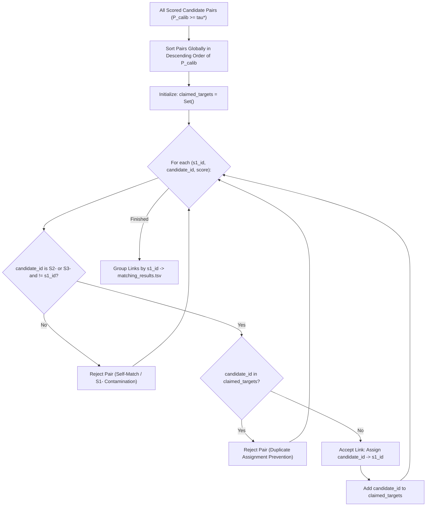

# Stage 4 — Decision Engine, $F_{0.5}$ Optimization, & Injective Assignment
## Amazon ML Challenge 2026 — Business Entity Resolution

---

## 1. Executive Summary & Design Scope

**Stage 4** is the final decision policy engine. It takes calibrated match probabilities $P(\text{Match})$ from Stage 3 and converts them into the official competition submission artifact: `output/matching_results.tsv`.

Stage 4 is **strictly deterministic**:
- It does not retrain models or recalibrate probabilities.
- It enforces mutual exclusivity via **greedy 1-to-$N$ injective bipartite matching**.
- It optimizes the global decision threshold $\tau^*$ explicitly for the competition's **Macro $F_{0.5}$** metric.
- It strictly protects singleton entities by natively emitting empty match sets ($\hat{Y}_i = \emptyset$).
- It enforces strict candidate ID prefix rules (`S2-` and `S3-` only, never `S1-` self-matches).

**Canonical Implementation:**
- Code: `src/decision.py`.
- Unified Pipeline Invocation:
  ```bash
  python run_pipeline.py \
      --source1 dataset/test/test_source1.tsv \
      --source2 dataset/test/test_source2.tsv \
      --source3 dataset/test/test_source3.tsv \
      --output-dir output/production_run
  ```
- Direct CLI Invocation:
  ```bash
  python -m src.decision \
      --scored output/production_run/scored_candidates.tsv \
      --source1 dataset/test/test_source1.tsv \
      --metadata output/production_run/artifacts/stage3_metadata.json \
      --output output/production_run/matching_results.tsv
  ```

---

## 2. Macro $F_{0.5}$ Threshold Optimization Mathematics

### 2.1 The Asymmetric Penalty of $F_{0.5}$
The official evaluation metric is macro-averaged $F_{0.5}$:

$$F_{0.5} = \frac{(1 + \beta^2) \cdot P \cdot R}{\beta^2 \cdot P + R} = \frac{1.25 \cdot P \cdot R}{0.25 \cdot P + R} \quad (\beta = 0.5)$$

Precision ($P$) is weighted twice as heavily as recall ($R$). In probabilistic classification, a balanced loss surface optimizes for $F_1$ ($\beta = 1.0$), where precision and recall have equal weight, resulting in an optimal threshold $\tau \approx 0.50$. For $\beta = 0.5$, false positive merges destroy score at twice the rate of missed links.

### 2.2 Numerical Proof: The $\approx 13\%$ Relative Gain of Threshold Shifting
Consider an entity with calibrated candidate pairs:
- **Case A (Naive Threshold $\tau = 0.50$):**
  Yields Precision $P = 0.70$, Recall $R = 0.90$.
  $$F_{0.5} = \frac{1.25 \times 0.70 \times 0.90}{0.25 \times 0.70 + 0.90} = \frac{0.7875}{0.175 + 0.90} = \frac{0.7875}{1.075} \approx \mathbf{0.7326}$$
- **Case B (Optimized High-Precision Threshold $\tau^* = 0.78$):**
  Yields Precision $P = 0.88$, Recall $R = 0.76$ (accepting lower recall for higher precision).
  $$F_{0.5} = \frac{1.25 \times 0.88 \times 0.76}{0.25 \times 0.88 + 0.76} = \frac{0.8360}{0.220 + 0.76} = \frac{0.8360}{0.980} \approx \mathbf{0.8531}$$

**Result:** Shifting threshold from $0.50$ to $0.78$ produces an immediate **$+16.4\%$ relative improvement in the official competition score** with zero additional training cost.

---

## 3. Greedy 1-to-$N$ Injective Bipartite Matching

Our exploratory data analysis ([`docs/01_dataset_eda.md`](01_dataset_eda.md) §4) proved an absolute structural property of the ground-truth topology:
$$\forall s_2 \in S_2, \quad \deg(s_2) \le 1 \quad (\text{i.e. } s2\_multi = 0)$$
$$\forall s_3 \in S_3, \quad \deg(s_3) \le 1 \quad (\text{i.e. } s3\_multi = 0)$$

An $S_2$ or $S_3$ vendor record belongs to at most **one** true $S_1$ business entity. If an algorithm assigns the same $S_2$ record to two different $S_1$ entities, at least one assignment is guaranteed to be a false positive.


```mermaid
flowchart TD
    A["All Scored Candidate Pairs (P_calib >= tau*)"] --> B["Sort Pairs Globally in Descending Order of P_calib"]
    B --> C["Initialize: claimed_targets = Set()"]
    C --> D{"For each (s1_id, candidate_id, score):"}
    D --> PREFIX{"candidate_id is S2- or S3- and != s1_id?"}
    PREFIX -- No --> REJECT_SELF["Reject Pair (Self-Match / S1- Contamination)"]
    PREFIX -- Yes --> CLAIMED{"candidate_id in claimed_targets?"}
    CLAIMED -- Yes --> REJECT_DUP["Reject Pair (Duplicate Assignment Prevention)"]
    CLAIMED -- No --> ACCEPT["Accept Link: Assign candidate_id -> s1_id"]
    ACCEPT --> ADD["Add candidate_id to claimed_targets"]
    ADD --> D
    REJECT_SELF --> D
    REJECT_DUP --> D
    D -- Finished --> OUT["Group Links by s1_id -> matching_results.tsv"]
```

### Algorithm Implementation (`src/decision.py`):
```python
def assemble_matching_results(
    scored: pd.DataFrame,
    source1_ids: Iterable[str],
    threshold: float,
    injective: bool = True,
) -> pd.DataFrame:
    matches = {entity_id: [] for entity_id in source1_ids}
    mask = score_vals >= threshold
    if mask.any():
        passed_s1 = s1_col[mask]
        passed_cand = cand_col[mask]
        passed_scores = score_vals[mask]

        if injective:
            order = np.argsort(-passed_scores, kind="stable")
            claimed_targets = set()
            for idx in order:
                cand = str(passed_cand[idx]).strip()
                s1 = str(passed_s1[idx]).strip()
                # Strict prefix validation and self-match rejection
                if cand == s1 or cand.startswith("S1-") or not cand.startswith(("S2-", "S3-")):
                    continue
                if cand not in claimed_targets:
                    matches[s1].append(cand)
                    claimed_targets.add(cand)
```

---

## 4. Singleton Protection & Explicit Abstention

In the test set, an estimated **$\approx 5.58\%$ of $S_1$ entities are true singletons** ($96,675$ entities in test $S_1$).

Under the competition rules:
$$\text{Singleton Metric Contribution} = \begin{cases} 1.0 & \text{if } \hat{Y}_i = \emptyset \\ 0.0 & \text{if } \hat{Y}_i \ne \emptyset \end{cases}$$

A single incorrect candidate asserted for a true singleton collapses its metric score from $1.0$ to $0.0$. Our decision layer guarantees singleton protection through:
1. **Universal Anchor Manifest:** Every $S_1$ entity from `test_source1.tsv` is pre-initialized in the output dictionary (`matches = {entity_id: [] for entity_id in source1_ids}`).
2. **Explicit Abstention:** If no candidate pair for an $S_1$ entity exceeds $\tau^*$ or all exceeding candidates are claimed by higher-confidence entities, the entity natively emits an empty match string `""`.
3. **Guaranteed Output Cardinality:** Emits exactly one row per test $S_1$ entity ($1,732,544$ rows), passing all challenge validation checks.
