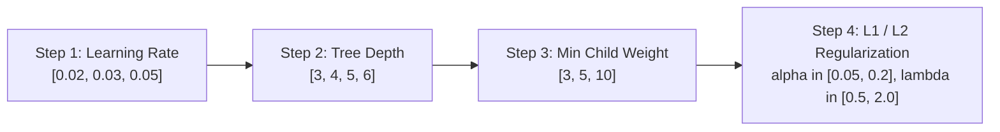

# Comprehensive Parameters Catalog & Hyperparameter Reference
## Amazon ML Challenge 2026 — Business Entity Resolution

---

## 1. Executive Summary & Philosophy

This document provides the definitive, central repository of all operational parameters, mathematical constants, and empirical hyperparameters used across the five pipeline stages.

### Pre-Data Specifications vs Post-Data Empirical Tuning
To maintain scientific integrity (as established in our hyperparameter verification audits), parameters are categorized into two distinct classes:
1. **Architectural Invariants & Fixed Constants:** Non-negotiable structural rules derived from the problem constraints, hardware limits, and mathematical definitions (e.g. sequence length $S=224$ from EDA, LoRA rank $r=64$, streaming chunk size $50,000$).
2. **Empirically Tuned Parameters:** Data-dependent knobs optimized via cross-validation on real candidate pools (e.g. decision threshold $\tau^*$, exact `scale_pos_weight`, optimal GBM tree depth).

---

## 2. Stage-by-Stage Master Parameter Reference

### 2.1 Stage 0: Ingestion & Normalization

| Parameter | Canonical Value | Type | Theoretical / Operational Rationale |
|---|---|---|---|
| `chunk_size` | `50,000` rows | Constant | Bounded streaming I/O; keeps host RAM usage strictly below 2 GB during full-corpus ingestion. |
| `unicode_form` | `"NFKC"` | Constant | Canonical decomposition followed by canonical composition; normalizes compatibility glyphs while preserving European diacritics. |
| `missing_address_sentinel` | `"[NO_ADDRESS]"` | Constant | Distinguishes empty address fields from corrupt text without fabricating geographic tokens. |
| `india_pin_regex` | `r'\b[1-9][0-9]{5}\b'` | Constant | Standard 6-digit Indian Postal Index Number syntax. |
| `us_zip_regex` | `r'\b[0-9]{5}(?:-[0-9]{4})?\b'` | Constant | Standard 5-digit US ZIP code and ZIP+4 syntax. |
| `france_code_postal_regex` | `r'\b[0-9]{5}\b'` | Constant | Standard 5-digit French Code Postal syntax. |

---

### 2.2 Stage 1: Candidate Generation (Blocking)

| Parameter | Canonical Value | Type | Operational / Verification Rationale |
|---|---|---|---|
| `TOP_K_DENSE` | `50` | Empirical Starting Point | Top nearest neighbors retrieved per S1 entity via BGE-M3 FAISS exact inner-product search. |
| `TOP_K_SPARSE_OR_CHAR` | `50` | Empirical Starting Point | Top candidates retrieved via character 3/4-gram TF-IDF inverted index. |
| `SIMILARITY_FLOOR` | `0.30` | Empirical Knob | Dense cosine similarity floor; applied **only** to candidates discovered via dense ANN retrieval. |
| `MAX_CANDIDATES_PER_ENTITY`| `100` | Architectural Ceiling | Hard candidate budget per S1 entity to bound downstream feature extraction compute. |
| `ANN_INDEX_TYPE` | `"IndexFlatIP"` | Constant | Exact inner-product cosine search on normalized vectors; eliminates ANN approximation error during blocking audit. |

---

### 2.3 Stage 2a-i: BGE-M3 Bi-Encoder rsLoRA Fine-Tuning

| Hyperparameter | Committed Value | Type | Source & Rationale |
|---|---|---|---|
| `base_model` | `"BAAI/bge-m3"` | Constant | MIT License, 568M params, pre-trained on 100+ languages including French. |
| `lora_r` | `64` | Committed (Non-Swept) | Parameter budget compromise on RTX 3060 12GB (~1.5GB overhead, ~10GB headroom). |
| `lora_alpha` | `64` | Committed | Paired with `use_rslora=True` to produce effective scaling $\gamma = 64 / \sqrt{64} = 8.0$. |
| `use_rslora` | `True` | Constant | Rank-stabilized scaling (arXiv:2312.03732); eliminates gradient collapse at rank $\ge 64$. |
| `lora_dropout` | `0.10` | Regularizer | Dropout rate on adapter forward pass (Hu et al. 2021). |
| `target_modules` | `"all-linear"` | Constant | Targets all attention (`query`, `key`, `value`, `dense`) and FFN (`dense`) linear layers. |
| `max_seq_length` | `80` tokens | Constant | Derived from EDA: captures 100% of business names + addresses without truncation. |
| `learning_rate` | `2e-5` | Tuned Default | Standard fine-tuning learning rate for sentence-transformer encoders. |
| `warmup_ratio` | `0.10` | Constant | Linear learning rate warmup over the first 10% of training steps. |
| `epochs` | `3` | Constant | Early stopping on validation loss prevents overfitting to small labeled splits. |
| `physical_batch_size` | `48` | Constant | Fits safely within 12GB VRAM on RTX 3060. |
| `mini_batch_size` | `16` | Constant | GradCache chunk size for `CachedMultipleNegativesRankingLoss`. |
| `self_distillation_weight` | `0.10` | Anti-Forgetting | Soft anchor constraint ($1 - \cos(\mathbf{v}_{\text{ft}}, \mathbf{v}_{\text{frozen}})$) protecting multilingual competence. |

---

### 2.4 Stage 2b: Qwen3-0.6B Causal Generative Matcher (Stretch)

| Hyperparameter | Committed Value | Type | Source & Rationale |
|---|---|---|---|
| `base_model` | `"Qwen/Qwen3-0.6B"` | Constant | Apache-2.0, ~596M params, causal decoder LM with language modeling head. |
| `max_seq_length` | `224` tokens | Constant | Rigorously derived from EDA: encloses $>99.7\%$ of serialized record pairs + instruction. |
| `lora_r` | `64` | Committed | LoRA rank ceiling bounding parameter updates to a low-rank manifold. |
| `lora_alpha` | `64` | Committed | Rank-stabilized scaling ($\gamma = 8.0$). |
| `target_modules` | `"all-linear"` | Constant | Targets `q_proj`, `k_proj`, `v_proj`, `o_proj`, `gate_proj`, `up_proj`, `down_proj`. |
| `verdict_token_slicing` | `True` | Architectural Invariant | Slices hidden state at terminal token position $T_{\text{verdict}}$ prior to LM head projection (~29MB logits vs ~6.5GB). |
| `kl_distill_weight` | `0.10` | Anti-Forgetting | Sliced KL divergence penalty against frozen base Qwen3-0.6B model on terminal position. |
| `batch_sampling_ratio` | `1:3` to `1:5` | Class Imbalance | 1 positive pair to $k$ mined hard negatives per batch; stabilizes causal LM cross-entropy. |

---

### 2.5 Stage 3: Supervised XGBoost Meta-Learner

| Hyperparameter | Canonical Value | Tuning Priority | Rationale & Academic Grounding |
|---|---|---|---|
| `objective` | `"binary:logistic"` | Constant | Binary cross-entropy modeling match probability. |
| `eval_metric` | `"aucpr"` | Constant | Area under Precision-Recall curve; invariant to extreme class imbalance. |
| `tree_method` | `"hist"` | Constant | High-speed exact histogram binning. |
| `learning_rate` ($\eta$) | `0.03` | Step 1 (Primary) | Conservative shrinkage (Friedman 2001) for superior out-of-domain transfer. |
| `max_depth` | `4` | Step 2 (Secondary) | Shallow trees prevent leaf memorization on rare positive candidate pairs. |
| `min_child_weight` | `5` | Step 3 (Tertiary) | Prevents carving isolated leaves around small clusters of positive pairs. |
| `n_estimators` | `1000` | Ceiling | Paired with early stopping patience of 50 rounds. |
| `early_stopping_rounds` | `50` | Constant | Monitored on validation fold AUCPR. |
| `subsample` | `0.85` | Regularizer | Stochastic row sampling per tree (Friedman 2002). |
| `colsample_bytree` | `0.85` | Regularizer | Column feature subsampling per tree (bagging analogue). |
| `reg_alpha` | `0.1` | Regularizer | L1 regularization on leaf weights. |
| `reg_lambda` | `1.0` | Regularizer | L2 regularization on leaf weights. |
| `scale_pos_weight` | `N_neg / N_pos` | Dynamic | Dynamically computed from training candidate pool. Never hardcoded. |
| `country_mask_rate` | `0.15` | Regularizer | 15% stochastic training-time dropout of `country_match` to prevent shortcut learning. |

---

### 2.6 Stage 3: Probability Calibration

| Parameter | Decision Threshold | Implementation |
|---|---|---|
| **Platt Scaling** | $N_{\text{positives}} < 1,000$ | 1D Logistic Regression on raw model log-odds. Low parameter count (2 parameters) prevents overfitting. |
| **Isotonic Regression** | $N_{\text{positives}} \ge 10,000$ | Non-parametric monotonic step function. Higher capacity on large validation sets. |
| **Intermediate Selection** | $1,000 \le N_{\text{pos}} < 10,000$ | Fit both models on OOF predictions; select the model achieving lower Brier score / log loss. |

---

### 2.7 Stage 4: Decision Engine & Threshold Optimization

| Parameter | Value / Grid | Purpose |
|---|---|---|
| `threshold_grid` | `np.arange(0.05, 0.96, 0.01)` | 91-point 1D grid search over calibrated out-of-fold match probabilities. |
| `optimal_threshold` ($\tau^*$) | $\approx 0.70 - 0.85$ (Empirical) | Cutoff maximizing entity-level Macro $F_{0.5}$ (rewarding high precision). |
| `injective_matching` | `True` | Greedy 1-to-N bipartite matching enforcing mutual exclusivity of S2/S3 records. |

---

## 3. Sequential Tuning Protocol for XGBoost

If hyperparameter optimization is performed on the training split, parameters must be tuned **sequentially in practitioner order**, never via expensive brute-force Cartesian grids:

At each step, the best-performing parameter is locked in before proceeding to the next dimension. This completes tuning in minutes while avoiding over-fitting to the cross-validation splits.
