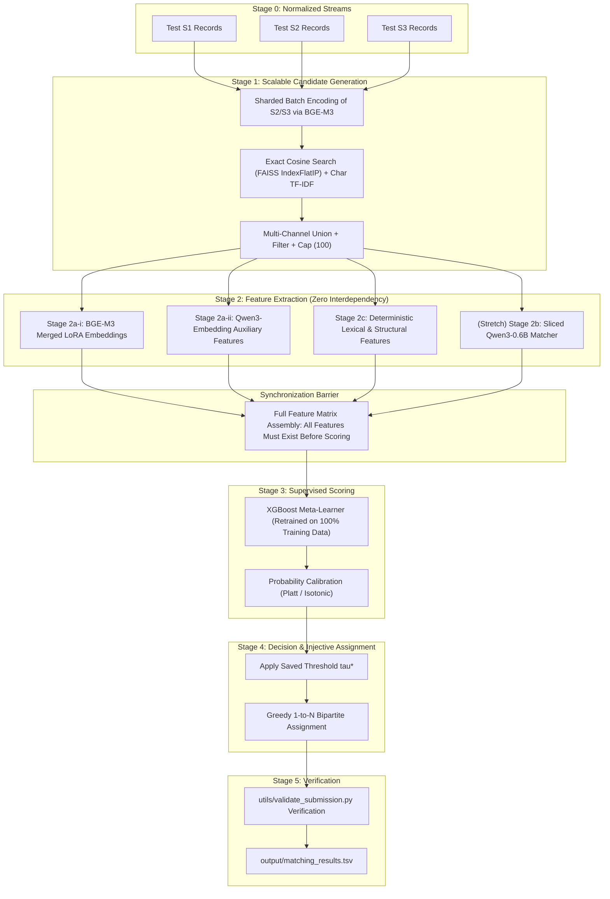

# Inference Latency, Memory Footprint, & Optimization Design
## Amazon ML Challenge 2026 — Business Entity Resolution

---

## 1. Executive Summary & Design Scope

This document details the inference execution sequence, hardware memory footprints, latency budgets, batching architectures, and first-principles optimization designs across all five stages of the business entity resolution pipeline.

### Core Engineering Invariant: Single-Pass Memory Safety
On a single consumer GPU (**NVIDIA GeForce RTX 3060 12GB VRAM**), all active models are loaded in `bfloat16` precision with zero disk thrashing. All LoRA adapters are pre-merged into base weights prior to inference, ensuring zero adapter latency penalty.

---

## 2. Inference Execution Sequence & Dependency Barriers

### Execution Scheduling Rules:
1. **Stage 1 Sharded Batching:** Encoding the entire test candidate pool ($|S_2 \cup S_3| \approx 10\text{M}$ records) must never be executed as a single monolithic array. Embeddings are generated in fixed batches of $256$ records and streamed to disk-backed FAISS shards.
2. **Stage 2 Independent Parallelism:** Stages 2a-i, 2a-ii, 2b, and 2c have zero mutual interdependencies. They can be scheduled in arbitrary order or interleaved across CPU/GPU cores.
3. **Stage 3 Hard Synchronization Barrier:** Stage 3 cannot score a pair until all Stage 2 feature columns exist for that pair.

---

## 3. Hardware Footprint on NVIDIA RTX 3060 (12GB)

### 3.1 Pre-Inference LoRA Weight Merging
During training, LoRA represents weight updates as factorized low-rank matrices:
$$W' = W_{\text{base}} + \frac{\alpha}{\sqrt{r}} (B \cdot A)$$
At inference time, adapters are permanently merged into the base weights (`model.merge_and_unload()`). This produces a single dense transformer weight tensor with **zero parameter overhead, zero branching, and zero runtime latency penalty**.

### 3.2 Total Active Model Memory in bf16

| Model Component | Parameter Count | Precision | VRAM Allocation | Role |
|---|---|---|---|---|
| **BGE-M3 (Merged LoRA)** | 568M params | `bfloat16` | **~1.14 GB** | Stage 1 Blocking & Stage 2a-i Bi-Encoder |
| **Qwen3-Embedding-0.6B** | ~596M params | `bfloat16` | **~1.19 GB** | Stage 2a-ii Auxiliary Dense Feature |
| **Qwen3-0.6B (Merged LoRA)** | ~596M params | `bfloat16` | **~1.19 GB** | Stage 2b Stretch Generative Matcher |
| **Combined Weight Footprint** | **~1.76 Billion** | `bfloat16` | **~3.52 GB** | Fits simultaneously within 12GB VRAM |
| **PyTorch Context & Workspace** | — | — | **~1.00 GB** | CUDA runtime buffer |
| **Batch Activation Buffer** | Batch 256, Seq 80 | fp32 / bf16 | **~1.20 GB** | Inference forward pass activations |
| **Total Peak Inference Footprint** | All Models Resident | — | **~5.72 GB** | **~6.28 GB Headroom (52% free)** |

---

## 4. Train vs Inference Mode Switches

To avoid subtle bugs, five operational switches must toggle synchronously when moving from training to test inference:

| Operational Dimension | Training Mode Setting | Test Inference Setting | Rationale |
|---|---|---|---|
| **Transformer Dropout** | Active ($0.10$ internal, $0.10$ LoRA) | **Strictly OFF (`model.eval()`)** | Preserves deterministic embedding geometry. |
| **Country-Match Masking** | Active ($15\%$ stochastically replaced with $-1.0$) | **Strictly OFF ($100\%$ real flags)** | Allows classifier full access to real country equality. |
| **Checkpoint Selection** | 5-Fold Grouped OOF checkpoints | **Final Full-Data Retrained Model Only** | Fold models saw only $80\%$ of data; final inference requires $100\%$ trained weights. |
| **Candidate Floor** | Candidate generation on train entities | **Applied to test pairs ($\ge 0.30$)** | Exactly enforces the $100$-candidate ceiling. |
| **Singleton Handling** | Positive pairs isolated for contrastive loss | **Universal S1 emission with empty matches** | Protects test singletons ($5.58\%$ of entities). |

---

## 5. First-Principles Optimization Rationale

Every architectural optimization in this pipeline is reasoned from first principles without relying on dogmatic literature citations:

### 5.1 Sub-Quadratic Multi-Key Blocking
Pairwise comparison over $2.2\text{M} \times 10.3\text{M} \approx 2.2 \times 10^{13}$ pairs would require over **250 days of continuous GPU compute**. Multi-channel union blocking prunes the search space down to $\le 100$ candidates per entity ($< 1.7 \times 10^8$ total pairs), completing candidate generation in $< 30$ minutes.

### 5.2 Multi-Feature Classification over Scalar Thresholding
A 1D cosine threshold cannot distinguish a high-name/low-address look-alike from an abbreviated true match. Feeding orthogonal features (Levenshtein ratio, postal match, dense cosine, ambiguity count) to an XGBoost meta-learner provides the capacity to isolate non-linear error surfaces.

### 5.3 Mined Hard Negatives
Training bi-encoders purely on random negatives teaches the model to separate obvious contrasts (e.g. "Apple Inc" vs "Boeing"), providing near-zero gradient signal on real-world error cases ("Acme Corp, Chicago" vs "Acme Corp, Dallas"). Mining hard negatives from Stage 1 blocking forces the loss surface to sharpen precisely along the decision boundary.

### 5.4 Sliced Verdict-Token Logits
In causal sequence-pair matching (Stage 2b), projecting full-sequence hidden states to Qwen3's $152,064$-token vocabulary creates a **~6.54 GB** intermediate tensor. Slicing hidden states at terminal token position $T_{\text{verdict}}$ prior to projection collapses memory by **$224\times$ down to ~29 MB**, completely eliminating VRAM bottlenecks on the RTX 3060.
