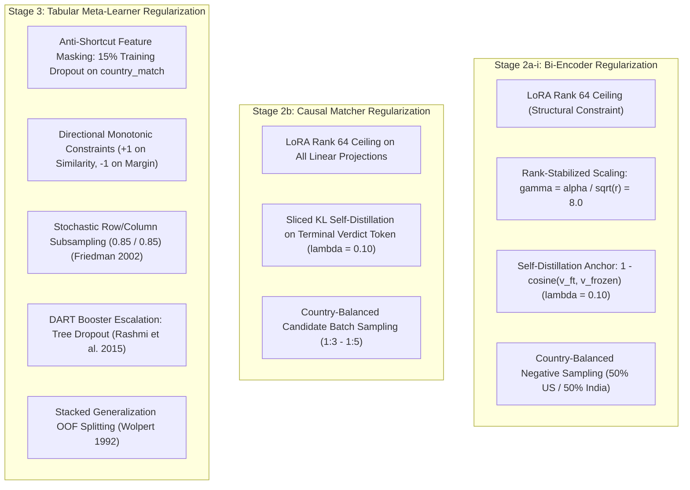

# Unified Regularization Theory & Anti-Catastrophic Forgetting
## Amazon ML Challenge 2026 — Business Entity Resolution

---

## 1. Executive Summary & Cross-Model Taxonomy

In a high-stakes competition where **France represents 15.0% of the test set but 0.0% of the training set**, regularization is not an afterthought — it is the primary architectural defense against catastrophic forgetting and distribution collapse.

This document establishes the theoretical grounding and operational settings for the regularization mechanisms applied across all three trained components:
1. **The Bi-Encoder:** BGE-M3 rsLoRA adapter (Stage 2a-i).
2. **The Causal Generative Matcher:** Qwen3-0.6B causal LM (Stage 2b stretch).
3. **The Tabular Meta-Learner:** XGBoost gradient-boosted decision trees (Stage 3).

---

## 2. Neural Encoder Regularization (Stage 2a-i & Stage 2b)

### 2.1 Transformer-Internal & Adapter Dropout
- **Internal Dropout ($0.10$):** Retained at the model's pre-trained default rate (Srivastava et al., *"Dropout: A Simple Way to Prevent Neural Networks from Overfitting"*, JMLR 2014).
- **LoRA Adapter Dropout ($0.10$ on BGE, $0.05$ on Qwen):** Applied directly to the low-rank projection $B \cdot A$ (Hu et al., *"LoRA: Low-Rank Adaptation of Large Language Models"*, ICLR 2022).

### 2.2 LoRA Rank as a Structural Regularizer & Scaling Reconciliation
Earlier literature debated whether low rank ($r=8-16$) or high rank ($r=64-128$) is optimal for entity resolution:
1. **Hu et al. (2021) Caveat:** In the original LoRA paper, Table 6 showed low ranks ($r=1-4$) performing competitively. However, Hu et al. explicitly stated their own caveat:
   > *"We do not expect a small $r$ to work for every task... If the downstream task were in a different language than the one used for pre-training, retraining the entire model could certainly outperform LoRA with a small $r$."*
   Cross-lingual transfer (unseen French text) is precisely the scenario requiring higher representational capacity.
2. **Rank-Stabilized Scaling Factor (arXiv:2312.03732):** Standard LoRA scaling ($\gamma = \alpha / r$) causes gradient collapse as rank grows, artificially handicapping higher ranks in naive sweeps. By employing rank-stabilized scaling:
   $$\gamma = \frac{\alpha}{\sqrt{r}} = \frac{64}{\sqrt{64}} = 8.0$$
   we ensure invariant gradient magnitudes, allowing rank $r=64$ to adapt to complex entity noise while remaining bound to a low-rank manifold.
3. **All-Linear Layer Coverage:** LoRA is applied across **all** linear layers (both attention projections `query`/`key`/`value`/`dense` and feed-forward projections `dense`). Restricting coverage to top layers or attention-only severely under-fits entity retrieval tasks (as proven in *"Scattered or Connected"*, arXiv:2208.09847, showing PEFT underperforms full fine-tuning below $1\%$ of parameters).

### 2.3 Self-Distillation Anchor Loss (The Anti-Forgetting Anchor)
Because no French training data is available in the challenge, we construct an auxiliary penalty against the **frozen pre-trained base model**:
$$\mathcal{L}_{\text{distill}} = \lambda_{\text{distill}} \cdot \left(1 - \cos\left(\mathbf{v}_{\text{ft}}, \mathbf{v}_{\text{frozen}}\right)\right)$$
- Weight: $\lambda_{\text{distill}} = 0.10$.
- **Mechanism:** Even though training text is English/Hindi-script, this loss penalizes the adapter from twisting the pre-trained multilingual vector space, preserving the underlying alignment for French tokens without requiring external French datasets.

---

## 3. Tabular Meta-Learner Regularization (Stage 3 XGBoost)

Tree ensembles do not possess neurons; applying "dropout" to a tree model requires distinct, mathematically formalized methods:

### 3.1 DART: Dropouts Meet Multiple Additive Regression Trees
- **Citation:** K. V. Rashmi & Ran Gilad-Bachrach, *"DART: Dropouts meet Multiple Additive Regression Trees"*, AISTATS 2015 (arXiv:1505.01866). Ranked the 8th Most Influential AISTATS 2015 Paper.
- **Mechanism:** On each boosting round, a random subset of existing trees is muted before calculating the gradient for the next tree. This directly prevents later trees from over-specializing on trivial residual errors of rare training instances.
- **Positioning:** Retained as an **escalation mode** (`booster="dart"`) for persistent train/validation gaps, rather than a default, because DART disables prediction caching and increases training time.

### 3.2 Stochastic Subsampling (Friedman 2001, 2002)
- **Shrinkage ($\eta = 0.03$):** Jerome H. Friedman (2001), *"Greedy Function Approximation: A Gradient Boosting Machine"*, Annals of Statistics. Smaller learning rates empirically yield superior generalization error.
- **Subsampling ($0.85$ row, $0.85$ column):** Jerome H. Friedman (2002), *"Stochastic Gradient Boosting"*. Subsampling introduces stochastic noise that dramatically reduces variance and prevents tree co-adaptation.

### 3.3 Anti-Shortcut Feature Masking (15% Dropout on `country_match`)
- **Problem:** In training data, $100\%$ of true matches share the same country. Unconstrained decision trees will greedily split on `country_match == 1`, ignoring subtle lexical differences.
- **Solution:** We borrow the native sparsity-aware split mechanism of XGBoost (Chen & Guestrin, KDD 2016). By randomly setting `country_match = -1.0` (missing) on $15\%$ of training rows, the tree is forced to learn default split paths that rely heavily on string similarity and dense embeddings.

### 3.4 Theoretical Foundation: Stacked Generalization
- **Foundational Theory:** David H. Wolpert, *"Stacked Generalization"*, Neural Networks, 1992.
- **Meta-Learner Architecture:** Kai Ming Ting & Ian H. Witten, *"Stacked Generalizations: When Does It Work?"*, IJCAI 1997.
- **Validation:** 5-fold Grouped Out-of-Fold cross-validation ensures that the meta-learner is fit strictly on predictions generated by models that never saw those entities during training, eliminating optimism bias and target leakage.
