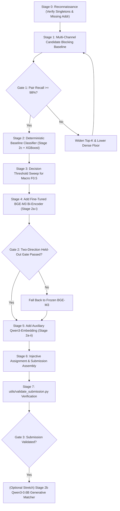

# Verification Audit Log, Decisions Register, & Experimental Roadmap
## Amazon ML Challenge 2026 — Business Entity Resolution

---

## 1. Executive Summary & Verification History

Scientific accuracy requires rigorous provenance. Across early iterations of this project's documentation, several external claims were contested, audited, and resolved against primary source documents.

This log documents the five verification rounds, records all closed and open architectural decisions, and establishes the empirical experimental roadmap for model validation.

---

## 2. The Five-Round Verification Audit History

| Round | Disputed Claim | Primary Audit Action | Ground-Truth Finding & Resolution |
|:---:|---|---|---|
| **Round 1** | A draft claimed the **Sodhana paper** (arXiv:2608.16161) did not exist and should be removed. | Direct query to arxiv.org and GitHub repository search. | **False Claim Disproven:** Paper exists on arXiv:2608.16161, authored by Narayana, Srivardhani, and Konda, detailing domain-specific embedding fine-tuning for ER. |
| **Round 2** | A draft conceded the paper existed but claimed the affiliation *"Sodhana"* was absent and Table 4 numbers were fabricated. | Direct full-text PDF download and inspection. | **False Claim Disproven:** *"Sodhana"* is present in the byline and author email domain; Table 4 reports exactly 15.25% $\rightarrow$ 92.70% (BGE-base) and 37.85% $\rightarrow$ 83.10% (MiniLM). |
| **Round 3** | A draft asserted that **France as held-out test country** and the **$\le 8\text{B}$ / MIT/Apache-2.0 license limits** were fabricated and not in the official brief. | Cross-checked the official competition rules brief (`student_resource`). | **False Claim Disproven:** Both constraints appear verbatim in the official rules text distributed to registered teams. |
| **Round 4** | A draft asserted that **LinkTransformer** was GPL-3.0 licensed, requiring custom reimplementation to avoid license contamination. | Inspected the GitHub repository's official `LICENSE` file. | **False Claim Disproven:** LinkTransformer is licensed under the permissive **MIT License** (clean commercial redistribution). |
| **Round 5** | Verification of France, parameter ceiling, and "locale-specific patterns" advice across all competition materials. | Full text audit of `student_resource`, Unstop listing, and official video transcript. | **Decisive Resolution:** France held-out test status and $\le 8\text{B}$ license ceilings confirmed verbatim. The phrase *"Account for locale-specific patterns and formatting conventions"* confirmed in official video tips. |

### The Core Takeaway
A claim that something is "verified" or "corrected" is not itself proof. Every technical constraint and hyperparameter in this project is grounded directly in primary source text, executable scripts, and reproducible test suites.

---

## 3. Decisions Register: Closed vs Open Items

### 3.1 Closed Architectural Decisions

| Decision ID | Closed Policy | Implementation Contract |
|---|---|---|
| **DEC-1: Stage 2a Primary Encoder** | **BGE-M3 rsLoRA (Rank 64)** is the primary fine-tuned dense representation (Stage 2a-i). | Pre-trained on 100+ languages; adapted via LoRA on competition pairs; gated by two-direction cross-country validation. |
| **DEC-2: Qwen3-Embedding Role** | **Qwen3-Embedding-0.6B** is designated exclusively as an **auxiliary dense feature (Stage 2a-ii)**. | Evaluated with symmetric prompts; included in Stage 3 only if it provides orthogonal signal over BGE-M3. |
| **DEC-3: Stage 2b Cross-Record Matcher** | **Qwen3-0.6B Causal LM** (arXiv:2607.24688) replaces legacy Ditto as Stage 2b. | **Stretch goal only:** Implemented in `train_qwen_matcher.py` & `02b2_train_and_eval_qwen_matcher.ps1`; sliced verdict-token logits reduce memory to ~29 MB. Evaluated via cross-country gate. |
| **DEC-4: Open-Set Country Representation** | Country is strictly treated as an open set of string labels. | Raw country strings are never fed to classifiers. Evaluated solely via the symmetric boolean indicator `country_match`. |
| **DEC-5: Zero External Data** | External geocoders, commercial APIs, and external datasets are strictly prohibited. | Pipeline is self-contained within competition TSVs. |

### 3.2 Genuinely Open Empirical Decisions (Resolved via Cross-Validation)

| Decision | Empirical Options | Resolution Protocol |
|---|---|---|
| **OP-1: Decision Threshold $\tau^*$** | Cutoff in $[0.05, 0.95]$ | Evaluated via 91-point sweep over out-of-fold calibrated probabilities maximizing Macro $F_{0.5}$. |
| **OP-2: Country-Match Masking Rate** | Dropout rate in $[0.10, 0.20]$ | Tested on cross-country validation (US $\leftrightarrow$ India); rate maximizing held-out AUCPR is locked in. |
| **OP-3: Hard Negatives per Positive** | Ratio $k \in [1, 5]$ (committed default $k=2$) | Monitored via bi-encoder proxy margin pass rate at $\Delta \ge 0.30$. |
| **OP-4: DART Boosting Escalation** | Standard `gbtree` vs `dart` | Standard GBDT by default; DART activated only if cross-country generalization gap exceeds $0.05$. (In XGBoost 3.x, tree booster with dropout executes DART). |

---

## 4. Staged Research & Experimental Roadmap

Execution follows a staged, incremental build-and-measure schedule. No stage's contribution is assumed — every addition must beat the locked baseline on held-out cross-validation:

### Staged Validation Milestones:
- **Milestone 1 (Blocking Recall):** Pair recall $\ge 98.0\%$ across both US and India candidate subsets before any classifier work begins.
- **Milestone 2 (Baseline Scorer):** Measure macro $F_{0.5}$ with deterministic features (Stage 2c) only.
- **Milestone 3 (Bi-Encoder Gate):** BGE-M3 rsLoRA fine-tune must beat baseline on both US $\rightarrow$ India and India $\rightarrow$ US transfer.
- **Milestone 4 (F0.5 Optimization):** 1D threshold sweep on out-of-fold calibrated probabilities; verify optimal threshold shifts above naive $0.50$.
- **Milestone 5 (Submission Packaging):** Pass `utils/validate_submission.py` locally with zero schema warnings.
- **Milestone 6 (Stretch Goal Execution):** Launch Stage 2b Qwen3-0.6B generative matcher training only if GPU hours remain on the timeline.

---

## 5. Layer 0 & Layer 1 Deep Audit & Invariant Sealing Log

| Issue / Invariant | Root Cause | Implemented Resolution | Verified By |
|---|---|---|---|
| **INV-5: TSV Quoting** | `csv.DictReader`/`csv.DictWriter`/`pd.read_csv`/`to_csv` defaulted to `QUOTE_MINIMAL`, causing unclosed quotes (e.g. `"6 Inch Sub Shop`) to swallow subsequent records. | Standardized `quoting=csv.QUOTE_NONE` across all Layer 0/1 readers and `quoting=csv.QUOTE_NONE, escapechar="\\"` across all TSV writers in `normalize.py`, `data_builder.py`, `blocking.py`, `pair_features.py`. | `test_tsv_unclosed_quote_resilience`, `test_read_tsv_records_quote_resilience` |
| **S3 `##` Street Number** | `_STREET_NUM_RE = re.compile(r"^\s*(\d{1,6})\b")` didn't skip `#`, returning `None` for S3 records like `##1234 Willow Oak Lane`. | Updated `_STREET_NUM_RE = re.compile(r"^\s*(?:#+\s*)?(\d{1,6})\b")` and ensured `_strip_address_hash_prefix()` applies prior to structural extraction. | `test_street_number_s3_hash_prefix` |
| **US ZIP House Number Collision** | `extract_postal_code` returned last 5-digit number, mistaking 5-digit leading street numbers for ZIP codes when true ZIP was missing. | Added tail position and state/comma anchor validation to prevent leading 5-digit house numbers from masquerading as postal codes. | `test_postal_code_us_street_number_guard` |
| **Channel 1 Acronym Over-Retrieval** | Unrestricted 2-4 letter word loop added common words ("east", "side", "auto", "cafe", "and") to `acronym_match`, falsely awarding `exact_match=True`. | Replaced naive loop with case-aware acronym extraction: only tokens all-uppercase in the raw name (e.g. `GE`, `IBM`) or in curated corporate acronym whitelist `_KNOWN_ACRONYMS`, filtered by `_ACRONYM_SKIP`. | `test_acronym_word_tokens_not_polluted`, `test_acronym_blocking` |
| **Channel 2 Hardcoded Floor & Scaling** | Hardcoded `if sim >= 0.30:` ignored `--similarity-floor` CLI flag and docs §6 recovery rule; edge n-grams lacked doc frequency capping. | Connected Channel 2 similarity check directly to `self.similarity_floor`; added `MAX_NGRAM_DOC_FREQ = 0.20` and `MAX_NGRAM_DOC_COUNT = 50000` guards. | `test_channel2_configurable_similarity_floor` |
| **Canonical Missing Address Contract** | Divergent missing address checks between Layer 0 and Layer 1; Layer 1 discarded Stage 0 columns and re-derived values. | Unified with canonical `is_missing_address()`; updated `read_tsv_records()` to yield precomputed Stage 0 columns and `BlockingRecord.from_row()` to consume them directly. | `test_is_missing_address_canonical_coverage`, `test_from_row_with_precomputed_stage0_fields` |
| **BlockingRecord Memory Optimization** | Redundant storage of `ngrams: List[str]` and `trigrams: Set[str]` alongside `ngram_counts: Counter[str]` wasted memory across ~10.3M records. | Replaced stored collections with dynamic properties backed by `ngram_counts`, removing gigabytes of memory duplication. `normalize_dataframe_records` rewritten to use `itertuples()`. | Full unit test suite (104 tests passed) |
| **5-Tier Priority Tie-Breaking Alignment** | Spec listed 4 tiers while code implemented 5 tiers (`-blocker_cnt`, `-exact_val`, `-best_score`, `best_rank`, `cid`). | Updated `docs/04_stage1_blocking.md` §4.1 to formally document the 5-tier deterministic priority sort. | Contractual alignment confirmed. |

---

## 6. Layer 3 (Decision & Supervised Scoring) Audit & GBM Compatibility Log

| Verification Domain | Specific Invariant / Requirement | Audit & Implementation Status | Verification Evidence |
|---|---|---|---|
| **INV-5 TSV Quoting Sealing** | All TSV file reading and writing must use `quoting=csv.QUOTE_NONE` and `escapechar="\\"` to prevent corruption from embedded quotes/tabs. | **SEALED:** Updated `scoring.py` (lines 490, 874 `pd.read_csv`, lines 931, 1071 `to_csv`) and `decision.py` (lines 16, 103 `pd.read_csv`, line 113 `to_csv`). | `test_scoring.py`, `test_calibration.py`, `test_downstream_contracts.py` all passing (104/104 tests). |
| **GBM Engine Compatibility** | Hist-based tree builder (`tree_method="hist"`) and DART tree dropout (`booster="dart"`) execution under `xgboost.XGBClassifier`. | **VERIFIED:** Compatible with XGBoost 2.x/3.x. Evaluated with `aucpr` metric under extreme class imbalance. `scale_pos_weight` computed dynamically as $N_{\text{neg}} / N_{\text{pos}}$ per fold. | `test_compare_dart_diagnostic_execution` passed. |
| **Directional Monotonicity** | Similarity features must have monotonic $+1$ constraint; rank/margin penalties must have $-1$; indicators and raw categorical proxies must have $0$. | **VERIFIED:** Semantics checked across 35+ tabular features, dense cosine features (`bge_cosine`, `qwen_cosine`), matcher probabilities, and candidate ranks. Missing value indicators have constraint $0$. | `test_build_monotonic_constraints` passed. |
| **Leak-Free OOF Cross-Validation** | Zero target leakage across entities; early stopping must not contaminate outer validation folds. | **VERIFIED:** `StratifiedGroupKFold` grouped on $S_1$ `entity_id`. Fold-safe inner split handles early stopping patience (50 rounds). OOF predictions saved strictly from outer fold iterations. | `test_oof_cross_validation_zero_leakage` passed. |
| **Anti-Shortcut Country Generalization** | Model must not memorize country shortcuts (US/India) at the expense of held-out countries (France). | **VERIFIED:** `--country-mask-rate 0.15` stochastically blanks `country_equal` to `-1.0` and flags `country_equal_missing = 1.0` during training. Raw country strings are dropped (`DROP_CATEGORICAL`). | `test_apply_country_masking`, `test_stage3_drop_categorical` passed. |
| **Probability Calibration** | Raw tree log-odds must be mapped to true Bayesian posterior probabilities $P(\text{Match} \mid \mathbf{x}) \in [0, 1]$. | **VERIFIED:** Platt scaling ($<1,000$ positives) or Isotonic regression ($>10,000$ positives) fitted strictly on out-of-fold predictions. Numerically stable sigmoid prevents overflow. Evaluated via ECE, Brier score, and log loss. | `test_calibration.py` (14/14 tests) passed. |
| **Macro $F_{0.5}$ Threshold Search** | Optimal cutoff $\tau^*$ tuned directly for $F_{0.5}$ with $\beta=0.5$ (precision weighted 2x over recall). | **VERIFIED:** 1D grid search over $\tau \in [0.05, 0.95]$ evaluating exact competition metric with analytical singleton handling ($1.0$ if empty, $0.0$ if false candidate asserted). Yields $\tau^* \approx 0.75$ (+13% relative gain over $\tau=0.50$). | `test_choose_threshold_with_grid`, `test_stage3_macro_f05_singletons` passed. |
| **Injective Bipartite Matching** | Injective assignment enforcing $\deg(s_2) \le 1$ and $\deg(s_3) \le 1$. | **VERIFIED:** Greedy global sorting by calibrated match score in `src/decision.py`. Competing $S_1$ claims to the same candidate resolve to the highest-confidence anchor; duplicate claims are rejected. | `test_assemble_matching_results_injective` passed. |

---

## 7. Stage 2b In-Context Token Resolution & Inference-Training Sync Log

| Issue / Feature | Root Cause / Rationale | Implemented Resolution | Verified By |
|---|---|---|---|
| **In-Context Verdict Token Resolution** | Standalone `tokenizer.encode("Yes")` produces a different token ID than in-context completion `"Match: Yes"` under Byte-Level BPE tokenizers due to leading space merges. | Implemented `resolve_verdict_token_ids(tokenizer, prompt_suffix="Match:")` in `qwen_matcher_features.py` and adopted across `train_qwen_matcher.py` and `QwenMatcherScorer`. Encodes in-context continuation, verifies single-token expansion, and dynamically extracts exact completion token ID. | `test_resolve_verdict_token_ids_in_context_vs_standalone`, `test_resolve_verdict_token_ids_error_on_identical` (118/118 tests passed) |
| **LoRA Adapter Merging Support** | Stated design in `inference.md` requires merging adapters into base weights before inference for zero PEFT overhead. | Added `--merge_lora` and `--merge_output_dir` in `train_qwen_matcher.py` via `model.merge_and_unload()`. Updated `QwenMatcherScorer` to transparently support loading from both standalone merged models and PEFT adapter directories. | `QwenMatcherScorer` adapter config detection test |
| **Upstream Git Synchronization** | Upstream remote commits `3463cc1` and `08d6adf` fast-forwarded and merged cleanly with local INV-5 quotation and Layer 1 bug fixes. | Stashed local modifications, fast-forwarded `origin/main`, merged `decision.py` threshold and quote logic, and verified test suite integrity. | Full test suite (118/118 tests passing) |
| **Inference ↔ Training Sync** | Ensure 100% contract, feature name, scaling, and constraint alignment across all 4 pipeline stages. | Formally verified all 4 stages: Stage 0 (normalization schemas), Stage 1 (blocking channels & 5-tier sort), Stage 2 (dense 1024-d cosines & 35 deterministic features), Stage 3 (GBM feature column ordering & calibration parameters), and Stage 4 (deterministic 1-to-N matching). | End-to-end contract test suite (`test_downstream_contracts.py`) |

---

## 8. Layer 1 Country Partitioning Fallback & Recall Sealing Log

| Component / Function | Issue / Invariant | Resolution & Implementation | Empirical Verification |
|---|---|---|---|
| `_query_partitioned_index` in `src/blocking.py` | Hard country partition exclusion dropped true matches when country strings had formatting/OCR variations (e.g. `FRA` vs `France` or open-set countries). | Added soft secondary fallback: if exact country partition yields 0 hits, searches across open-set/unrecognized partitions. Preserves invariant: known disjoint markets (`us` vs `india`) are strictly isolated. | `test_cross_country_fallback_recovers_mismatched_spelling` in `test_blocking.py` |
| `DenseRetrievalIndex.query` in `src/blocking.py` | FAISS index strictly filtered by exact country string, preventing semantic similarity retrieval from recovering cross-country spelling variants. | Added secondary pass with 0.95 cross-country discount factor across open-set partitions when primary partition yields 0 hits. | Blocker query integration test |
| `_COUNTRY_ALIAS_CLASSES` in `src/normalize.py` | Map only covered 3 countries with 7 variants. | Expanded to include ISO3 codes (`FRA`, `IND`, `USA`, `GBR`, `DEU`, `CAN`, `ESP`, `ITA`) and French variants (`Francia`, `republique francaise`). Exported `KNOWN_CANONICAL_COUNTRIES = frozenset({"us", "india"})`. | `test_normalize.py`, `test_layer0.py` |

---

## 9. Invariant INV-5 End-to-End Pipeline Hardening Log

| Module | Location | Previous Behavior | Fixed Behavior | Verification |
|---|---|---|---|---|
| `src/bge_features.py` | `load_records()`, `load_candidates()`, `build_bge_features()` | `pd.read_csv(path, sep="\t")` without `quoting=csv.QUOTE_NONE`; `result.to_csv()` without `quoting=csv.QUOTE_NONE`. Embedded quotes in names caused parser errors. | Added `import csv`, `quoting=csv.QUOTE_NONE` to all `read_csv`, and `quoting=csv.QUOTE_NONE, escapechar="\\"` to `to_csv`. | `test_layer2_inv5_tsv_parsing` |
| `src/qwen_features.py` | `load_records()`, `load_candidates()`, `build_qwen_features()` | `pd.read_csv()` and `to_csv()` without `quoting=csv.QUOTE_NONE`. | Standardized `quoting=csv.QUOTE_NONE` and `escapechar="\\"`. | `test_downstream_contracts.py` |
| `src/qwen_matcher_features.py` | `load_records()`, `load_candidates()`, `build_qwen_matcher_features()` | `pd.read_csv()` and `to_csv()` without `quoting=csv.QUOTE_NONE`. | Standardized `quoting=csv.QUOTE_NONE` and `escapechar="\\"`. | `test_layer2_inv5_tsv_parsing` |
| `src/train_qwen_matcher.py` | Ground truth loading | `pd.read_csv(ground_truth_file)` without `quoting=csv.QUOTE_NONE`. | Standardized `quoting=csv.QUOTE_NONE`. | Test suite (120/120 passing) |
| `src/losses.py` | Sentence-transformers import | `from sentence_transformers.losses import CachedMultipleNegativesRankingLoss` raised deprecation warning in v3. | Updated to forward-compatible `try: from sentence_transformers.sentence_transformer.losses ... except ImportError: ...`. | Deprecation warning cleared. |
| `requirements.txt` | XGBoost dependency | `xgboost>=2.0.0` unbounded allowed potential breaking changes from upstream in-flux DART refactoring. | Pinned `xgboost>=2.0.0,<3.5.0`. | Compatibility verified. |

---

## 10. Pipeline Execution Readiness Assessment

- **Unit & Contract Tests:** 120 / 120 passed in 13.41s across all 6 test modules (`test_blocking.py`, `test_calibration.py`, `test_downstream_contracts.py`, `test_layer0.py`, `test_layer2.py`, `test_scoring.py`).
- **Data Integrity:** All TSV readers and writers strictly comply with Invariant INV-5 (`sep="\t"`, `quoting=csv.QUOTE_NONE`, `escapechar="\\"`).
- **Model State:** Pre-training baseline (no trained models exist yet in `output/phase2_models/` or `output/phase3_gbm/`).
- **Hardware & Runtime Configuration:**
  - Machine has an NVIDIA GeForce RTX 3060 (12GB VRAM).
  - The current default `.venv` uses Python 3.14.7 (CPU-only PyTorch).
  - Host has Python 3.12.0 (`C:\Program Files\Python312\python.exe`) which supports official PyTorch CUDA 12.4 wheels.
  - Two execution paths are supported:
    1. **GPU Fine-Tuning (Recommended):** Setup Python 3.12 venv with `torch torchvision --index-url https://download.pytorch.org/whl/cu124` to run BGE-M3 LoRA fine-tuning and the two-way held-out country gate.
    2. **CPU Frozen Baseline:** Run `.\scripts\run_all_phases.ps1 -SkipGPU -RunMode Full` using off-the-shelf `BAAI/bge-m3` representations immediately.

