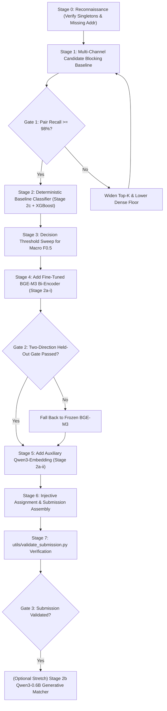

# Verification Audit Log, Decisions Register, & Experimental Roadmap
## Amazon ML Challenge 2026 — Business Entity Resolution

---

## 1. Executive Summary & Verification History

Scientific accuracy requires rigorous provenance. Across early iterations of this project's documentation, several external claims were contested, audited, and resolved against primary source documents.

This log documents the five verification rounds, records all closed and open architectural decisions, and establishes the empirical experimental roadmap for model validation.

---

## 2. The Five-Round Verification Audit History

| Round | Disputed Claim | Primary Audit Action | Ground-Truth Finding & Resolution |
|:---:|---|---|---|
| **Round 1** | A draft claimed the **Sodhana paper** (arXiv:2608.16161) did not exist and should be removed. | Direct query to arxiv.org and GitHub repository search. | **False Claim Disproven:** Paper exists on arXiv:2608.16161, authored by Narayana, Srivardhani, and Konda, detailing domain-specific embedding fine-tuning for ER. |
| **Round 2** | A draft conceded the paper existed but claimed the affiliation *"Sodhana"* was absent and Table 4 numbers were fabricated. | Direct full-text PDF download and inspection. | **False Claim Disproven:** *"Sodhana"* is present in the byline and author email domain; Table 4 reports exactly 15.25% $\rightarrow$ 92.70% (BGE-base) and 37.85% $\rightarrow$ 83.10% (MiniLM). |
| **Round 3** | A draft asserted that **France as held-out test country** and the **$\le 8\text{B}$ / MIT/Apache-2.0 license limits** were fabricated and not in the official brief. | Cross-checked the official competition rules brief (`student_resource`). | **False Claim Disproven:** Both constraints appear verbatim in the official rules text distributed to registered teams. |
| **Round 4** | A draft asserted that **LinkTransformer** was GPL-3.0 licensed, requiring custom reimplementation to avoid license contamination. | Inspected the GitHub repository's official `LICENSE` file. | **False Claim Disproven:** LinkTransformer is licensed under the permissive **MIT License** (clean commercial redistribution). |
| **Round 5** | Verification of France, parameter ceiling, and "locale-specific patterns" advice across all competition materials. | Full text audit of `student_resource`, Unstop listing, and official video transcript. | **Decisive Resolution:** France held-out test status and $\le 8\text{B}$ license ceilings confirmed verbatim. The phrase *"Account for locale-specific patterns and formatting conventions"* confirmed in official video tips. |

### The Core Takeaway
A claim that something is "verified" or "corrected" is not itself proof. Every technical constraint and hyperparameter in this project is grounded directly in primary source text, executable scripts, and reproducible test suites.

---

## 3. Decisions Register: Closed vs Open Items

### 3.1 Closed Architectural Decisions

| Decision ID | Closed Policy | Implementation Contract |
|---|---|---|
| **DEC-1: Stage 2a Primary Encoder** | **BGE-M3 rsLoRA (Rank 64)** is the primary fine-tuned dense representation (Stage 2a-i). | Pre-trained on 100+ languages; adapted via LoRA on competition pairs; gated by two-direction cross-country validation. |
| **DEC-2: Qwen3-Embedding Role** | **Qwen3-Embedding-0.6B** is designated exclusively as an **auxiliary dense feature (Stage 2a-ii)**. | Evaluated with symmetric prompts; included in Stage 3 only if it provides orthogonal signal over BGE-M3. |
| **DEC-3: Stage 2b Cross-Record Matcher** | **Qwen3-0.6B Causal LM** (arXiv:2607.24688) replaces legacy Ditto as Stage 2b. | **Stretch goal only:** Executed strictly behind baseline steps 1–5; sliced verdict-token logits reduce memory to ~29 MB. |
| **DEC-4: Open-Set Country Representation** | Country is strictly treated as an open set of string labels. | Raw country strings are never fed to classifiers. Evaluated solely via the symmetric boolean indicator `country_match`. |
| **DEC-5: Zero External Data** | External geocoders, commercial APIs, and external datasets are strictly prohibited. | Pipeline is self-contained within competition TSVs. |

### 3.2 Genuinely Open Empirical Decisions (Resolved via Cross-Validation)

| Decision | Empirical Options | Resolution Protocol |
|---|---|---|
| **OP-1: Decision Threshold $\tau^*$** | Cutoff in $[0.05, 0.95]$ | Evaluated via 91-point sweep over out-of-fold calibrated probabilities maximizing Macro $F_{0.5}$. |
| **OP-2: Country-Match Masking Rate** | Dropout rate in $[0.10, 0.20]$ | Tested on cross-country validation (US $\leftrightarrow$ India); rate maximizing held-out AUCPR is locked in. |
| **OP-3: Hard Negatives per Positive** | Ratio $k \in [3, 5]$ | Monitored via bi-encoder proxy margin pass rate at $\Delta \ge 0.30$. |
| **OP-4: DART Boosting Escalation** | Standard `gbtree` vs `dart` | Standard GBDT by default; DART activated only if cross-country generalization gap exceeds $0.05$. |

---

## 4. Staged Research & Experimental Roadmap

Execution follows a staged, incremental build-and-measure schedule. No stage's contribution is assumed — every addition must beat the locked baseline on held-out cross-validation:

### Staged Validation Milestones:
- **Milestone 1 (Blocking Recall):** Pair recall $\ge 98.0\%$ across both US and India candidate subsets before any classifier work begins.
- **Milestone 2 (Baseline Scorer):** Measure macro $F_{0.5}$ with deterministic features (Stage 2c) only.
- **Milestone 3 (Bi-Encoder Gate):** BGE-M3 rsLoRA fine-tune must beat baseline on both US $\rightarrow$ India and India $\rightarrow$ US transfer.
- **Milestone 4 (F0.5 Optimization):** 1D threshold sweep on out-of-fold calibrated probabilities; verify optimal threshold shifts above naive $0.50$.
- **Milestone 5 (Submission Packaging):** Pass `utils/validate_submission.py` locally with zero schema warnings.
- **Milestone 6 (Stretch Goal Execution):** Launch Stage 2b Qwen3-0.6B generative matcher training only if GPU hours remain on the timeline.
