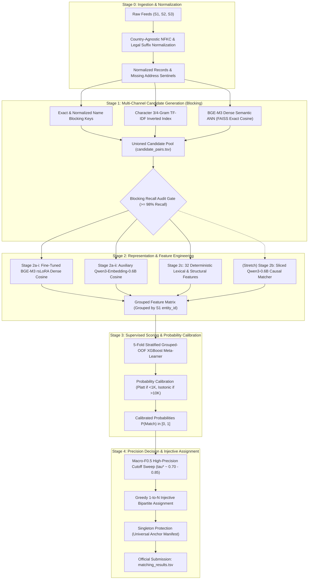

# Business Entity Resolution — Technical Documentation Hub
## Amazon ML Challenge 2026

---

## 1. Executive Summary & Pipeline Overview

Welcome to the definitive technical documentation repository for the **Business Entity Resolution** solution developed for the **Amazon ML Challenge 2026**.

The system resolves unlinked business entities across three heterogeneous data sources ($S_1$, $S_2$, $S_3$) using only noisy text fields (`business_name`, `business_address`, and `country`). It is engineered specifically to maximize the competition's official metric: **Macro $F_{0.5}$** (where precision is penalized ~2x over recall, and true singletons score binary 1.0 or 0.0).



---

## 2. Master Documentation Catalog

The documentation suite is structured into fifteen self-contained, rigorously numbered engineering specifications:

| Document | Title | Scope & Key Contents |
|:---:|---|---|
| [**`00_product_requirements.md`**](00_product_requirements.md) | **Product Requirements Document (PRD)** | Formal PRD, business problem, competition constraints (MIT/Apache 2.0, $\le 8\text{B}$ params, zero external data), metric mathematics (Macro $F_{0.5}$, singleton penalty/reward), deliverables. |
| [**`01_dataset_eda.md`**](01_dataset_eda.md) | **Comprehensive Dataset Audit & EDA Report** | Full audit across all 24.2M records (Train S1/S2/S3, GT, Test S1/S2/S3). Documents the 15% France out-of-domain shift, 3.3% missing addresses, 0 cross-country matches, and proves the 1-to-N injective constraint (`s2_multi=0`, `s3_multi=0`). |
| [**`02_system_architecture.md`**](02_system_architecture.md) | **Master System Architecture & Execution Contract** | Authoritative system blueprint: 5-stage pipeline, execution ordering, stop rules, failure recovery protocols, v1 baseline roadmap vs stretch goals, dependency barriers. |
| [**`03_stage0_normalization.md`**](03_stage0_normalization.md) | **Stage 0: Ingestion & Normalization Contract** | Country-agnostic Unicode NFKC normalization, legal suffix canonicalization (US, India, France), address abbreviation expansions, missing address sentinel handling, streaming chunked I/O. |
| [**`04_stage1_blocking.md`**](04_stage1_blocking.md) | **Stage 1: Candidate Generation (Blocking)** | Multi-channel unioned candidate generation: exact name keys, char n-gram TF-IDF, BGE-M3 dense retrieval, hard country partitioning, similarity floor (0.30), cap (100), recall audit gate. |
| [**`05_stage2_features_and_embeddings.md`**](05_stage2_features_and_embeddings.md) | **Stage 2: Representation & Feature Engineering** | Comprehensive feature design: Stage 2a-i (BGE-M3 rsLoRA), Stage 2a-ii (Qwen3-Embedding auxiliary), Stage 2b (stretch causal matcher), and Stage 2c (32 deterministic lexical, phonetic, and address features). |
| [**`06_stage2a_bge_m3_training_spec.md`**](06_stage2a_bge_m3_training_spec.md) | **Stage 2a-i: BGE-M3 Bi-Encoder Training Spec** | LoRA rank-64 with rank-stabilized scaling ($\alpha / \sqrt{r} = 8$), `CachedMultipleNegativesRankingLoss`, VRAM budget on RTX 3060 12GB (~1.5GB overhead, ~10GB headroom), 4-layer anti-forgetting stack, bidirectional cross-country gate. |
| [**`07_stage2b_qwen3_generative_matcher_spec.md`**](07_stage2b_qwen3_generative_matcher_spec.md) | **Stage 2b: Qwen3-0.6B Generative Matcher Spec** | Cross-record causal LM matcher (stretch): grounded in arXiv:2607.24688, prompt serialization, sequence length $S=224$ from EDA, ~29MB sliced verdict logits memory proof, 4-layer anti-forgetting. |
| [**`08_stage3_scoring_and_calibration.md`**](08_stage3_scoring_and_calibration.md) | **Stage 3: Supervised Scoring & Calibration** | 5-fold Grouped-OOF XGBoost meta-learner, runtime dynamic `scale_pos_weight`, monotonic constraints, 15% country-match feature masking, Platt vs Isotonic calibration rules. |
| [**`09_stage4_decision_and_singletons.md`**](09_stage4_decision_and_singletons.md) | **Stage 4: Decision Engine & Injective Assignment** | Macro $F_{0.5}$ threshold sweep ($\tau^* \approx 0.70 - 0.85$, proof of ~13% relative gain), greedy 1-to-N injective assignment algorithm, singleton protection, format validation. |
| [**`10_parameters_and_hyperparameters.md`**](10_parameters_and_hyperparameters.md) | **Parameters Catalog & Hyperparameter Reference** | Master parameters catalog for every stage: fixed constants vs data-dependent empirical knobs, initial values, tuning order, early stopping rules. |
| [**`11_inference_latency_and_optimization.md`**](11_inference_latency_and_optimization.md) | **Inference Latency, Memory, & Optimization** | Inference scheduling, memory footprint on RTX 3060 (~3.52 GB total active weights in bf16), merged LoRA weights, sharded batching plan, train/eval mode switches, first-principles optimizations. |
| [**`12_regularization_and_anti_forgetting.md`**](12_regularization_and_anti_forgetting.md) | **Unified Regularization & Anti-Forgetting** | Cross-model regularization theory: neural encoder regularizers (LoRA rank ceiling, rsLoRA scaling, self-distillation anchor), causal matcher regularizers, tabular meta-learner regularizers (DART, subsampling, stacked generalization). |
| [**`13_citations_and_benchmarks.md`**](13_citations_and_benchmarks.md) | **Citations, Academic References, & Benchmarks** | Exhaustive verified bibliography: PosIR (arXiv:2601.08363), Sodhana (arXiv:2608.16161), TriBERTa, vstash, Ditto, Zeakis et al., LinkTransformer (MIT license verified), Zhang et al. (arXiv:2607.24688), DART, Friedman. |
| [**`14_verification_and_decisions_log.md`**](14_verification_and_decisions_log.md) | **Verification Log, Decisions, & Roadmap** | 5-round verification audit history, closed architectural decisions, open empirical decisions register, staged experimental roadmap with explicit go/no-go gates. |

---

## 3. Visual Figures Catalog

The exploratory data analysis reports and visual matrices from the 24.2-million record audit are stored in [`figures/`](figures/):

- [**`Figure 1: Dataset Volume Comparison`**](figures/fig1_dataset_volume_comparison.png) — Record counts by source across Train and Test, plus Ground Truth links.
- [**`Figure 2: Country Distributions & Out-of-Domain Shift`**](figures/fig2_country_distributions.png) — Visualizing the 15.0% France zero-shot distribution shift and India dominance.
- [**`Figure 3: Ground Truth Graph Topology`**](figures/fig3_ground_truth_topology.png) — Singletons (5.58%) vs Matched (94.42%), match degree distribution (1–11), and 1-to-N uniqueness proof (`s2_multi=0`, `s3_multi=0`).
- [**`Figure 4: Text Length Distributions`**](figures/fig4_text_length_distributions.png) — Character and word count distributions for business names and addresses (P95 and P99 bounds).
- [**`Figure 5: Missingness & Quality Heatmap`**](figures/fig5_data_quality_and_null_matrix.png) — Missing address rates across sources (~3.3% in S2/S3) and non-ASCII character rates.
- [**`Figure 6: Pair Similarity Comparison Matrix`**](figures/fig6_pair_similarity_comparison_matrix.png) — 2D density distributions, margin separations, and feature correlation heatmap.
- [**`Figure 7: Noise Patterns & Blocking Trade-offs`**](figures/fig7_noise_patterns_and_vocabulary_overlap.png) — True pair exact match rates vs token Jaccard recall-leakage curves.
- [**`Figure 8: Country-Specific Address Profiles`**](figures/fig8_country_specific_address_characteristics.png) — Structural patterns and matching difficulty across US, India, and France.

---

## 4. End-to-End Execution Quickstart

The entire pipeline is automated via modular PowerShell scripts in `scripts/`:

```powershell
# 1. Environment & Hardware Verification
./scripts/00_verify_environment.ps1

# 2. Stage 0 Normalization & Stage 1 Multi-Channel Blocking
./scripts/01_run_blocking.ps1

# 3. Mandatory Blocking Recall Audit Gate
./scripts/01_audit_blocking_recall.ps1

# 4. Stage 2a-i BGE-M3 rsLoRA Fine-Tuning (with Anti-Forgetting)
./scripts/02a_train_bi_encoder.ps1

# 5. Stage 2c Deterministic Pair Feature Extraction
./scripts/02c_extract_pair_features.ps1

# 6. Stage 3 Supervised XGBoost Training & Probability Calibration
./scripts/03_train_gbm.ps1

# 7. Stage 4 Decision Threshold Tuning (Macro F0.5 Optimization)
./scripts/04_tune_threshold.ps1

# 8. Stage 4 Inference & Greedy 1-to-N Injective Assignment
./scripts/05_generate_submission.ps1

# 9. Stage 5 Submission Package Validation
./scripts/06_validate_submission.ps1
```
