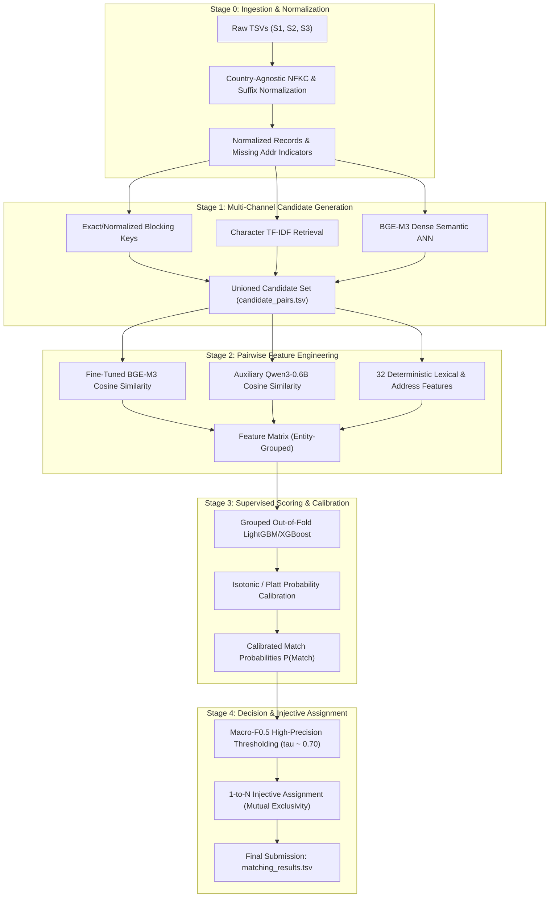

# Business Entity Resolution — Technical Documentation Hub
## Amazon ML Challenge 2026

Welcome to the central technical documentation repository for the **Business Entity Resolution** solution. This directory contains all architectural contracts, exploratory data analysis reports, stage-by-stage engineering specifications, and research reference documents.

---

## 1. End-to-End Pipeline Architecture

The solution implements a precision-first, multi-stage machine learning system optimized for the **macro $F_{0.5}$** metric:

---

## 2. Core Documentation Index

Every component of the pipeline is documented in depth with clear mathematical formulations, implementation contracts, and empirical data audits:

| Document | Title | Scope & Key Contents |
|---|---|---|
| [**`00_system_architecture.md`**](00_system_architecture.md) | **Master System Architecture & Execution Contract** | The authoritative blueprint: decision summaries, evidence policy, BGE-M3 LoRA configuration contract, Qwen auxiliary ablation protocol, LightGBM/XGBoost feature budget, and singleton decision policy. |
| [**`01_dataset_review_and_eda.md`**](01_dataset_review_and_eda.md) | **Comprehensive Dataset Audit & EDA Report** | Full audit across all 24.2M records (Train S1/S2/S3, GT, Test S1/S2/S3). Documents the 15% France out-of-domain shift, 3.3% missing addresses, 0 cross-country matches, and proves the 1-to-N injective constraint (`s2_multi=0`, `s3_multi=0`). |
| [**`02_stage0_normalization.md`**](02_stage0_normalization.md) | **Stage 0: Ingestion & Normalization Contract** | Country-agnostic Unicode NFKC normalization, legal suffix canonicalization (US, India, France), address abbreviation expansion, missing address sentinel handling, and streaming chunked I/O. |
| [**`03_stage1_blocking.md`**](03_stage1_blocking.md) | **Stage 1: Candidate Generation & Blocking** | High-recall multi-channel candidate generation: exact name keys, char n-gram TF-IDF, BGE-M3 dense retrieval, hard country partitioning, and candidate provenance tracking. |
| [**`04_stage2_features_and_embeddings.md`**](04_stage2_features_and_embeddings.md) | **Stage 2: Feature Engineering & Embeddings** | 32 deterministic pair features (token Jaccard, Levenshtein, address overlap, numeric/postal matching), fine-tuned BGE-M3 similarity, and auxiliary Qwen3-0.6B embedding features. |
| [**`05_stage3_scoring_and_calibration.md`**](05_stage3_scoring_and_calibration.md) | **Stage 3: Supervised Scoring & Calibration** | Grouped-OOF cross-validation (grouping by S1 entity to prevent data leakage), LightGBM/XGBoost pair ranker, isotonic calibration, and probability thresholding. |
| [**`06_stage4_decision_and_singletons.md`**](06_stage4_decision_and_singletons.md) | **Stage 4: F0.5 Optimization & Singleton Policy** | Greedy 1-to-N injective assignment enforcing mutual exclusivity, high-precision threshold optimization for macro $F_{0.5}$, singleton protection, and output validation. |
| [**`07_bi_encoder_lora_rationale.md`**](07_bi_encoder_lora_rationale.md) | **BGE-M3 LoRA Fine-Tuning Design Rationale** | Comprehensive decision log explaining every bi-encoder choice: BGE-M3 vs alternatives, rank-64 RSLoRA, CachedMNRL loss, self-distillation anti-forgetting, and held-out country gate. |

---

## 3. Visual Figures & Comparison Matrices

The visual figures from the 24.2-million record exploratory data analysis are stored in the [`figures/`](figures/) directory:

- [**`Figure 1: Dataset Volume Comparison`**](figures/fig1_dataset_volume_comparison.png) — Record counts by source across Train and Test, plus Ground Truth links.
- [**`Figure 2: Country Distributions & Out-of-Domain Shift`**](figures/fig2_country_distributions.png) — Visualizing the 15% France zero-shot distribution shift and India dominance.
- [**`Figure 3: Ground Truth Graph Topology`**](figures/fig3_ground_truth_topology.png) — Singletons (5.58%) vs Matched (94.42%), match degree distribution (1–11), and 1-to-N uniqueness.
- [**`Figure 4: Text Length Distributions`**](figures/fig4_text_length_distributions.png) — Character and word count distributions for business names and addresses.
- [**`Figure 5: Missingness & Quality Heatmap`**](figures/fig5_data_quality_and_null_matrix.png) — Missing address rates across sources (~3.3% in S2/S3) and non-ASCII character rates.
- [**`Figure 6: Pair Similarity Comparison Matrix`**](figures/fig6_pair_similarity_comparison_matrix.png) — 2D density distributions, margin separations, and feature correlation heatmap.
- [**`Figure 7: Noise Patterns & Blocking Trade-offs`**](figures/fig7_noise_patterns_and_vocabulary_overlap.png) — True pair exact match rates vs token Jaccard recall-leakage curves.
- [**`Figure 8: Country-Specific Address Profiles`**](figures/fig8_country_specific_address_characteristics.png) — Structural patterns and matching difficulty across US, India, and France.

---

## 4. Reference Specifications & Research Notes

The [`reference/`](reference/) directory contains foundational research notes, baseline specifications, and formal mathematical parameter tables:

| Reference Document | Description |
|---|---|
| [`reference/01_v1_baseline_plan.md`](reference/01_v1_baseline_plan.md) | The 72-hour competition execution plan, prioritizations, and baseline roadmap. |
| [`reference/02_parameters_table.md`](reference/02_parameters_table.md) | Canonical starting values, hyperparameters, and search grids for all models. |
| [`reference/03_target_architecture_spec.md`](reference/03_target_architecture_spec.md) | Architectural specification of the multi-stage entity resolution framework. |
| [`reference/04_bge_m3_training_spec.md`](reference/04_bge_m3_training_spec.md) | Mathematical training protocol for BGE-M3 bi-encoder LoRA adaptation. |
| [`reference/05_regularization_and_anti_forgetting.md`](reference/05_regularization_and_anti_forgetting.md) | Anti-catastrophic forgetting mechanisms and regularization protocols. |
| [`reference/06_inference_and_latency.md`](reference/06_inference_and_latency.md) | Inference-time execution budgets, batching strategies, and memory constraints. |
| [`reference/07_citations_and_benchmarks.md`](reference/07_citations_and_benchmarks.md) | Comprehensive citations, verified academic papers, and benchmark proofs. |
| [`reference/08_open_decisions_log.md`](reference/08_open_decisions_log.md) | Protocol for empirical questions resolved during training and cross-validation. |
| [`reference/09_verification_log.md`](reference/09_verification_log.md) | Independent verification audit log and license compliance checks. |
| [`reference/10_product_requirements_document.md`](reference/10_product_requirements_document.md) | Formal functional and non-functional requirements specification (PRD). |
| [`reference/11_research_and_experimental_plan.md`](reference/11_research_and_experimental_plan.md) | Experimental roadmap, evaluation metrics, and ablation schedule. |
| [`reference/12_hyperparameter_verification_status.md`](reference/12_hyperparameter_verification_status.md) | Distinction between pre-data bounds and post-data empirically tuned parameters. |
| [`reference/13_optimization_design.md`](reference/13_optimization_design.md) | Engineering optimization rationale and memory safety guardrails. |
