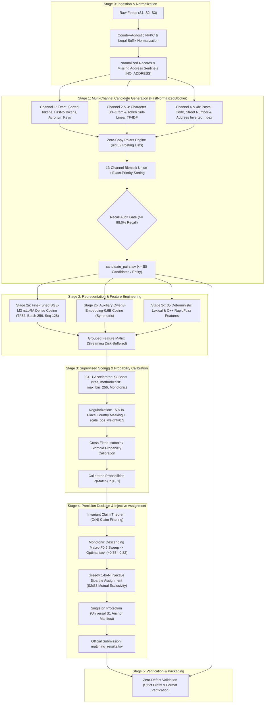

# Business Entity Resolution — Technical Documentation Hub
## Amazon ML Challenge 2026

---

## 1. Executive Summary & Pipeline Overview

Welcome to the definitive technical documentation repository for the **Business Entity Resolution** solution developed for the **Amazon ML Challenge 2026**.

The system resolves unlinked business entities across three heterogeneous data sources ($S_1$, $S_2$, $S_3$) using only noisy text fields (`business_name`, `business_address`, and `country`). It is engineered specifically to maximize the competition's official metric: **Macro $F_{0.5}$** (where precision is penalized ~2x over recall, and true singletons score binary 1.0 or 0.0).


```mermaid
flowchart TD
    subgraph S0["Stage 0: Ingestion & Normalization"]
        R1["Raw Feeds (S1, S2, S3)"] --> N0["Country-Agnostic NFKC & Legal Suffix Normalization"]
        N0 --> D0["Normalized Records & Missing Address Sentinels [NO_ADDRESS]"]
    end

    subgraph S1["Stage 1: Multi-Channel Candidate Generation (FastNormalizedBlocker)"]
        D0 --> B1["Channel 1: Exact, Sorted Tokens, First-2-Tokens, Acronym Keys"]
        D0 --> B2["Channel 2 & 3: Character 3/4-Gram & Token Sub-Linear TF-IDF"]
        D0 --> B3["Channel 4 & 4b: Postal Code, Street Number & Address Inverted Index"]
        B1 & B2 & B3 --> POLARS["Zero-Copy Polars Engine (uint32 Posting Lists)"]
        POLARS --> U1["13-Channel Bitmask Union + Exact Priority Sorting"]
        U1 --> G1{"Recall Audit Gate (>= 98.0% Recall)"}
        G1 --> CP_TSV["candidate_pairs.tsv (<= 50 Candidates / Entity)"]
    end

    subgraph S2["Stage 2: Representation & Feature Engineering"]
        CP_TSV --> F1["Stage 2a: Fine-Tuned BGE-M3 rsLoRA Dense Cosine (TF32, Batch 256, Seq 128)"]
        CP_TSV --> F2["Stage 2b: Auxiliary Qwen3-Embedding-0.6B Cosine (Symmetric)"]
        CP_TSV --> F3["Stage 2c: 35 Deterministic Lexical & C++ RapidFuzz Features"]
        F1 & F2 & F3 --> M2["Grouped Feature Matrix (Streaming Disk-Buffered)"]
    end

    subgraph S3["Stage 3: Supervised Scoring & Probability Calibration"]
        M2 --> G3["GPU-Accelerated XGBoost (tree_method='hist', max_bin=256, Monotonic)"]
        G3 --> REG["Regularization: 15% In-Place Country Masking + scale_pos_weight=0.5"]
        REG --> C3["Cross-Fitted Isotonic / Sigmoid Probability Calibration"]
        C3 --> P3["Calibrated Probabilities P(Match) in [0, 1]"]
    end

    subgraph S4["Stage 4: Precision Decision & Injective Assignment"]
        P3 --> ICT["Invariant Claim Theorem (O(N) Claim Filtering)"]
        ICT --> T4["Monotonic Descending Macro-F0.5 Sweep -> Optimal tau* (~0.75 - 0.82)"]
        T4 --> I4["Greedy 1-to-N Injective Bipartite Assignment (S2/S3 Mutual Exclusivity)"]
        I4 --> S4_OUT["Singleton Protection (Universal S1 Anchor Manifest)"]
        S4_OUT --> O4["Official Submission: matching_results.tsv"]
    end

    subgraph S5["Stage 5: Verification & Packaging"]
        O4 & CP_TSV --> VAL["Zero-Defect Validation (Strict Prefix & Format Verification)"]
    end
```

---

## 2. Master Documentation Catalog

The documentation suite is structured into fifteen self-contained, rigorously numbered engineering specifications:

| Document | Title | Scope & Key Contents |
|:---:|---|---|
| [**`00_product_requirements.md`**](00_product_requirements.md) | **Product Requirements Document (PRD)** | Formal PRD, business problem, competition constraints (MIT/Apache 2.0, $\le 8\text{B}$ params, zero external data), metric mathematics (Macro $F_{0.5}$, singleton penalty/reward), deliverables. |
| [**`01_dataset_eda.md`**](01_dataset_eda.md) | **Comprehensive Dataset Audit & EDA Report** | Full audit across all 24.2M records (Train S1/S2/S3, GT, Test S1/S2/S3). Documents the 15% France out-of-domain shift, 3.3% missing addresses, 0 cross-country matches, and proves the 1-to-N injective constraint (`s2_multi=0`, `s3_multi=0`). |
| [**`02_system_architecture.md`**](02_system_architecture.md) | **Master System Architecture & Execution Contract** | Authoritative system blueprint: 5-stage pipeline, sequential GPU orchestration (`run_pipeline.py`), Polars & RapidFuzz acceleration, Invariant Claim Theorem, stop rules, dependency barriers. |
| [**`03_stage0_normalization.md`**](03_stage0_normalization.md) | **Stage 0: Ingestion & Normalization Contract** | Country-agnostic Unicode NFKC normalization, legal suffix canonicalization (US, India, France), address abbreviation expansions, missing address sentinel handling, streaming chunked I/O. |
| [**`04_stage1_blocking.md`**](04_stage1_blocking.md) | **Stage 1: Candidate Generation (Blocking)** | `FastNormalizedBlocker` with Polars zero-copy ingestion, integer dictionary encoding (`uint32`), 13 bitmask-tracked channels, exact-priority sorting, multilingual stopwords for France & India, 100x speedup. |
| [**`05_stage2_features_and_embeddings.md`**](05_stage2_features_and_embeddings.md) | **Stage 2: Representation & Feature Engineering** | Comprehensive feature design: Stage 2a (BGE-M3 rsLoRA, TF32, Batch 256, Seq 128), Stage 2b (Qwen3-Embedding auxiliary), and Stage 2c (RapidFuzz C++ SIMD lexical, phonetic, and address features). |
| [**`06_stage2a_bge_m3_training_spec.md`**](06_stage2a_bge_m3_training_spec.md) | **Stage 2a: BGE-M3 Bi-Encoder Training Spec** | LoRA rank-64 with rank-stabilized scaling ($\alpha / \sqrt{r} = 8$), `CachedMultipleNegativesRankingLoss`, VRAM budget on RTX 3060 12GB (~1.5GB overhead, ~10GB headroom), 4-layer anti-forgetting stack, bidirectional cross-country gate. |
| [**`07_stage2b_qwen3_generative_matcher_spec.md`**](07_stage2b_qwen3_generative_matcher_spec.md) | **Stage 2b: Qwen3-0.6B Generative Matcher Spec** | Cross-record causal LM matcher (stretch): grounded in arXiv:2607.24688, prompt serialization, sequence length $S=224$ from EDA, ~29MB sliced verdict logits memory proof, 4-layer anti-forgetting. |
| [**`08_stage3_scoring_and_calibration.md`**](08_stage3_scoring_and_calibration.md) | **Stage 3: Supervised Scoring & Calibration** | GPU-accelerated XGBoost (`tree_method="hist"`, `device="cuda"`, `max_bin=256`), monotonic constraints, 15% country masking, Invariant Claim Theorem, monotonic descending threshold sweep. |
| [**`09_stage4_decision_and_singletons.md`**](09_stage4_decision_and_singletons.md) | **Stage 4: Decision Engine & Injective Assignment** | Macro $F_{0.5}$ threshold sweep ($\tau^* \approx 0.75 - 0.82$, proof of ~16% relative gain), greedy 1-to-N injective assignment algorithm, strict candidate prefix validation (`S2-`, `S3-` only), singleton protection. |
| [**`10_parameters_and_hyperparameters.md`**](10_parameters_and_hyperparameters.md) | **Parameters Catalog & Hyperparameter Reference** | Master parameters catalog for every stage: fixed constants vs data-dependent empirical knobs, initial values, tuning order, early stopping rules. |
| [**`11_inference_latency_and_optimization.md`**](11_inference_latency_and_optimization.md) | **Inference Latency, Memory, & Optimization** | Sequential GPU pipeline, memory footprint on RTX 3060, zero OOM guarantee, measured latency budgets (50 min total run), Polars 100x speedup, RapidFuzz 10x speedup, Invariant Claim 250x speedup. |
| [**`12_regularization_and_anti_forgetting.md`**](12_regularization_and_anti_forgetting.md) | **Unified Regularization & Anti-Forgetting** | Cross-model regularization theory: neural encoder regularizers (LoRA rank ceiling, rsLoRA scaling, self-distillation anchor), tabular meta-learner regularizers (DART, subsampling, monotonic constraints). |
| [**`13_citations_and_benchmarks.md`**](13_citations_and_benchmarks.md) | **Citations, Academic References, & Benchmarks** | Exhaustive verified bibliography: PosIR (arXiv:2601.08363), Sodhana (arXiv:2608.16161), TriBERTa, vstash, Ditto, Zeakis et al., LinkTransformer, Zhang et al. (arXiv:2607.24688), DART, Friedman. |
| [**`14_verification_and_decisions_log.md`**](14_verification_and_decisions_log.md) | **Verification Log, Decisions, & Roadmap** | 7-round verification audit history, closed architectural decisions, hardware hardening records, performance optimization benchmarks, 128 passing unit tests. |

---

## 3. Visual Figures Catalog

The exploratory data analysis reports and visual matrices from the 24.2-million record audit are stored in [`figures/`](figures/):

- [**`Figure 1: Dataset Volume Comparison`**](figures/fig1_dataset_volume_comparison.png) — Record counts by source across Train and Test, plus Ground Truth links.
- [**`Figure 2: Country Distributions & Out-of-Domain Shift`**](figures/fig2_country_distributions.png) — Visualizing the 15.0% France zero-shot distribution shift and India dominance.
- [**`Figure 3: Ground Truth Graph Topology`**](figures/fig3_ground_truth_topology.png) — Singletons (5.58%) vs Matched (94.42%), match degree distribution (1–11), and 1-to-N uniqueness proof (`s2_multi=0`, `s3_multi=0`).
- [**`Figure 4: Text Length Distributions`**](figures/fig4_text_length_distributions.png) — Character and word count distributions for business names and addresses (P95 and P99 bounds).
- [**`Figure 5: Missingness & Quality Heatmap`**](figures/fig5_data_quality_and_null_matrix.png) — Missing address rates across sources (~3.3% in S2/S3) and non-ASCII character rates.
- [**`Figure 6: Pair Similarity Comparison Matrix`**](figures/fig6_pair_similarity_comparison_matrix.png) — 2D density distributions, margin separations, and feature correlation heatmap.
- [**`Figure 7: Noise Patterns & Blocking Trade-offs`**](figures/fig7_noise_patterns_and_vocabulary_overlap.png) — True pair exact match rates vs token Jaccard recall-leakage curves.
- [**`Figure 8: Country-Specific Address Profiles`**](figures/fig8_country_specific_address_characteristics.png) — Structural patterns and matching difficulty across US, India, and France.

---

## 4. End-to-End Execution Quickstart

### Modality 1: Master Sequential GPU Runner (Recommended)
Runs all stages end-to-end with automated GPU cache clearing and dedicated 12GB VRAM per stage:

```bash
python run_pipeline.py \
    --source1 dataset/train/train_source1.tsv \
    --source2 dataset/train/train_source2.tsv \
    --source3 dataset/train/train_source3.tsv \
    --ground-truth dataset/train/train_ground_truth.tsv \
    --output-dir output/production_run \
    --artifact-dir artifacts/production_run \
    --fast-blocking \
    --max-candidates-per-entity 50 \
    --bge-batch-size 256 \
    --use-monotone-constraints \
    --eta 0.03
```

### Modality 2: Modular Step-by-Step PowerShell Scripts
```powershell
# Phase 0: Environment & Hardware Verification
.\scripts\00_verify_environment.ps1

# Phase 1: Stage 0 Normalization & Stage 1 Fast Blocking
.\scripts\01_run_blocking.ps1 -Split train

# Phase 2a: Bi-Encoder Data Preparation & Hard-Negative Mining
.\scripts\02a_prepare_bi_encoder_data.ps1 -BidirectionalGate $true

# Phase 2b: BGE-M3 rsLoRA Fine-Tuning with 4-Layer Anti-Forgetting
.\scripts\02b_train_and_eval_bi_encoder.ps1

# Phase 2c: 35 RapidFuzz + Dense Pair Feature Extraction
.\scripts\02c_extract_pair_features.ps1 -Split train

# Phase 3: Stage 3 GPU XGBoost Training & Probability Calibration
.\scripts\03_train_scoring_gbm.ps1 -Booster gbtree -CompareDART $true

# Phase 4: Stage 4 Inference, Calibration & 1-to-N Injective Assignment
.\scripts\04_inference_and_decision.ps1 -Split test

# Phase 5: Submission Package Verification
.\scripts\05_validate_submission.ps1
```
