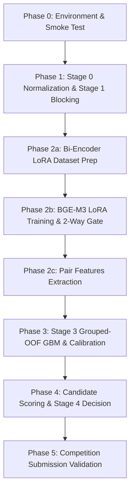

# Pipeline Orchestration Scripts (.ps1)

This directory contains the production-grade PowerShell orchestration suite for the **Amazon ML Challenge 2026: Business Entity Resolution** system.

The scripts orchestrate the complete end-to-end architecture across 6 sequential phases, ensuring clean separation of concerns, reproducible artifacts, automated validation gates, and leak-safe cross-validation.

---

## Architecture & Phased Execution



| Phase | Script | Primary Operation | Key Outputs |
|---|---|---|---|
| **0** | [`00_verify_environment.ps1`](00_verify_environment.ps1) | Python environment, packages, GPU/VRAM audit, module check, unit tests | Environment report, test results |
| **1** | [`01_run_blocking.ps1`](01_run_blocking.ps1) | Multi-channel candidate generation across 7 blocking channels | `candidate_pairs.tsv`, `candidate_provenance.tsv`, `blocking_summary.json` |
| **2a** | [`02a_prepare_bi_encoder_data.ps1`](02a_prepare_bi_encoder_data.ps1) | 50k US + 50k India balanced sampling & bidirectional IR eval splits | `held_out_country_dataset/`, `full_training_dataset/`, `eval_*.json` |
| **2b** | [`02b_train_and_eval_bi_encoder.ps1`](02b_train_and_eval_bi_encoder.ps1) | BGE-M3 LoRA fine-tuning, bidirectional gate evaluation & weight merge | `bge-m3-lora-gate/`, `bge-m3-merged/`, `eval_results_bidirectional.json` |
| **2c** | [`02c_extract_pair_features.ps1`](02c_extract_pair_features.ps1) | Deterministic lexical/address/rank features + BGE dense cosine + optional Qwen | `pair_features.tsv`, `bge_pair_features.tsv`, `qwen_pair_features.tsv` |
| **3** | [`03_train_scoring_gbm.ps1`](03_train_scoring_gbm.ps1) | Entity-grouped OOF XGBoost, monotonic constraints, Platt/isotonic calibration | `gbm.json`, `stage3_metadata.json`, `tfidf_vectorizer.joblib` |
| **4** | [`04_inference_and_decision.ps1`](04_inference_and_decision.ps1) | Test candidate scoring, optimal macro-F0.5 thresholding, singleton emission | `scored_candidates.tsv`, `matching_results.tsv`, `candidate_pairs.tsv` |
| **5** | [`05_validate_submission.ps1`](05_validate_submission.ps1) | Strict competition formatting and containment validation | Compliance certificate |
| **ALL** | [`run_all_phases.ps1`](run_all_phases.ps1) | Master orchestrator coordinating all phases with timer & markdown summary | `output/pipeline_execution_summary.md` |

---

## Quick Start Examples

All commands are executed using PowerShell from the repository root:

### 1. Verify Environment & Smoke Tests (Phase 0)
```powershell
powershell -ExecutionPolicy Bypass -File scripts/00_verify_environment.ps1
```

### 2. Master Pipeline: Dry-Run Mode (Inspect Execution Plan)
```powershell
powershell -ExecutionPolicy Bypass -File scripts/run_all_phases.ps1 -DryRun
```

### 3. Fast Sample Run (5,000 Entities, CPU Fallback)
```powershell
powershell -ExecutionPolicy Bypass -File scripts/run_all_phases.ps1 -RunMode FastSample -SkipGPU
```

### 4. Full GPU Production Run
```powershell
powershell -ExecutionPolicy Bypass -File scripts/run_all_phases.ps1 -RunMode Full
```

### 5. Resume from a Specific Phase (e.g. from Phase 3 to 5)
```powershell
powershell -ExecutionPolicy Bypass -File scripts/run_all_phases.ps1 -FromPhase 3 -ToPhase 5
```

### 6. Inference Only (Score Test Set using Trained Model)
```powershell
powershell -ExecutionPolicy Bypass -File scripts/run_all_phases.ps1 -RunMode InferenceOnly
```

---

## Individual Phase Scripts Reference

### `01_run_blocking.ps1`
Generates candidate pairs using exact names, character 3-grams, address tokens, phonetic keys, and token inverted index.
```powershell
# Run blocking on train set with ground truth recall audit
powershell -ExecutionPolicy Bypass -File scripts/01_run_blocking.ps1 -Split train -MaxCandidates 50

# Run blocking on test set
powershell -ExecutionPolicy Bypass -File scripts/01_run_blocking.ps1 -Split test -MaxCandidates 50
```

### `02a_prepare_bi_encoder_data.ps1`
Builds balanced positive pairs and bidirectional IR evaluation data (`US -> India` and `India -> US`).
```powershell
powershell -ExecutionPolicy Bypass -File scripts/02a_prepare_bi_encoder_data.ps1 `
    -SamplePerCountry 50000 `
    -BlockingCandidates output/phase1_blocking_train/candidate_pairs.tsv `
    -NegativesPerPositive 2
```

### `02b_train_and_eval_bi_encoder.ps1`
Fine-tunes BGE-M3 with LoRA (r=64, rsLoRA, CachedMNRL, 0.10 self-distillation) and enforces the 2-way gate.
```powershell
powershell -ExecutionPolicy Bypass -File scripts/02b_train_and_eval_bi_encoder.ps1 `
    -Epochs 3 `
    -BatchSize 48 `
    -MiniBatchSize 16 `
    -LoraR 64 `
    -DistillWeight 0.10
```

**Gate Policy**:
- Recall@10 ≥ 0.80
- Relative degradation ≤ 0.10 vs off-the-shelf BAAI/bge-m3 baseline
- Margin pass rate at 0.10 ≥ 0.60
- *If gate fails (NO-GO):* halts pipeline without silently deploying a degraded model.

### `02c_extract_pair_features.ps1`
Extracts deterministic pair features, dense embeddings, and optional Stage 2b generative-matcher probabilities for candidate pairs.
```powershell
powershell -ExecutionPolicy Bypass -File scripts/02c_extract_pair_features.ps1 `
    -CandidateFile output/phase1_blocking_train/candidate_pairs.tsv `
    -Split train `
    -IncludeQwenMatcher:$false `
    -QwenMatcherAdapter "path/to/adapter"
```

### `03_train_scoring_gbm.ps1`
Trains entity-grouped out-of-fold XGBoost, fits leak-safe Platt/isotonic calibrator, and optimizes macro-F0.5 threshold. Auto-detects BGE, Qwen, and Qwen Matcher features from `output/phase2_features_train/`.
```powershell
powershell -ExecutionPolicy Bypass -File scripts/03_train_scoring_gbm.ps1 `
    -Booster gbtree `
    -CountryMaskRate 0.15 `
    -UseMonotoneConstraints $true `
    -QwenMatcherFeatures output/phase2_features_train/qwen_matcher_features.tsv
```

### `04_inference_and_decision.ps1`
Applies trained GBM and calibrator to test set, then runs Stage 4 decision policy with greedy 1-to-N injective bipartite matching (enforcing candidate mutual exclusivity per competition rules). Auto-detects test feature tables (including Stage 2b matcher features if present).
```powershell
powershell -ExecutionPolicy Bypass -File scripts/04_inference_and_decision.ps1 `
    -Injective $true `
    -TestQwenMatcherFeatures output/phase2_features_test/qwen_matcher_features.tsv
```

### `05_validate_submission.ps1`
Validates `matching_results.tsv` and `candidate_pairs.tsv` against all competition submission rules.
```powershell
powershell -ExecutionPolicy Bypass -File scripts/05_validate_submission.ps1 -CheckIds
```

---

## Configuration & Environment Overrides

- **Python Interpreter**: Scripts automatically detect virtual environments at `code/business_entity_resolution/.venv/Scripts/python.exe`. You can override with `$env:PYTHON_BIN = "C:\Path\To\python.exe"` or pass `-PythonPath "C:\Path\To\python.exe"`.
- **Output Directory**: Default output root is `output/`. Can be customized via `-OutputDir "custom_output"`.
- **Error Handling**: All scripts execute with `$ErrorActionPreference = "Stop"`. If any python process exits with a non-zero code, execution halts immediately with duration and failure diagnostics.
